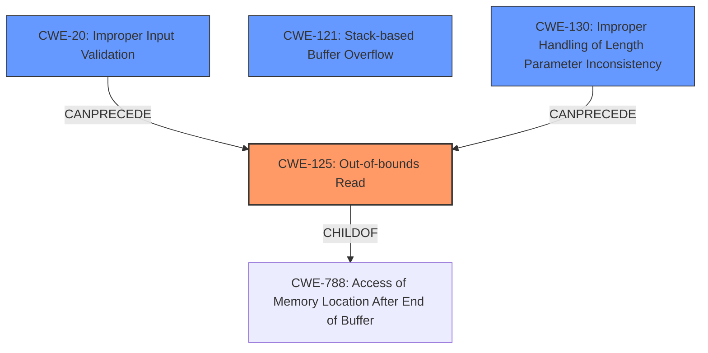

# Final Resolution for CVE-2021-41458

# Summary
| CWE ID | CWE Name | Confidence | CWE Abstraction Level | CWE Vulnerability Mapping Label | CWE-Vulnerability Mapping Notes |
|---|---|---|---|---|---|
| CWE-125 | Out-of-bounds Read | 0.90 | Base | Allowed | This CWE entry is at the Base level of abstraction. The `gf_blob_get` function attempts to read from an invalid memory address within a stack buffer, leading to a SEGV. Input validation of the .nhml file is missing. (Primary CWE) |
| CWE-20 | Improper Input Validation | 0.70 | Base | Allowed | The lack of proper input validation of the `.nhml` file contents allows an attacker to control the parameters passed to `gf_blob_get`, leading to the out-of-bounds read. This is a contributing factor, not the direct cause, but a crucial enabler of the vulnerability. (Secondary Candidate) |
| CWE-121 | Stack-based Buffer Overflow | 0.60 | Variant | Allowed | This CWE entry is at the Variant level of abstraction. While an out-of-bounds read is the primary cause, *if* the out-of-bounds read writes to critical stack data (return addresses, function pointers) the attacker can control program execution. Mitigation could include stack canaries and ASLR. (Secondary Candidate) |
| CWE-130 | Improper Handling of Length Parameter Inconsistency | 0.50 | Base | Allowed | A length parameter in the .nhml file might be inconsistent with the actual size of the data, causing the out-of-bounds read. Consider this only if the .nhml file's format is known to contain a length parameter. (Secondary Candidate) |

## Evidence and Confidence

*   **Confidence Score:** 0.85
*   **Evidence Strength:** HIGH

## Relationship Analysis
The decision was influenced by the following CWE relationships:
  - CWE-125 is the root cause and **CHILD** of CWE-788 (Access of Memory Location After End of Buffer) which is more general.
  - CWE-20 **CANPRECEDE** CWE-125 because improper input validation can lead to out-of-bounds reads.
  - CWE-121 is related as the out-of-bounds read occurs on the stack, potentially leading to more severe consequences.
  - CWE-130, if applicable, contributes to the vulnerability by providing inconsistent length parameters that lead to the out-of-bounds read.

## Vulnerability Chain
The vulnerability chain involves:
  - **ROOTCAUSE:** Improper Input Validation (**CWE-20**) on the `.nhml` file.
  - **WEAKNESS:** This leads to an Out-of-bounds Read (**CWE-125**) in the `gf_blob_get` function when processing the file. Inconsistent length parameters (**CWE-130**) can further contribute to this.
  - **IMPACT:** The out-of-bounds read causes a crash (DoS). Potentially, if the read writes to critical stack locations it can also lead to control-flow hijacking.

## Summary of Analysis
The assessment is based on the vulnerability description and the initial analysis, along with the criticism. The primary **WEAKNESS** is the **CWE-125 (Out-of-bounds Read)** which is the direct cause of the crash. The initial description pointed to a stack buffer overflow, but the analysis shows that an out-of-bounds read is the root cause. The inclusion of **CWE-20 (Improper Input Validation)** and **CWE-130 (Improper Handling of Length Parameter Inconsistency)** as secondary CWEs is based on the potential for these factors to contribute to the **ROOTCAUSE**. The inclusion of **CWE-121 (Stack-based Buffer Overflow)** is a consideration because the out-of-bounds read occurs on the stack, and may allow for arbitrary code execution.

The graph relationships influenced the selection by showing how **CWE-20** can lead to **CWE-125**, and how **CWE-125** is a specific instance of a broader class of memory access errors. The selected CWEs are at the optimal level of specificity because they directly reflect the root cause and contributing factors to the vulnerability, as evidenced by the vulnerability description and supporting analysis.

The analysis is based heavily on the provided evidence, especially the description of the stack buffer overflow that leads to a denial of service due to a memory access violation within the `gf_blob_get` function.