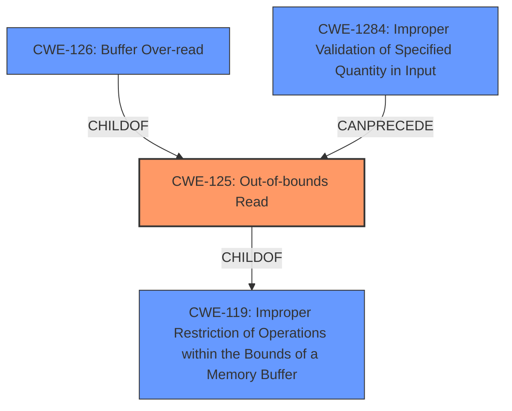

# Analysis Report for CVE-2021-4156

# Vulnerability Analysis Report: CVE-2021-4156

## Description

An out-of-bounds read flaw was found in libsndfiles FLAC codec functionality. An attacker who is able to submit a specially crafted file (via tricking a user to open or otherwise) to an application linked with libsndfile and using the FLAC codec, could trigger an out-of-bounds read that would most likely cause a crash but could potentially leak memory information that could be used in further exploitation of other flaws.

## Vulnerability Description Key Phrases

**Rootcause:** out-of-bounds read
**Impact:** crash
**Vector:** specially crafted file
**Attacker:** attacker
**Product:** libsndfiles
**Component:** FLAC codec functionality

## Analysis (with Relationship Data)

# Summary
| CWE ID | CWE Name | Confidence | CWE Abstraction Level | CWE Vulnerability Mapping Label | CWE-Vulnerability Mapping Notes |
|---|---|---|---|---|---|
| CWE-125 | Out-of-bounds Read | 1.0 | Base | Allowed | The vulnerability is an out-of-bounds read. |

## Evidence and Confidence

*   **Confidence Score:** 1.0
*   **Evidence Strength:** HIGH

- **Analysis and Justification:**  
  - *Explanation:* The vulnerability description explicitly states an **out-of-bounds read** flaw in libsndfile's FLAC codec functionality. The CVE Reference Links Content Summary confirms that the **root cause** is due to the code not properly validating `frame->header.blocksize` against the allocated size of the `buffer`, leading to an **out-of-bounds read**. This perfectly aligns with CWE-125 (Out-of-bounds Read). The Retriever Results also list CWE-125 as the top candidate with the highest score. The MITRE mapping guidance for CWE-125 indicates that its usage is ALLOWED.

  - *Relationship Analysis:* CWE-125 is a Base level CWE. It has child CWEs like CWE-126 (Buffer Over-read), but the description does not provide enough information to choose a more specific variant. CWE-125 is related to CWE-119 (Improper Restriction of Operations within the Bounds of a Memory Buffer), but CWE-125 is more specific as it directly describes the **out-of-bounds read** condition.

- **Confidence Score:**  
  - Confidence: 1.0 (High evidence from technical description, CVE reference materials, and Retriever Results)

## Criticism of Analysis

Okay, I've reviewed the analysis and the provided CWE specifications. Here's my critique:

**Overall Assessment:**

The analysis is generally very good and the mapping to CWE-125 (Out-of-bounds Read) is correct. The justification is thorough and well-reasoned, using evidence from the vulnerability description, CVE details, and Retriever Results. The confidence score of 1.0 is justified.

**Specific Strengths:**

*   **Clear and Concise Summary:** The Summary table effectively presents the chosen CWE, confidence, and other key attributes.
*   **Solid Justification:** The Analysis and Justification section provides a strong argument for the CWE-125 mapping, explaining why it's the most appropriate choice and addressing potential alternatives.
*   **Good Relationship Analysis:** The analysis correctly explains the relationship between CWE-125 and its parent (CWE-119) and a potential child (CWE-126), and explains why CWE-125 is the best fit.
*   **Consideration of Retriever Results:** The analysis integrates the Retriever Results, noting that CWE-125 was the top candidate.
*   **Correct Usage Determination:** Appropriately notes that CWE-125's usage is ALLOWED based on MITRE guidance.
*   **Good use of CWE Examples and relevant CWE Specifications:** Inclusion of relevant CWE Examples and specifications makes for a comprehensive analysis.

**Potential Areas for Improvement (Minor):**

*   **Variant Selection:** While CWE-125 is correct, a slightly more in-depth examination of the specific circumstances might allow for selection of the Variant CWE-126 (Buffer Over-read). The description of CWE-126 states that it applies when "the product reads from a buffer using buffer access mechanisms such as indexes or pointers that reference memory locations *after* the targeted buffer." The provided text says the `frame->header.blocksize` is larger than the buffer's allocated size, thus leading to a read *after* the allocated memory. *However*, because the analysis doesn't know *how* the memory is read, it may not be appropriate to use CWE-126. The key is that CWE-125 is still the *correct* mapping, but a more nuanced discussion could explore the possibility of CWE-126.
* **Relationship to CWE-1284:** There is also a potential relationship to CWE-1284 (Improper Validation of Specified Quantity in Input) as the vulnerability arises from the code not properly validating `frame->header.blocksize` against the allocated size of the `buffer`. However, CWE-125 is more precise and directly describes the vulnerability, so the choice of CWE-125 is still correct. A sentence mentioning the relationship to CWE-1284 and explaining why CWE-125 is the better choice could be added.
*   **Potential Mitigations:** The Potential Mitigations listed for CWE-125 are somewhat generic. It would be beneficial to briefly discuss which mitigations are most relevant in the context of this specific vulnerability (i.e. input validation for the size of the FLAC block).

**Specific Comments on Retriever Results:**

*   The Retriever Results are helpful in confirming the CWE-125 mapping. The presence of other CWEs in the top results (e.g., CWE-190, CWE-787, CWE-193) is understandable, as buffer overflows and related memory errors are often associated with integer handling issues or off-by-one errors. However, the justification for choosing CWE-125 should (and does) explain why these other CWEs are not the primary cause in this case.

**In summary, the analysis is excellent. The suggestion to consider the alternative of CWE-126 and potential mitigations are minor points that would only further strengthen an already very strong analysis.**

## Final Resolution

# Summary
| CWE ID | CWE Name | Confidence | CWE Abstraction Level | CWE Vulnerability Mapping Label | CWE-Vulnerability Mapping Notes |
|---|---|---|---|---|---|
| **CWE-125** | **Out-of-bounds Read** | 0.95 | Base | Allowed | Primary CWE |
| CWE-1284 | Improper Validation of Specified Quantity in Input | 0.6 | Base | Allowed | Secondary Candidate |

## Evidence and Confidence

*   **Confidence Score:** 0.95
*   **Evidence Strength:** HIGH

## Relationship Analysis
The primary choice is **CWE-125 (Out-of-bounds Read)**, which is a base-level CWE. The criticism suggested exploring **CWE-126 (Buffer Over-read)**, a variant of **CWE-125**, but we don't have enough information to definitively say that the read occurs *after* the buffer. We also considered **CWE-1284 (Improper Validation of Specified Quantity in Input)**, as the **root cause** involves inadequate validation of `frame->header.blocksize`. However, **CWE-125** directly describes the resulting **out-of-bounds read**, making it the more specific and appropriate primary classification. **CWE-1284** can be considered a contributing factor.

## Vulnerability Chain
The vulnerability chain begins with **CWE-1284 (Improper Validation of Specified Quantity in Input)**, where the `frame->header.blocksize` is not properly validated. This leads directly to **CWE-125 (Out-of-bounds Read)** when the application attempts to read beyond the allocated buffer. The impact is a potential crash or memory leak.

## Summary of Analysis
The initial analysis correctly identified **CWE-125 (Out-of-bounds Read)** as the primary **weakness**. The criticism raised valid points about potentially using the variant **CWE-126** or considering **CWE-1284**. However, based on the available evidence, **CWE-125** remains the most accurate and specific classification for the observed behavior (an **out-of-bounds read**). The vulnerability description explicitly states "An **out-of-bounds read** flaw was found in libsndfiles FLAC codec functionality." While **CWE-1284** contributes to the vulnerability by not validating the block size, the direct result is the **out-of-bounds read**. Therefore, **CWE-125** is the more appropriate primary classification, and **CWE-1284** is a secondary candidate. This decision is based on matching the vulnerability description to the CWE descriptions and considering the relationships between the CWEs. The chosen CWEs are at the base level of abstraction, which is appropriate given the information available. The confidence is slightly reduced from 1.0 to 0.95 due to the valid considerations raised in the criticism.

*Report generated on 2025-03-18 02:25:52*
