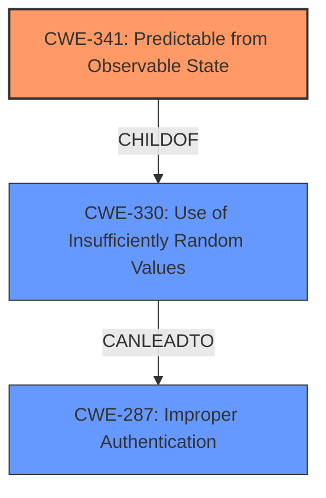

# Analysis Report for CVE-2021-41694

# Vulnerability Analysis Report: CVE-2021-41694

## Description

An Incorrect Access Control vulnerability exists in Premiumdatingscript 4.2.7.7 via the password change procedure in requests\user.php.

## Vulnerability Description Key Phrases

**Rootcause:** Incorrect Access Control
**Product:** Premiumdatingscript
**Version:** 4.2.7.7
**Component:** password change procedure in requestsuser.php

## Analysis (with Relationship Data)

# Summary
| CWE ID | CWE Name | Confidence | CWE Abstraction Level | CWE Vulnerability Mapping Label | CWE-Vulnerability Mapping Notes |
|---|---|---|---|---|---|
| CWE-330 | Use of Insufficiently Random Values | 0.85 | Class | Allowed-with-Review | Primary CWE. The vulnerability lies in using `md5($time)` which is insufficiently random for generating password reset codes. |
| CWE-287 | Improper Authentication | 0.6 | Class | Discouraged | Secondary candidate. While the root cause is weak randomness, the impact is on authentication. |

## Evidence and Confidence

*   **Confidence Score:** 0.8
*   **Evidence Strength:** HIGH

- **Analysis and Justification:**  
  - *Explanation:* The core of the vulnerability lies in the **weak password recovery** mechanism using `md5($time)` as the secret recovery code, as described in the CVE Reference Links Content Summary. The `time` value is easily predictable, making the recovery code guessable, which is a prime example of **insufficient randomness**. This directly corresponds to CWE-330 (Use of Insufficiently Random Values), which is a Class-level CWE. CWE-330 is chosen as the primary CWE because it accurately represents the root cause. The Retriever results also suggest related CWEs like CWE-341 (Predictable from Observable State), supporting the insufficient randomness aspect. Although CWE-330 is a class level CWE, it is appropriate since there are no child CWEs that fit the description better. The use of `md5($time)` leads to a **brute-force vulnerability** enabling **account takeover**.
  - *Relationship Analysis:* CWE-330 (Use of Insufficiently Random Values) is a Class-level CWE. While it doesn't have direct relationships listed in the provided data, its implications directly affect the authentication process. CWE-330 CanLeadTo CWE-287(Improper Authentication).

- **Confidence Score:**  
  - Confidence: 0.85 (High confidence due to clear evidence from the CVE summary pointing to the insufficient randomness in password recovery).

---
- **Analysis and Justification:**  
  - *Explanation:* CWE-287 (Improper Authentication) could be considered as a secondary CWE because the **incorrect access control** leads to an authentication bypass. An attacker can take over an account by exploiting the **weak password recovery**. However, the root cause is the weak randomness, so CWE-287 would be a result of the primary weakness. The description mentions "**Incorrect Access Control** vulnerability" which could be related to authentication issues. However, the details indicate the primary issue is the predictable password reset code. The high-level description of Incorrect Access Control is not detailed enough to make this a primary CWE. MITRE discourages using this CWE when more specific options exist.
  - *Relationship Analysis:* CWE-287 (Improper Authentication) is a Class-level CWE, and several child CWEs exist that are related to authentication failures. However, given that the primary weakness stems from the insufficient randomness used in the password recovery process (CWE-330), rather than a direct flaw in the authentication mechanism, CWE-287 is a secondary consideration.

- **Confidence Score:**  
  - Confidence: 0.6 (Medium confidence as CWE-287 is more of an impact than the root cause.)

## Criticism of Analysis

Okay, I've reviewed the provided analysis and the complete CWE specifications. Here's my critique:

**Overall Assessment:**

The analysis is generally sound and identifies the core issue well. The primary CWE selection of `CWE-330: Use of Insufficiently Random Values` is appropriate and well-justified. The consideration of `CWE-287: Improper Authentication` as a secondary CWE is also reasonable, though the strength of that connection is weaker. The reasoning is clear and the confidence levels are appropriately assigned.

**Detailed Review:**

*   **Vulnerability Description and CVE Summary:**

    *   The initial description clearly states the vulnerability as an **Incorrect Access Control** in a password change procedure.
    *   The CVE summary focuses on the predictable nature of the password recovery code due to `md5($time)`. This is a crucial distinction that shifts the focus from access control to randomness.
*   **CWE-330: Use of Insufficiently Random Values (Primary CWE):**

    *   **Justification:** The explanation is well-articulated. The reliance on `md5($time)` *directly* leads to the generation of predictable values, making `CWE-330` a suitable primary CWE. The description accurately connects the use of weak randomness to the potential for impersonation and unauthorized access.
    *   **Abstraction Level:** The analysis mentions that CWE-330 is a class-level CWE and that it is appropriate since there are no child CWEs that fit the description better. This is correct because while `CWE-340: Generation of Predictable Numbers or Identifiers` is a child of `CWE-330`, it is still a class-level CWE. A better fit may be to consider `CWE-341: Predictable from Observable State`, which is a `Base` level CWE and a child of `CWE-340`. While the description for `CWE-340` mentions *numbers or identifiers that are more predictable than required*, `CWE-341` aligns more accurately with the predictability arising from observable system states like time.
    *   **Confidence:** The high confidence (0.85) is justified given the direct link between the code and the weakness.
*   **CWE-287: Improper Authentication (Secondary CWE):**

    *   **Justification:** The analysis correctly identifies that `CWE-287` is a *result* or an *impact* of the insufficient randomness. The attacker ultimately bypasses authentication by exploiting the predictability. However, the primary *cause* isn't a flaw in the authentication *mechanism itself* but rather in the generation of the recovery code.
    *   **Mapping Guidance:** The analysis appropriately acknowledges that `CWE-287` is discouraged unless more specific options exist. The analysis is also correct in that, given the nature of the vulnerability, more specific options may not exist. `CWE-306 Missing Authentication for Critical Function` may be considered, but the function in question is only accessible through a password reset procedure.

    *   **Confidence:** The confidence level of 0.6 is appropriate. `CWE-287` is a consequence, not the root cause.
* **CWE-341: Predictable from Observable State**
    * A number or object is predictable based on observations that the attacker can make about the state of the system or network, such as time, process ID, etc.
    *   The analysis is correct that this is the closest option to a base level CWE. This is a child of CWE-330. This may be a stronger option then CWE-330, since it gets more specific.
*   **Retriever Results Analysis:**

    *   The top retriever results, particularly `CWE-472: External Control of Assumed-Immutable Web Parameter`, `CWE-306: Missing Authentication for Critical Function`, and `CWE-639: Authorization Bypass Through User-Controlled Key`, highlight aspects of the vulnerability's potential attack vectors and impact. However, these results are more tangential than the chosen CWEs.
    *   `CWE-341: Predictable from Observable State` is the most interesting option from this list. This could be a superior primary CWE to `CWE-330`, since it gets more specific, it is a child of `CWE-330`, and it is a base level CWE.
*   **Mitigation:** The analysis does not include mitigation suggestions. Mitigation for `CWE-330` would be to "Use a well-vetted algorithm that is currently considered to be strong by experts in the field, and select well-tested implementations with adequate length seeds." For `CWE-341`, a mitigation would be to "Increase the entropy used to seed a PRNG". For `CWE-287`, "Use an authentication framework or library such as the OWASP ESAPI Authentication feature."

**Recommendations:**

1.  **Consider making `CWE-341` the Primary CWE:** While `CWE-330` is a reasonable choice, carefully evaluate whether `CWE-341` is a *more precise* fit, given the observable state (time) being the basis for prediction. `CWE-341` is a more specific, base-level CWE than `CWE-330` and the description closely matches the root cause.
2.  **Add Mitigation Information:** Include a section on potential mitigations based on the chosen CWEs. This would enhance the practical value of the analysis.
3.  **Relationship Analysis:** Although done well, review the relationships between `CWE-341`, `CWE-330`, and `CWE-287` to confirm the reasoning and justification.

**Revised Summary Table (If `CWE-341` is chosen as Primary)**

| CWE ID    | CWE Name                                | Confidence | CWE Abstraction Level | CWE Vulnerability Mapping Label | CWE-Vulnerability Mapping Notes                                                                                                        |
| :-------- | :-------------------------------------- | :--------- | :---------------------- | :------------------------------ | :------------------------------------------------------------------------------------------------------------------------------------- |
| CWE-341 | Predictable from Observable State       | 0.85       | Base             | Allowed           | Primary CWE. The vulnerability lies in using `md5($time)` which is predictable since 'time' is an observable state.                                          |
| CWE-287 | Improper Authentication                 | 0.6        | Class        | Discouraged | Secondary candidate. While the root cause is weak randomness, the impact is on authentication.                                       |

By incorporating these suggestions, the analysis would be even more robust and valuable.

## Final Resolution

# Summary
| CWE ID | CWE Name | Confidence | CWE Abstraction Level | CWE Vulnerability Mapping Label | CWE-Vulnerability Mapping Notes |
|---|---|---|---|---|---|
| CWE-341 | Predictable from Observable State | 0.85 | Base | Allowed | Primary CWE. The vulnerability lies in using `md5($time)` which is predictable since 'time' is an observable state. |
| CWE-287 | Improper Authentication | 0.6 | Class | Discouraged | Secondary candidate. While the root cause is weak randomness, the impact is on authentication. |

## Evidence and Confidence

*   **Confidence Score:** 0.85
*   **Evidence Strength:** HIGH

## Relationship Analysis
The primary relationship that impacted the decision was the parent-child relationship between CWE-330 and CWE-341. CWE-341 is a child of CWE-330, which makes it a more specific classification. CWE-330 (Use of Insufficiently Random Values) CanLeadTo CWE-287 (Improper Authentication). The abstraction levels influenced the decision by favoring the base level CWE-341 over the class level CWE-330.

## Vulnerability Chain
The chain of root cause and weaknesses for the Vulnerability Description is as follows:
1.  **Root Cause:** CWE-341 (**Predictable from Observable State**) - The use of `time` as input to `md5` makes the output predictable since time is an observable state.
2.  CWE-330 (**Use of Insufficiently Random Values**) The `md5($time)` is insufficiently random for generating password reset codes.
3.  **Impact:** CWE-287 (**Improper Authentication**) - The predictable password reset code allows attackers to bypass authentication and take over accounts.

## Summary of Analysis
The analysis and criticism both agree that the root cause of the vulnerability lies in the **predictable password recovery** mechanism. The initial analysis identified CWE-330 as the primary weakness. However, the criticism suggested using CWE-341, which is a child of CWE-330 and a base level CWE, making it a more specific fit. The vulnerability description clearly indicates that the password reset code is predictable because it's based on the observable state (time).

The decision to use CWE-341 as the primary CWE is based on the following:

*   **Content Matching:** The description of CWE-341 ("A number or object is predictable based on observations that the attacker can make about the state of the system or network, such as time, process ID, etc.") directly matches the vulnerability where `time` is used to generate the password reset code.
*   **Relationship Analysis:** CWE-341 is a child of CWE-330, providing a more specific classification.
*   **Mapping Guidance:** CWE-341 is a Base level CWE, which is preferred for mapping root causes.
*   **Evidence:** The CVE summary states that the password recovery code is predictable due to `md5($time)`.

The selected CWEs are at the optimal level of specificity because CWE-341 directly addresses the **predictability** arising from the observable `time` state, and CWE-287 captures the resulting **improper authentication**.

*Report generated on 2025-03-17 03:36:55*
