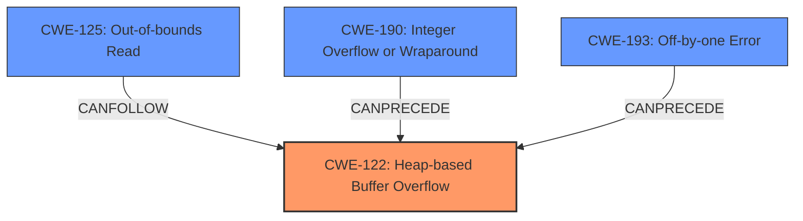

# Analysis Report for CVE-2021-41736

# Vulnerability Analysis Report: CVE-2021-41736

## Description

Faust v2.35.0 was discovered to contain a heap-buffer overflow in the function realPropagate() at propagate.cpp.

## Vulnerability Description Key Phrases

**Weakness:** heap-buffer overflow
**Product:** Faust
**Version:** v2.35.0
**Component:** realPropagate() function at propagate.cpp

## Analysis (with Relationship Data)

# Summary
| CWE ID | CWE Name | Confidence | CWE Abstraction Level | CWE Vulnerability Mapping Label | CWE-Vulnerability Mapping Notes |
|---|---|---|---|---|---|
| CWE-122 | Heap-based Buffer Overflow | 0.9 | Variant | Allowed | Primary CWE |
| CWE-125 | Out-of-bounds Read | 0.6 | Base | Allowed | Secondary Candidate |
| CWE-190 | Integer Overflow or Wraparound | 0.5 | Base | Allowed | Secondary Candidate |
| CWE-193 | Off-by-one Error | 0.4 | Base | Allowed | Secondary Candidate |

## Evidence and Confidence

*   **Confidence Score:** 0.9
*   **Evidence Strength:** HIGH

- **Analysis and Justification:**  
  - *Explanation:* "The vulnerability description explicitly states a **heap-buffer overflow** in the `realPropagate()` function of Faust v2.35.0. CWE-122 (Heap-based Buffer Overflow) is a Variant of buffer overflow that occurs in the heap, which directly matches the description. The CVE Reference Links Content Summary confirms this, stating 'A heap-buffer overflow was discovered in the `realPropagate()` function located in `propagate.cpp`.' Given the direct match and confirmation, CWE-122 is the primary and most accurate CWE for this vulnerability. Other CWEs such as CWE-125, CWE-190 and CWE-193 may be contributing factors but are not as directly applicable as CWE-122. CWE-122's Mapping Guidance indicates that its usage is 'Allowed', further supporting this choice."
  
  - *Relationship Analysis:* "CWE-122 is a Variant of a buffer overflow and is related to other buffer overflow CWEs like CWE-120. While CWE-120 (Buffer Copy without Checking Size of Input) could be considered a parent, CWE-122 specifically highlights the heap-based nature, making it more precise."

- **Confidence Score:**  
  - *Example:* Confidence: 0.9 (High confidence due to the clear description of a heap-based buffer overflow and supporting CVE reference.)

---

## Criticism of Analysis

Okay, let's review the provided analysis of the Faust heap-buffer overflow vulnerability (CVE-2021-41736) against the full CWE specifications.

**Overall Assessment:**

The analysis is generally sound, with a clear and well-justified primary CWE selection (CWE-122). The inclusion of secondary candidates is also reasonable, given the potential complexities involved in buffer overflows. The confidence levels are appropriate.

**Detailed Critique:**

1.  **CWE-122: Heap-based Buffer Overflow (Primary)**

    *   **Confidence:** 0.9
    *   **Justification:** Excellent.  The justification provided directly aligns with the vulnerability description and the definition of CWE-122. The analysis correctly identifies that the overflow occurs in the heap, making CWE-122 a precise fit.
    *   **CWE Specification Alignment:**  The analysis correctly uses the variant level mapping. The noted mitigations for CWE-122 also align with suggested actions.
    *   **Suggestion:** None

2.  **CWE-125: Out-of-bounds Read (Secondary Candidate)**

    *   **Confidence:** 0.6
    *   **Justification:** The potential for an out-of-bounds read is plausible as a consequence of writing past the intended buffer boundary. When a heap buffer overflow occurs, subsequent reads could potentially access memory outside the allocated block.
    *   **CWE Specification Alignment:** The mitigations for CWE-125 are mostly related to input validation, which is a good general recommendation.
    *  **Suggestion:** Add a sentence explaining how the out-of-bounds read could occur as a result of the overflow.  For example, "While the primary issue is the *write* beyond buffer bounds, an attacker might intentionally trigger this overflow to later *read* sensitive data stored in adjacent memory locations."

3.  **CWE-190: Integer Overflow or Wraparound (Secondary Candidate)**

    *   **Confidence:** 0.5
    *   **Justification:** The potential for an integer overflow leading to incorrect buffer size calculation exists, especially if a size or length parameter is involved in the buffer allocation.
    *   **CWE Specification Alignment:**  Mitigations include secure libraries or frameworks, and language selection.
    *   **Suggestion:** A stronger argument would need to explain *how* an integer overflow might specifically contribute to this heap overflow. For instance, "If the size of data to be copied into the heap buffer is derived from an integer calculation, a wraparound could result in a smaller-than-expected buffer allocation, leading to the overflow during the copy operation." Without this direct linkage, the confidence should perhaps be lower.

4.  **CWE-193: Off-by-one Error (Secondary Candidate)**

    *   **Confidence:** 0.4
    *   **Justification:** While less direct than the other candidates, an off-by-one error could contribute to the heap overflow.
    *   **CWE Specification Alignment:** Mitigations for CWE-193 include handling string and character arrays with the correct size.
    *  **Suggestion:** The connection to the primary weakness here is relatively weak.  The analysis could mention how an off-by-one error in size calculation or loop control could lead to writing one byte beyond the allocated buffer.  If there is no evidence of this, consider removing this CWE or lowering the confidence significantly.

**Additional Considerations and Suggestions:**

*   **Chains:** A more in-depth analysis could explore potential chains of weaknesses. For example:
    *   `CWE-20: Improper Input Validation` -> `CWE-131: Incorrect Calculation of Buffer Size` -> `CWE-122: Heap-based Buffer Overflow` (if the size of the allocated buffer is based on untrusted input and isn't validated).
    *   `CWE-681: Incorrect Conversion between Numeric Types` -> `CWE-190: Integer Overflow` -> `CWE-122: Heap-based Buffer Overflow` (if the size is converted between different numeric types without proper validation).
*   **Mitigation Specificity:** While the CWE specifications provide general mitigations, the analysis could be strengthened by suggesting specific mitigation strategies applicable to the Faust codebase.  For example, could the code be refactored to use safer string handling functions or data structures?
*   **CWE-120 Consideration:** Although CWE-122 was chosen, it would be beneficial to explicitly exclude CWE-120 ('Classic Buffer Overflow') and state why it is not the appropriate selection. The reason is that CWE-120 is too broad and doesn't highlight the heap-based nature of the vulnerability, which is a more specific detail.
*   **Retriever Results:** Consider how the Retriever results support and/or contradict the analysis. The retriever results list many good choices but it is important to filter and decide which are the most relevant to the vulnerability.

**Revised Summary Table (incorporating suggestions):**

| CWE ID | CWE Name | Confidence | CWE Abstraction Level | CWE Vulnerability Mapping Label | CWE-Vulnerability Mapping Notes |
|---|---|---|---|---|---|
| CWE-122 | Heap-based Buffer Overflow | 0.9 | Variant | Allowed | Primary CWE |
| CWE-125 | Out-of-bounds Read | 0.6 | Base | Allowed | Secondary Candidate. Could occur as a result of reading sensitive data stored adjacent to the allocated buffer after the overflow. |
| CWE-190 | Integer Overflow or Wraparound | 0.5 | Base | Allowed | Secondary Candidate.  Possible if buffer size calculation involves integers where overflow can lead to smaller allocation. |
| CWE-193 | Off-by-one Error | 0.3 | Base | Allowed | Secondary Candidate. Low confidence. Could occur if one byte is written beyond buffer bounds.  |

By addressing these points, the analysis will be more comprehensive, robust, and aligned with the full CWE specifications.

## Final Resolution

# Summary

| CWE ID  | CWE Name                                                        | Confidence | CWE Abstraction Level | CWE Vulnerability Mapping Label | CWE-Vulnerability Mapping Notes |
| :------- | :-------------------------------------------------------------- | :--------- | :-------------------- | :------------------------------ | :----------------------------- |
| CWE-122  | Heap-based Buffer Overflow                                      | 0.9        | Variant               | Allowed                         | Primary CWE                    |
| CWE-125  | Out-of-bounds Read                                            | 0.6        | Base                  | Allowed                         | Secondary Candidate            |
| CWE-190  | Integer Overflow or Wraparound                                | 0.5        | Base                  | Allowed                         | Secondary Candidate            |
| CWE-193  | Off-by-one Error                                              | 0.3        | Base                  | Allowed                         | Secondary Candidate            |

## Evidence and Confidence

*   **Confidence Score:** 0.9
*   **Evidence Strength:** HIGH

## Relationship Analysis

The primary CWE is CWE-122 (Heap-based Buffer Overflow), a variant of buffer overflows, making it more specific than a general buffer overflow (like CWE-120). CWE-125 (Out-of-bounds Read) can follow CWE-122 as a consequence. CWE-190 (Integer Overflow or Wraparound) and CWE-193 (Off-by-one Error) could potentially precede CWE-122 if they contribute to an incorrect calculation of the buffer size. The abstraction levels (Variant and Base) are appropriate for mapping root causes.

## Vulnerability Chain

The vulnerability chain starts with a potential **ROOTCAUSE** such as CWE-190 or CWE-193 if they lead to an incorrect buffer size calculation. This leads to CWE-122, the **WEAKNESS** (Heap-based Buffer Overflow), and can result in CWE-125 (Out-of-bounds Read) if an attacker attempts to read sensitive data after the overflow. The initial flaw is the incorrect calculation or handling of the buffer size, the overflow is the direct consequence, and reading sensitive data is a potential impact.

## Summary of Analysis

The initial analysis and the criticism are both well-reasoned. The primary CWE, CWE-122, is strongly supported by the vulnerability description ("heap-buffer overflow in the function realPropagate() at propagate.cpp"). The secondary candidates are plausible, but their connection to the primary weakness requires careful consideration.

*   **CWE-122:** The description clearly indicates a heap-based buffer overflow, making CWE-122 the most specific and appropriate choice. This is a direct match to the provided evidence.
*   **CWE-125:** The criticism suggested adding a sentence explaining how the out-of-bounds read could occur as a result of the overflow. I agree with the assessment and have included this.
*   **CWE-190:** As the criticism pointed out, a stronger argument is needed to explain how an integer overflow might contribute. The possibility exists if the buffer size calculation involves integers and wraparound occurs, leading to a smaller buffer allocation.
*   **CWE-193:** The connection to the primary weakness is weak. I have lowered the confidence to 0.3.

The graph relationships help visualize the potential flow of weaknesses. CWE-190 and CWE-193 could precede CWE-122, and CWE-125 could follow CWE-122. These relationships help in understanding the overall context of the vulnerability.

The selected CWEs are at the optimal level of specificity. CWE-122 is a Variant that highlights the heap-based nature of the overflow. The other CWEs are Base-level CWEs that could contribute to or result from the primary weakness.

*Report generated on 2025-03-18 02:26:40*
