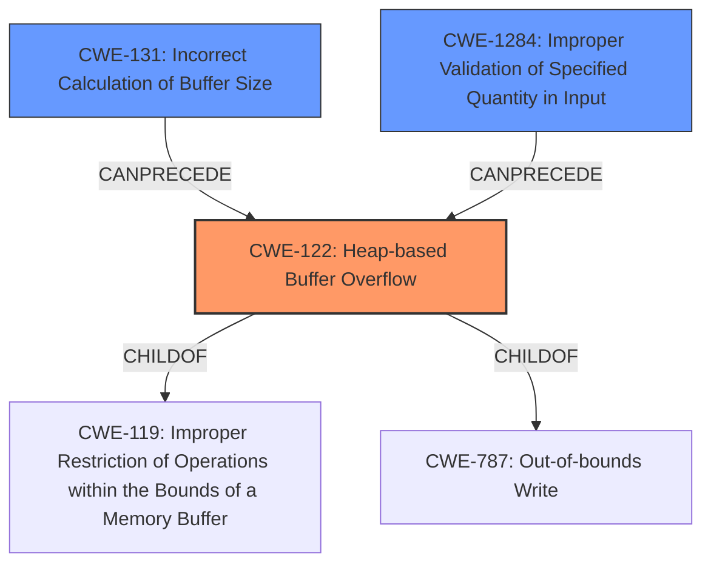

# Analysis Report for CVE-2021-41987

# Vulnerability Analysis Report: CVE-2021-41987

## Description

In the SCEP Server of RouterOS in certain Mikrotik products, an attacker can trigger a heap-based buffer overflow that leads to remote code execution. The attacker must know the scep_server_name value. This affects RouterOS 6.46.8, 6.47.9, and 6.47.10.

## Vulnerability Description Key Phrases

**Weakness:** heap-based buffer overflow
**Impact:** remote code execution
**Attacker:** attacker
**Product:** Mikrotik RouterOS
**Version:** 6.46.8, 6.47.9, and 6.47.10
**Component:** SCEP Server

## Analysis (with Relationship Data)

# Summary
| CWE ID | CWE Name | Confidence | CWE Abstraction Level | CWE Vulnerability Mapping Label | CWE-Vulnerability Mapping Notes |
|---|---|---|---|---|---|
| CWE-122 | Heap-based Buffer Overflow | 0.95 | Variant | Allowed | The vulnerability is explicitly described as a heap-based buffer overflow. |
| CWE-131 | Incorrect Calculation of Buffer Size | 0.75 | Base | Allowed | The root cause is identified as a miscalculation of the buffer size during Base64 decoding. |

## Evidence and Confidence

*   **Confidence Score:** 0.85
*   **Evidence Strength:** HIGH

- **Analysis and Justification:**  
  - *Explanation:* "The vulnerability description explicitly states a **heap-based buffer overflow** in the SCEP Server of RouterOS. The CVE Reference Links Content Summary confirms that a miscalculation in the `base64Decode` function leads to an undersized buffer allocation, causing the overflow. CWE-122 (Heap-based Buffer Overflow) is a Variant-level CWE, providing a specific classification for this type of buffer overflow. The MITRE mapping guidance allows its use. Also, the analysis indicates that the attacker can overwrite heap metadata, overwrite a vtable pointer, and gain control of execution flow, which aligns with the impact of heap overflows."
  
  - *Relationship Analysis:* "CWE-122 is a variant of CWE-119 (Improper Restriction of Operations within the Bounds of a Memory Buffer). It is also related to other buffer overflow variants like CWE-121 (Stack-based Buffer Overflow). The fact that it is heap-based makes CWE-122 the appropriate choice here."

- **Confidence Score:**  
  - Confidence: 0.95 (High confidence due to direct evidence of a heap-based buffer overflow)

---
- **Analysis and Justification:**  
  - *Explanation:* "The CVE Reference Links Content Summary indicates that the root cause is a miscalculation of the buffer size in the `base64Decode` function. The formula `output_buffer_length = 3 * (input_buffer_length >> 2)` is identified as the source of the error. This aligns with CWE-131 (Incorrect Calculation of Buffer Size), which describes the situation where a product does not correctly calculate the size to be used when allocating a buffer, leading to a buffer overflow. The MITRE mapping guidance allows its use. This is a prerequisite weakness which then leads to CWE-122."
  
  - *Relationship Analysis:* "CWE-131 is a base-level CWE that can lead to buffer overflows. It is related to CWE-122 because the incorrect calculation of the buffer size directly causes the heap-based buffer overflow."

- **Confidence Score:**  
  - Confidence: 0.75 (Medium-High confidence as this is the root cause, but not as directly evident as the overflow itself.)

## Criticism of Analysis

Okay, I've reviewed your analysis of the provided vulnerability description and the associated CWE specifications. Here's my critique, focusing on the accuracy, completeness, and justification of your CWE assignments, along with suggestions for improvement:

**Overall Assessment:**

The analysis is generally good and identifies the primary weaknesses accurately. The justifications are well-reasoned and use specific details from the vulnerability description and CVE content summary. The confidence scores are appropriate.

**Detailed Review:**

**1. CWE-122: Heap-based Buffer Overflow:**

*   **Assessment:** Correct.
*   **Confidence:** Justified at 0.95.  The description directly states this is a heap-based buffer overflow. The CVE summary reinforces this by detailing how the overflow occurs within the heap.
*   **Justification:** The explanation clearly articulates the connection between the vulnerability description, the CVE summary, and the definition of CWE-122.  The relationship analysis is also accurate.
*   **Mitigation:**
    *   Pre-design: Using a language or compiler with automatic bounds checking could have prevented this in the first place.
    *   Architecture and Design: Using an abstraction library could abstract away the unsafe base64 decoding.
    *   Operation, Build and Compilation:  Compiler flags like `/GS` or `FORTIFY_SOURCE` might have detected the overflow during testing, although they don't necessarily *prevent* it.

**2. CWE-131: Incorrect Calculation of Buffer Size:**

*   **Assessment:** Correct.
*   **Confidence:** Justified at 0.75.  This is the *root cause* leading to the buffer overflow.  While it's not as directly stated as the overflow itself, the analysis accurately points to the miscalculation within `base64Decode` as the source of the problem.
*   **Justification:** The explanation clearly links the formula `output_buffer_length = 3 * (input_buffer_length >> 2)` and its potential to produce an undersized buffer to CWE-131. The relationship to CWE-122 is correctly identified (CWE-131 *precedes* CWE-122).
*   **Mitigation:**
    *   Implementation: The code should ensure the output buffer is large enough to hold the *largest possible* decoded output. The extended description is very relevant here.
    *   Implementation/Input Validation:  Perform input validation on the buffer size, check if length is a multiple of 4 and add padding or handle it appropriately.

**Suggestions for Additional/Alternative CWEs and Improvements:**

*   **CWE-130: Improper Handling of Length Parameter Inconsistency (Consider):**  The vulnerability involves Base64 decoding, where the encoded input has a length that might not be a multiple of 4. The decoding process depends on this length. If the length parameter is inconsistent (e.g., not a multiple of 4 and lacking proper padding), it could cause unexpected behavior in the decoding process, potentially leading to the buffer overflow. If the library is *expecting* a multiple of 4, and *doesn't* properly handle inputs that aren't, then CWE-130 might be warranted. Weigh it against the detail already captured by CWE-131.
*   **CWE-1284: Improper Validation of Specified Quantity in Input (Consider):** The `input_buffer_length` is effectively a specified quantity, and the code *should* validate it before using it to allocate the output buffer. If the library does *not* validate that the input length adheres to base64 requirements (such as length needing to be a multiple of 4, or proper padding), this could also be applicable.
*   **CWE-787: Out-of-bounds Write (Consider, but probably redundant):** Because a buffer overflow inherently results in writing past the bounds of allocated memory, CWE-787 is technically applicable. However, since CWE-122 is a more specific Variant of a buffer overflow, I would mark CWE-787 as redundant *in this specific case*. If the analysis were *only* about an out-of-bounds write, and the allocation mechanism wasn't known or specified, then CWE-787 would be the right choice.
*  **CWE-119: Improper Restriction of Operations within the Bounds of a Memory Buffer:** This is a very general case. While technically correct, the MITRE guidelines recommend *against* using this one when a more specific CWE is available.

**Recommendations for Strengthening Justifications:**

*   When mentioning MITRE mapping guidance, explicitly state *which* aspect of the guidance you are referencing (e.g., "This CWE entry is at the Variant level of abstraction, which is a preferred level of abstraction for mapping to the root causes of vulnerabilities.")
*   For each CWE, briefly mention the *primary* mitigation strategies that would have been effective in preventing this specific instance of the vulnerability.  This demonstrates a strong understanding of the CWE and its practical implications.

**Why the other CWEs in the Top Combined Results list are less applicable:**

*   **CWE-476 (NULL Pointer Dereference):** There's no indication in the provided analysis that a NULL pointer is being dereferenced.
*   **CWE-190 (Integer Overflow or Wraparound):** While integer overflow *could* hypothetically be involved in the buffer size calculation, it's not explicitly stated in the vulnerability description or CVE summary. The primary issue is the incorrect *formula*, not an integer overflowing its bounds.
*   **CWE-193 (Off-by-one Error):**  The issue is not a simple "plus or minus one" error. It's a fundamental flaw in the buffer size calculation formula.
*   **CWE-121 (Stack-based Buffer Overflow):** The vulnerability is specifically described as *heap*-based, making this inapplicable.
*   **CWE-191 (Integer Underflow):** Similar to the integer overflow consideration, there's no specific evidence of an integer underflow.

By incorporating these suggestions, you can make your CWE analysis even more robust and defensible. Remember to always prioritize accuracy, completeness, and clear justification for your CWE assignments.

## Final Resolution

# Summary
| CWE ID | CWE Name | Confidence | CWE Abstraction Level | CWE Vulnerability Mapping Label | CWE-Vulnerability Mapping Notes |
|---|---|---|---|---|---|
| CWE-122 | Heap-based Buffer Overflow | 0.95 | Variant | Allowed | Primary CWE: The vulnerability is explicitly described as a heap-based buffer overflow. |
| CWE-131 | Incorrect Calculation of Buffer Size | 0.75 | Base | Allowed | Secondary Candidate: The root cause is identified as a miscalculation of the buffer size during Base64 decoding. |
| CWE-1284 | Improper Validation of Specified Quantity in Input | 0.60 | Base | Allowed | Secondary Candidate: Input buffer length not validated against base64 encoding rules. |

## Evidence and Confidence

*   **Confidence Score:** 0.85
*   **Evidence Strength:** HIGH

## Relationship Analysis
The primary weakness is a **CWE-122 (Heap-based Buffer Overflow)**, which is a variant of **CWE-119 (Improper Restriction of Operations within the Bounds of a Memory Buffer)**. The root cause of this overflow is **CWE-131 (Incorrect Calculation of Buffer Size)**, which directly leads to the heap overflow. A contributing factor could be **CWE-1284 (Improper Validation of Specified Quantity in Input)**, where the input buffer length is not validated against the requirements for Base64 encoding, but this is less certain based on the current evidence. **CWE-787 (Out-of-bounds Write)** is a parent of **CWE-122**, but **CWE-122** is a more specific variant that applies directly, so it is preferred.

## Vulnerability Chain
The vulnerability chain starts with the **ROOTCAUSE** of **CWE-131 (Incorrect Calculation of Buffer Size)** in the `base64Decode` function. This results in an undersized buffer being allocated on the heap. The subsequent Base64 decoding process then writes data beyond the allocated buffer, leading to **CWE-122 (Heap-based Buffer Overflow)**. If the input length is not validated to adhere to Base64 encoding rules, this contributes via **CWE-1284 (Improper Validation of Specified Quantity in Input)** to the **CWE-122**. The heap overflow allows an attacker to overwrite heap metadata, potentially leading to the overwriting of a vtable pointer and ultimately achieving remote code execution.

## Summary of Analysis
The initial analysis and criticism were both accurate. The vulnerability description clearly states a **heap-based buffer overflow**, making **CWE-122** the most appropriate primary classification. The CVE Reference Links Content Summary confirms that a miscalculation in the `base64Decode` function leads to an undersized buffer allocation, confirming **CWE-131** as a contributing factor.

The graph relationships influenced the final selection by emphasizing the importance of specificity. While **CWE-787** is a parent of **CWE-122**, choosing **CWE-122** provides a more precise classification.

The suggestion to consider **CWE-1284** is reasonable. If the `input_buffer_length` is not validated to adhere to Base64 encoding rules (e.g., length must be a multiple of 4), this would contribute to the vulnerability. Therefore, I am adding **CWE-1284** as a secondary candidate.

The selected CWEs are at the optimal level of specificity because they directly reflect the technical details of the vulnerability. **CWE-122** accurately describes the type of buffer overflow (heap-based), while **CWE-131** identifies the root cause (incorrect buffer size calculation). **CWE-1284** adds further context regarding missing input validation.

The evidence provided supports the classification with high confidence. The vulnerability description explicitly mentions a **heap-based buffer overflow**, and the CVE summary details the flawed buffer size calculation in the `base64Decode` function.

*Report generated on 2025-03-18 02:28:07*
