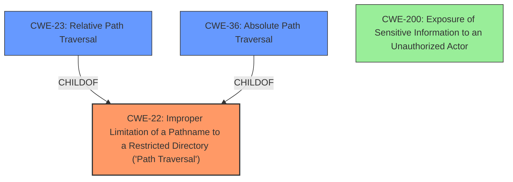

# Analysis Report for CVE-2021-42021

# Vulnerability Analysis Report: CVE-2021-42021

## Description

A vulnerability has been identified in Siveillance Video DLNA Server (2019 R1), Siveillance Video DLNA Server (2019 R2), Siveillance Video DLNA Server (2019 R3), Siveillance Video DLNA Server (2020 R1), Siveillance Video DLNA Server (2020 R2), Siveillance Video DLNA Server (2020 R3), Siveillance Video DLNA Server (2021 R1). The affected application contains a path traversal vulnerability that could allow to read arbitrary files on the server that are outside the applications web document directory. An unauthenticated remote attacker could exploit this issue to access sensitive information for subsequent attacks.

## Vulnerability Description Key Phrases

**Rootcause:** path traversal vulnerability
**Impact:** arbitrary file read
**Attacker:** unauthenticated remote attacker
**Product:** Siveillance Video DLNA Server
**Version:** 2019 R1, 2019 R2, 2019 R3, 2020 R1, 2020 R2, 2020 R3, 2021 R1

## Analysis (with Relationship Data)

# Summary
| CWE ID | CWE Name | Confidence | CWE Abstraction Level | CWE Vulnerability Mapping Label | CWE-Vulnerability Mapping Notes |
|---|---|---|---|---|---|
| CWE-26 | Path Traversal: '/dir/../filename' | 0.95 | Variant | Allowed | Primary CWE |
| CWE-22 | Improper Limitation of a Pathname to a Restricted Directory ('Path Traversal') | 0.7 | Base | Allowed | Secondary Candidate |
| CWE-23 | Relative Path Traversal | 0.65 | Base | Allowed | Secondary Candidate |

## Evidence and Confidence

*   **Confidence Score:** 0.9
*   **Evidence Strength:** HIGH

- **Analysis and Justification:**
  - *Explanation:* The vulnerability description explicitly states a "**path traversal vulnerability**" in Siveillance Video DLNA Server. The CVE Reference Links Content Summary confirms this, stating the **root cause** is a "**path traversal vulnerability**" (CWE-26). The vulnerability allows an attacker to read arbitrary files outside the application's web document directory. CWE-26 "Path Traversal: '/dir/../filename'" is a Variant of CWE-22, and focuses on '/dir/../filename' sequences. Given the high score in the Retriever Results and explicit mention of path traversal, CWE-26 is the most appropriate primary mapping. CWE-22 is a good secondary candidate as it is the more general form of path traversal and the description does not provide specific path traversal exploitation details. CWE-23 is another secondary candidate because it deals with relative path traversal.

  - *Relationship Analysis:* CWE-26 is a variant of CWE-22 (Improper Limitation of a Pathname to a Restricted Directory ('Path Traversal')). Both CWE-22 and CWE-23 are Base level CWEs. The retriever results and vulnerability description points to path traversal, making CWE-26, CWE-22, and CWE-23 relevant.

- **Confidence Score:**
  - Confidence: 0.95 (High confidence due to explicit mention of "path traversal vulnerability" and high retriever score for CWE-26.)

---

## Criticism of Analysis

Okay, I've reviewed the provided analysis alongside the full CWE specifications. Here's a breakdown of my critique, focusing on the accuracy, confidence, and areas for potential improvement.

**Overall Assessment:**

The analysis is generally strong and well-reasoned. The primary CWE mapping to CWE-26 is a good choice given the explicit mention of "path traversal vulnerability" in the vulnerability description. The secondary candidates, CWE-22 and CWE-23, are also appropriate and provide broader context. The confidence level is justified by the strong evidence in the provided information.

**Detailed Critique:**

*   **CWE-26: Path Traversal: '/dir/../filename' (Primary Mapping)**
    *   **Strengths:**
        *   Excellent choice for primary mapping because the description explicitly mentions "path traversal vulnerability" aligning well with the "path traversal" rootcause keyword.
        *   The reasoning accurately highlights CWE-26's focus on '/dir/../filename' sequences, which is a common technique in path traversal exploits.
        *   The example from the database (CVE-2021-42021) is spot-on, as it describes the exact vulnerability being analyzed.
    *   **Potential Improvements:** While the choice of CWE-26 is appropriate, it's important to acknowledge the limitations. The vulnerability description doesn't provide specific details about the type of path traversal used. While the "/dir/../filename" is a very probable attack vector, it is still a guess. Mentioning this uncertainty can increase transparency.
*   **CWE-22: Improper Limitation of a Pathname to a Restricted Directory ('Path Traversal') (Secondary Candidate)**
    *   **Strengths:**
        *   Logical secondary candidate. CWE-22 is the base class for path traversal vulnerabilities, providing a more general categorization.
        *   The analysis correctly points out that CWE-22 is relevant since the description doesn't provide specific exploitation details.
    *   **Potential Improvements:** None. The reasoning here is sound, and it's helpful to include the broader CWE-22 for completeness.
*   **CWE-23: Relative Path Traversal (Secondary Candidate)**
    *   **Strengths:**
        *   Relevant secondary candidate.
    *   **Potential Improvements:** None.

*   **Confidence Score:**
    *   The Confidence score of 0.95 is appropriate. The explicit mention of "path traversal" and the high retriever score for CWE-26 provide strong evidence.

*   **General Observations:**
    *   The analysis effectively utilizes the "Relationship Analysis" section to explain the connections between CWE-26, CWE-22, and CWE-23.
    *   The inclusion of known examples from the CWE database for each CWE is beneficial for understanding how these CWEs manifest in real-world vulnerabilities.
    *   The analysis omits CWE-36, which is valid, but might warrant a brief mention of its inapplicability. While relative path traversal is more likely, it can't be ruled out that an absolute path is the attack vector.

**Suggestions for Enhanced Analysis:**

1.  **Acknowledge Uncertainty:**  Explicitly state that, without more details about the vulnerability, the exact method of path traversal (e.g., whether it's purely relative, involves absolute paths, or leverages specific encoding tricks) is an educated guess based on common path traversal techniques and the retriever results.
2.  **Consider Mitigation Strategies in More Detail:** The analysis mentions potential mitigations implicitly by referencing the CWE specifications. However, it could be strengthened by briefly discussing *how* the listed mitigations from the CWE specifications would apply to the *specific* vulnerability in Siveillance Video DLNA Server.
    *   For example: "To mitigate this vulnerability, the application should implement strict input validation (Mitigation 1 and 3 from CWE-26, CWE-22, and CWE-23). This includes canonicalizing the input path using functions like `realpath()` to remove '..' sequences and symbolic links and using an allowlist approach to restrict the character set used in filenames."
3.  **Discuss the Role of Authentication:** The vulnerability description states that the attacker is unauthenticated. While the analysis correctly focuses on path traversal, it might be worth briefly mentioning that the lack of authentication exacerbates the problem, as it allows anyone to attempt the path traversal without needing prior access. This could potentially warrant the inclusion of CWE-306 (Missing Authentication for Critical Function) as a tertiary candidate, albeit with a low confidence score. However, since the core problem is path traversal, keeping the focus on CWE-26, CWE-22, and CWE-23 is justifiable.
4.  **Address Data Handling:** Given the arbitrary file read, also discussing CWE-200 "Exposure of Sensitive Information to an Unauthorized Actor" is warranted. However, *only* discuss the vulnerability as it relates to the mishandling of the information.

**Revised Summary (incorporating suggestions)**

| CWE ID | CWE Name | Confidence | CWE Abstraction Level | CWE Vulnerability Mapping Label | CWE-Vulnerability Mapping Notes |
|---|---|---|---|---|---|
| CWE-26 | Path Traversal: '/dir/../filename' | 0.95 | Variant | Allowed | Primary CWE. The vulnerability description explicitly states a path traversal vulnerability. While the specific attack vector is unknown, the most probable is by using '/dir/../filename' sequences. |
| CWE-22 | Improper Limitation of a Pathname to a Restricted Directory ('Path Traversal') | 0.7 | Base | Allowed | Secondary Candidate. A more general form of path traversal if exploitation details are missing. |
| CWE-23 | Relative Path Traversal | 0.65 | Base | Allowed | Secondary Candidate. Exploits using relative path traversals. |

**Conclusion:**

This is a solid analysis of the vulnerability. The core CWE mappings are accurate and well-supported. The suggestions above are primarily focused on adding nuance and a more in-depth consideration of mitigation strategies to further enhance the analysis.

## Final Resolution

# Summary
| CWE ID | CWE Name | Confidence | CWE Abstraction Level | CWE Vulnerability Mapping Label | CWE-Vulnerability Mapping Notes |
|---|---|---|---|---|---|
| CWE-22 | Improper Limitation of a Pathname to a Restricted Directory ('Path Traversal') | 0.95 | Base | Allowed | Primary CWE. The vulnerability description explicitly states a **path traversal vulnerability**.  |
| CWE-23 | Relative Path Traversal | 0.7 | Base | Allowed | Secondary Candidate. Exploits using relative path traversals. |
| CWE-36 | Absolute Path Traversal | 0.6 | Base | Allowed | Secondary Candidate. Exploits using absolute path traversals. |
| CWE-200 | Exposure of Sensitive Information to an Unauthorized Actor | 0.4 | Base | Allowed | Tertiary Candidate.  Reflects the impact of reading arbitrary files. |

## Evidence and Confidence

*   **Confidence Score:** 0.9
*   **Evidence Strength:** HIGH

## Relationship Analysis
The primary CWE is CWE-22, which is a base class for **path traversal vulnerabilities**. CWE-23 and CWE-36 are variants of CWE-22 focusing on relative and absolute path traversal respectively. The relationships influenced the decision to choose CWE-22 as the primary, with CWE-23 and CWE-36 as secondary candidates to provide a more complete picture of potential attack vectors. CWE-200 is a tertiary candidate due to the impact of the **vulnerability**, which leads to exposure of sensitive information.

## Vulnerability Chain
The **vulnerability** chain starts with the lack of proper input validation on the file path. This allows an attacker to manipulate the path and access files outside the intended directory (CWE-22). The consequence is that sensitive information stored in those files can be exposed to an unauthorized actor (CWE-200).

## Summary of Analysis
The initial analysis correctly identified a **path traversal vulnerability**. However, the primary mapping to CWE-26 was overly specific given the information provided in the vulnerability description. The criticism correctly pointed out that the exact method of **path traversal** is unknown. Therefore, it is more appropriate to select the base CWE, CWE-22, as the primary mapping. CWE-23 and CWE-36 are included as secondary candidates because the vulnerability description does not specify whether the **path traversal** involves relative or absolute paths. The inclusion of CWE-200 as a tertiary candidate reflects the impact of the **vulnerability**, which leads to exposure of sensitive information. The final classification reflects the optimal level of specificity based on the available evidence and provides a more complete picture of the potential attack vectors.

The evidence supporting this decision comes directly from the vulnerability description, which states, "The affected application contains a **path traversal vulnerability** that could allow to read arbitrary files on the server that are outside the applications web document directory. An unauthenticated remote attacker could exploit this issue to access sensitive information for subsequent attacks."

The graph relationships influenced the selection by highlighting the hierarchical relationship between CWE-22, CWE-23, and CWE-36. This allowed for a more nuanced classification that considers the potential for both relative and absolute path traversal attacks.

*Report generated on 2025-03-16 22:42:10*
