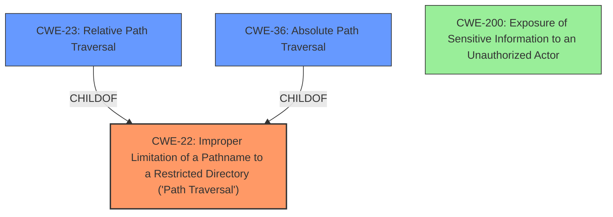

# Final Resolution for CVE-2021-42021

# Summary
| CWE ID | CWE Name | Confidence | CWE Abstraction Level | CWE Vulnerability Mapping Label | CWE-Vulnerability Mapping Notes |
|---|---|---|---|---|---|
| CWE-22 | Improper Limitation of a Pathname to a Restricted Directory ('Path Traversal') | 0.95 | Base | Allowed | Primary CWE. The vulnerability description explicitly states a **path traversal vulnerability**.  |
| CWE-23 | Relative Path Traversal | 0.7 | Base | Allowed | Secondary Candidate. Exploits using relative path traversals. |
| CWE-36 | Absolute Path Traversal | 0.6 | Base | Allowed | Secondary Candidate. Exploits using absolute path traversals. |
| CWE-200 | Exposure of Sensitive Information to an Unauthorized Actor | 0.4 | Base | Allowed | Tertiary Candidate.  Reflects the impact of reading arbitrary files. |

## Evidence and Confidence

*   **Confidence Score:** 0.9
*   **Evidence Strength:** HIGH

## Relationship Analysis
The primary CWE is CWE-22, which is a base class for **path traversal vulnerabilities**. CWE-23 and CWE-36 are variants of CWE-22 focusing on relative and absolute path traversal respectively. The relationships influenced the decision to choose CWE-22 as the primary, with CWE-23 and CWE-36 as secondary candidates to provide a more complete picture of potential attack vectors. CWE-200 is a tertiary candidate due to the impact of the **vulnerability**, which leads to exposure of sensitive information.

## Vulnerability Chain
The **vulnerability** chain starts with the lack of proper input validation on the file path. This allows an attacker to manipulate the path and access files outside the intended directory (CWE-22). The consequence is that sensitive information stored in those files can be exposed to an unauthorized actor (CWE-200).

## Summary of Analysis
The initial analysis correctly identified a **path traversal vulnerability**. However, the primary mapping to CWE-26 was overly specific given the information provided in the vulnerability description. The criticism correctly pointed out that the exact method of **path traversal** is unknown. Therefore, it is more appropriate to select the base CWE, CWE-22, as the primary mapping. CWE-23 and CWE-36 are included as secondary candidates because the vulnerability description does not specify whether the **path traversal** involves relative or absolute paths. The inclusion of CWE-200 as a tertiary candidate reflects the impact of the **vulnerability**, which leads to exposure of sensitive information. The final classification reflects the optimal level of specificity based on the available evidence and provides a more complete picture of the potential attack vectors.

The evidence supporting this decision comes directly from the vulnerability description, which states, "The affected application contains a **path traversal vulnerability** that could allow to read arbitrary files on the server that are outside the applications web document directory. An unauthenticated remote attacker could exploit this issue to access sensitive information for subsequent attacks."

The graph relationships influenced the selection by highlighting the hierarchical relationship between CWE-22, CWE-23, and CWE-36. This allowed for a more nuanced classification that considers the potential for both relative and absolute path traversal attacks.