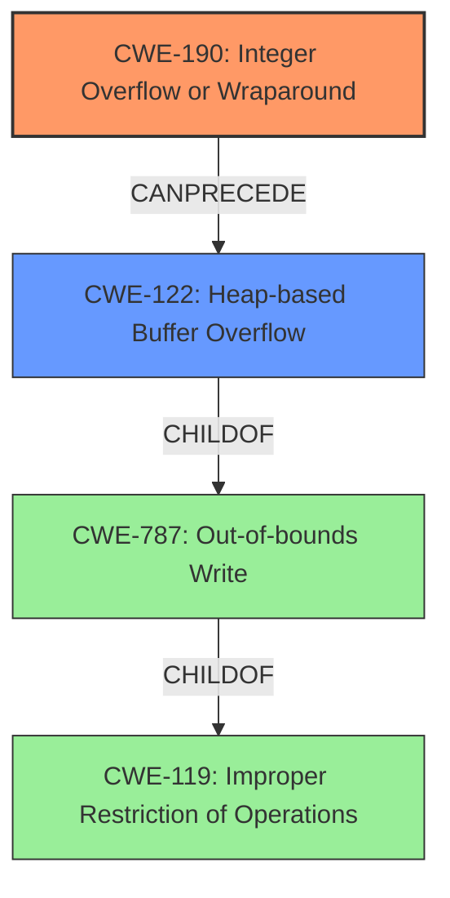

# Analysis Report for CVE-2021-4206

# Vulnerability Analysis Report: CVE-2021-4206

## Description

A flaw was found in the QXL display device emulation in QEMU. An integer overflow in the cursor_alloc() function can lead to the allocation of a small cursor object followed by a subsequent heap-based buffer overflow. This flaw allows a malicious privileged guest user to crash the QEMU process on the host or potentially execute arbitrary code within the context of the QEMU process.

## Vulnerability Description Key Phrases

**Rootcause:** integer overflow
**Weakness:** heap-based buffer overflow
**Impact:** ['crash the QEMU process on the host', 'potentially execute arbitrary code']
**Vector:** allocation of a small cursor object followed by a subsequent heap-based buffer overflow
**Attacker:** malicious privileged guest user
**Product:** QEMU
**Component:** QXL display device emulation

## Analysis (with Relationship Data)

# Summary
| CWE ID | CWE Name | Confidence | CWE Abstraction Level | CWE Vulnerability Mapping Label | CWE-Vulnerability Mapping Notes |
|---|---|---|---|---|---|
| CWE-190 | Integer Overflow or Wraparound | 0.95 | Base | Allowed | Primary CWE: The **integer overflow** is the root cause, leading to a heap overflow. |
| CWE-122 | Heap-based Buffer Overflow | 0.95 | Variant | Allowed | Secondary CWE: The integer overflow results in a small allocation, leading to a **heap-based buffer overflow** when the system writes past the allocated buffer. |

## Evidence and Confidence

*   **Confidence Score:** 0.95
*   **Evidence Strength:** HIGH

- **Analysis and Justification:**  
  - *Explanation:* "The vulnerability description explicitly states an **integer overflow** in the cursor_alloc() function leads to a **heap-based buffer overflow**. The CVE reference confirms the root cause is an integer overflow when calculating the buffer size for cursor allocation. This aligns with CWE-190 (Integer Overflow or Wraparound) as the primary weakness. The subsequent **heap-based buffer overflow** is a direct consequence of the undersized buffer, making CWE-122 (Heap-based Buffer Overflow) a relevant secondary weakness. Both CWEs are at appropriate abstraction levels (Base and Variant respectively) and their usage is ALLOWED according to MITRE mapping guidance. The attack involves setting large values for width and height, which triggers the overflow during the buffer size calculation."
  
  - *Relationship Analysis:* "CWE-190 is a Base level CWE, and CWE-122 is a Variant of CWE-119 (Improper Restriction of Operations within the Bounds of a Memory Buffer). CWE-190 **CanPrecede** CWE-787 (Out-of-bounds Write) and thus CWE-122, as the integer overflow leads to the out-of-bounds write. In this case, there's a clear sequence: Integer Overflow leading to Heap Overflow.

- **Confidence Score:**  
  - Confidence: 0.95 (High confidence due to clear technical description and CVE reference details.)

## Criticism of Analysis

Okay, here's a detailed review of the CWE analysis, incorporating the full CWE specifications you've provided.

**Overall Assessment:**

The analysis correctly identifies CWE-190 (Integer Overflow or Wraparound) and CWE-122 (Heap-based Buffer Overflow) as the primary and secondary weaknesses, respectively. The confidence level of 0.95 is justified given the clear evidence from the vulnerability description and the CVE reference. The explanation of the relationship between the two CWEs is also well-articulated.

**Detailed Critique:**

1.  **CWE-190 (Integer Overflow or Wraparound):**

    *   **Correct Identification:** The analysis correctly identifies CWE-190 as the *root cause*.  The description accurately reflects how the integer overflow leads to a calculation of an insufficient buffer size.
    *   **Abstraction Level:** The analysis notes that CWE-190 is a Base level CWE, which aligns with the mapping guidance ("*This CWE entry is at the Base level of abstraction, which is a preferred level of abstraction for mapping to the root causes of vulnerabilities.*").
    *   **Mitigations:**
        *   The analysis doesn't explicitly mention mitigations, but it could be enhanced by referencing the potential mitigations from the CWE specification.  Relevant mitigations for CWE-190 include:
            *   **Language Selection:** Using languages with automatic bounds checking.
            *   **Libraries/Frameworks:** Utilizing safe integer handling libraries (e.g., SafeInt).
            *   **Requirements:** Ensuring protocols are strictly defined to identify out-of-bounds behavior.
    *   **Relationships:** The analysis correctly identifies that CWE-190 can precede CWE-119 and, therefore, CWE-122.  The specification notes the importance of this relationship:"*[Relationship]** Integer overflows can be primary to buffer overflows when they cause less memory to be allocated than expected."
    *   **Suggested Alternatives:** The analysis does not consider CWE-191 (Integer Underflow). However, since the issue is that the value becomes *too large*, integer overflow is correct in this case.

2.  **CWE-122 (Heap-based Buffer Overflow):**

    *   **Correct Identification:** The analysis correctly identifies CWE-122 as the direct consequence of the integer overflow leading to a heap-based buffer overflow. The undersized allocation results in out-of-bounds writes.
    *   **Abstraction Level:** The analysis notes that CWE-122 is a Variant level CWE, which is appropriate for a secondary weakness.
    *   **Mitigations:**
        *   The analysis could benefit from explicitly mentioning the mitigations from the CWE specification.  Relevant mitigations for CWE-122 include:
            *   **Language Selection:** Using languages with automatic bounds checking.
            *   **Architecture and Design:** Employing abstraction libraries to handle risky APIs.
            *   **Operation, Build, and Compilation:** Using compiler-provided buffer overflow detection mechanisms (e.g., /GS flag in Visual Studio, FORTIFY\_SOURCE in GCC).
    *   **Relationships:** Correctly identified as a child of CWE-787, highlighting the nature of the vulnerability as an out-of-bounds write.
    *   **Observed Examples:** The report includes observed examples which are relevant and enhance understanding.

3.  **Consideration of Other CWEs from Retriever Results:**
    *   **CWE-1284 (Improper Validation of Specified Quantity in Input):** The analysis could briefly address why this CWE was not selected.  While an integer overflow occurred, the *root cause* was not a lack of validation *per se*, but a failure of the calculation.  If input validation *had* occurred, it would have been on the *already overflowed* (incorrect) buffer size.
    *   **CWE-787 (Out-of-bounds Write):** This CWE is a good option to consider, and the relationship between CWE-122 and CWE-787 could be noted in the report. However, CWE-122 is a more *specific* variant of CWE-787, hence the choice of CWE-122.
    *   **CWE-131 (Incorrect Calculation of Buffer Size):** This CWE would be an acceptable alternative, however, it's important to note that the underlying cause is still the Integer Overflow. Therefore, it is better to have CWE-190 followed by CWE-122.
    *   **CWE-197 (Numeric Truncation Error):** This is less applicable than CWE-190 as the core issue is exceeding the maximum value, not specifically the truncation of bits.
    *   **CWE-191 (Integer Underflow):** This is not applicable as the overflow leads to the number being a very large number in some cases, not an underflow.

4.  **CWE-119 (Improper Restriction of Operations within the Bounds of a Memory Buffer):**

    *   The analysis *implicitly* addresses CWE-119 by focusing on the more specific CWE-122 and CWE-190. However, it might be useful to *explicitly* state why CWE-119 was not chosen. The CWE specification notes that "CWE-119 is commonly misused in low-information vulnerability reports when lower-level CWEs could be used instead... Look at CWE-119's children and consider mapping to CWEs such as CWE-787: Out-of-bounds Write, CWE-125: Out-of-bounds Read, or others."  The analysis has correctly followed this guidance by choosing CWE-122, which is a child of CWE-787 (Out-of-bounds Write) and a more specific description of the vulnerability.

**Suggestions for Improvement:**

*   **Explicitly Address Alternative CWEs:** Briefly explain why other CWEs from the Retriever results (like CWE-1284, CWE-787, CWE-131) were considered but not selected, justifying the choice of CWE-190 and CWE-122.
*   **Incorporate Mitigations:** Add a section discussing potential mitigations for CWE-190 and CWE-122, drawing directly from the CWE specifications.  This strengthens the practical value of the analysis.
*   **Terminology:** While "heap-based buffer overflow" is commonly used, ensure precise language aligns with CWE definitions to avoid ambiguity, particularly when using "overflow" which has nuances described in the CWE specifications.
*   **Relationship to CWE-119:** Explicitly state why the more general CWE-119 was not selected in favor of more specific classifications.

By incorporating these suggestions, the analysis can be even more comprehensive and demonstrate a thorough understanding of the relevant CWE specifications and mapping guidance. The current analysis is already strong, but these additions will further solidify its value.

## Final Resolution

# Summary
| CWE ID | CWE Name | Confidence | CWE Abstraction Level | CWE Vulnerability Mapping Label | CWE-Vulnerability Mapping Notes |
|---|---|---|---|---|---|
| **CWE-190** | **Integer Overflow or Wraparound** | 0.95 | Base | Allowed | Primary CWE: The **integer overflow** is the root cause, leading to a heap overflow. |
| **CWE-122** | **Heap-based Buffer Overflow** | 0.95 | Variant | Allowed | Secondary CWE: The integer overflow results in a small allocation, leading to a **heap-based buffer overflow** when the system writes past the allocated buffer. |

## Evidence and Confidence

*   **Confidence Score:** 0.95
*   **Evidence Strength:** HIGH

## Relationship Analysis
The analysis correctly identifies CWE-190 as the **root cause**, which **CanPrecede** CWE-122. CWE-122 is a variant of CWE-787 (Out-of-bounds Write), which is a child of CWE-119 (Improper Restriction of Operations within the Bounds of a Memory Buffer). The hierarchical relationships highlight the flow from a general buffer issue (CWE-119) to a specific out-of-bounds write (CWE-787) that manifests as a heap overflow (CWE-122), driven by an initial integer overflow (CWE-190). Abstraction levels are appropriate, with CWE-190 at the Base level and CWE-122 at the Variant level, providing a detailed yet focused view of the vulnerability.

## Vulnerability Chain
The vulnerability chain starts with **CWE-190 (Integer Overflow or Wraparound)** in the cursor_alloc() function. This leads to an undersized buffer allocation on the heap. Subsequently, when data is written to this buffer, it overflows the allocated space, resulting in **CWE-122 (Heap-based Buffer Overflow)**. The root cause is the integer overflow, and the impact is the heap overflow, allowing a malicious guest user to crash the QEMU process or potentially execute arbitrary code. There are no missing links in the chain.

## Summary of Analysis
The initial analysis correctly identifies **CWE-190 (Integer Overflow or Wraparound)** as the primary **weakness** and **CWE-122 (Heap-based Buffer Overflow)** as the secondary **weakness**. This assessment is based on the vulnerability description: "An **integer overflow** in the cursor_alloc() function can lead to the allocation of a small cursor object followed by a subsequent **heap-based buffer overflow**." The graph relationships confirm that CWE-190 can precede CWE-122, and the abstraction levels are appropriate for identifying the root cause and its direct consequence. Alternative CWEs like CWE-1284 (Improper Validation of Specified Quantity in Input) were considered but deemed less relevant because the primary issue wasn't the lack of input validation but the integer overflow itself. The selected CWEs are at the optimal level of specificity, providing a clear and accurate representation of the vulnerability.

*Report generated on 2025-03-18 02:29:31*
