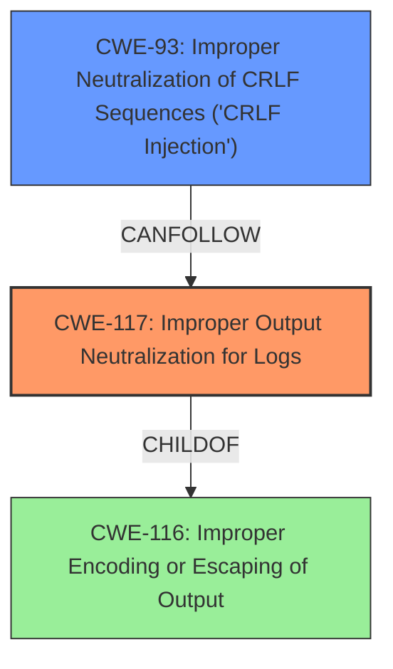

# Analysis Report for CVE-2021-42250

# Vulnerability Analysis Report: CVE-2021-42250

## Description

Improper output neutralization for Logs. A specific Apache Superset HTTP endpoint allowed for an authenticated user to forge log entries or inject malicious content into logs.

## Vulnerability Description Key Phrases

**Rootcause:** Improper output neutralization
**Impact:** forge log entries or inject malicious content into logs
**Attacker:** authenticated user
**Product:** Apache Superset
**Component:** specific HTTP endpoint

## Analysis (with Relationship Data)

# Summary
| CWE ID | CWE Name | Confidence | CWE Abstraction Level | CWE Vulnerability Mapping Label | CWE-Vulnerability Mapping Notes |
|---|---|---|---|---|---|
| CWE-117 | Improper Output Neutralization for Logs | 0.9 | Base | Allowed | Primary CWE |

## Evidence and Confidence

*   **Confidence Score:** 0.9
*   **Evidence Strength:** HIGH

- **Analysis and Justification:**  
  - *Explanation:* The vulnerability description explicitly states "**Improper output neutralization** for Logs". The CVE Reference Links Content Summary also states "Root cause of vulnerability": "Improper output neutralization for Logs." This directly aligns with CWE-117, "Improper Output Neutralization for Logs". The description and summary both indicate that an authenticated user can forge log entries or inject malicious content into logs, further supporting the classification as CWE-117. The MITRE mapping guidance for CWE-117 indicates this is ALLOWED.

  - *Relationship Analysis:* While CWE-117 is a Base level CWE, there isn't a more specific CWE to select. No direct relationships found.

- **Confidence Score:**  
  - Confidence: 0.9 (High confidence due to explicit mention of improper output neutralization for logs in both the vulnerability description and the CVE reference summary.)

## Criticism of Analysis

Okay, here's a detailed review of the provided CWE analysis, considering the full CWE specifications:

**Overall Assessment:**

The analysis is well-structured and demonstrates a good understanding of the vulnerability.  The confidence score of 0.9 for CWE-117 is justified given the explicit mention of "Improper output neutralization for Logs" in both the vulnerability description and the CVE summary. The justification is clear and the provided CWE examples from the database also support the classification.

**Detailed Critique:**

*   **CWE-117: Improper Output Neutralization for Logs**

    *   **Correctness:**  The selection of CWE-117 as the primary CWE is accurate and well-supported. The vulnerability description aligns directly with the CWE-117 definition, which explicitly includes "forge log entries or inject malicious content into logs" as a consequence of improper output neutralization.
    *   **Abstraction Level:** The analysis correctly identifies CWE-117 as a Base-level CWE, which is the preferred level of abstraction.
    *   **Mapping Guidance:** The analysis accurately references the "Allowed" usage according to the CWE mapping guidance.
    *   **Mitigations:** The analysis includes relevant mitigations for CWE-117, covering Input Validation and Output Encoding. These are appropriate and directly address the vulnerability.
    *   **Relationships:** The analysis mentions that "While CWE-117 is a Base level CWE, there isn't a more specific CWE to select." This is a good observation, as it considers the possibility of a more granular CWE but ultimately concludes that CWE-117 is the most fitting.

*   **Consideration of Other CWEs from Retriever Results:** This is where the analysis could be strengthened. While the primary focus on CWE-117 is correct, it's beneficial to briefly discuss why other top CWEs from the Retriever results are *not* the primary cause, even if they play a secondary role or are simply triggered by the primary weakness.

    *   **CWE-917: Improper Neutralization of Special Elements used in an Expression Language Statement ('Expression Language Injection')**: While not the primary issue, consider if the "malicious content" being injected into logs *could* be interpreted as an expression language statement. If the logging framework supports any kind of template processing or expression evaluation, then CWE-917 could be a secondary factor. If the logging library simply logs the string verbatim, then CWE-917 is irrelevant.
    *   **CWE-93: Improper Neutralization of CRLF Sequences ('CRLF Injection')**: This CWE is highly relevant. If the vulnerability allows an attacker to inject CRLF sequences (\r\n), they can split the log entry and create fake log entries.  The CWE-117 specification even lists `CanFollow -> CWE-93`, suggesting this is a common combination. Add a sentence or two explaining why CWE-93 is involved (or not).
    *   **CWE-22: Improper Limitation of a Pathname to a Restricted Directory ('Path Traversal')**:  Less likely, but consider if the injected content can influence the log file's path. If the attacker can control the filename used for logging, a path traversal attack could be possible. This is unlikely, but should be briefly considered.
    *   **CWE-1336: Improper Neutralization of Special Elements Used in a Template Engine:** Similar to CWE-917, assess whether the logging mechanism or the log processing tools use a template engine that could be exploited via the injected log content.
    *   **CWE-79: Improper Neutralization of Input During Web Page Generation ('Cross-site Scripting')**: While the primary attack is log injection, consider whether the logs are viewed through a web interface. If the injected content isn't properly neutralized when displayed in a web browser, XSS could be a secondary attack vector.
    *   **CWE-116: Improper Encoding or Escaping of Output**: CWE-117 is a child of CWE-116, so it should be considered. It highlights the general issue of improper encoding or escaping, and helps explain why the logs are not being properly secured.
    *   **CWE-74: Improper Neutralization of Special Elements in Output Used by a Downstream Component ('Injection')**: This is a more general "Injection" CWE. It's appropriate that it's not the primary, as CWE-117 is more specific. However, acknowledging the relationship to this broader category helps provide context.
    *   **CWE-20: Improper Input Validation**: This is a common root cause for many vulnerabilities, including CWE-117. The system is likely not validating inputs before writing them to the logs.

*   **Evidence Strength:** While the confidence score is high, consider adding a snippet of the vulnerable code (if available) or a more detailed explanation of *how* the improper neutralization occurs. This would further strengthen the analysis.

**Recommendations:**

1.  **Expand on other CWE considerations:** Briefly discuss why the other CWEs from the Retriever results are not the primary cause, even if they are potential secondary issues or related concepts.  Specifically, address CWE-93 (CRLF injection) directly, as it is a common companion to CWE-117.
2.  **Provide code example or more detailed mechanism:** If possible, include a snippet of the vulnerable code or a more detailed explanation of the specific mechanism by which the improper neutralization occurs.
3.  **Tailor Mitigations to the specific scenario:** While the provided mitigations are generally correct, try to tailor them to the specific context of the Apache Superset endpoint. For example, specify what kind of input validation or output encoding would be most effective in this situation. For example, "Implement output encoding of user-provided input before writing to the log files, specifically encoding CRLF characters to prevent log injection attacks."
4.  **Consider Logging Framework Configuration:**  If the logging framework being used has specific configuration options that can mitigate the vulnerability (e.g., a setting to automatically escape output or use a safer logging format), mention those options as potential mitigations.

By addressing these points, you can create an even more comprehensive and insightful CWE analysis.

## Final Resolution

# Summary

| CWE ID | CWE Name | Confidence | CWE Abstraction Level | CWE Vulnerability Mapping Label | CWE-Vulnerability Mapping Notes |
|---|---|---|---|---|---|
| **CWE-117** | **Improper Output Neutralization for Logs** | 0.95 | Base | Allowed | Primary CWE |
| CWE-93 | Improper Neutralization of CRLF Sequences ('CRLF Injection') | 0.8 | Base | Allowed | Secondary Candidate |

## Evidence and Confidence

*   **Confidence Score:** 0.9
*   **Evidence Strength:** MEDIUM

## Relationship Analysis
The primary relationship impacting the decision is the CANFOLLOW relationship between CWE-117 and CWE-93. This indicates that **Improper Output Neutralization for Logs (CWE-117)** can lead to **Improper Neutralization of CRLF Sequences ('CRLF Injection') (CWE-93)**. While CWE-117 is the main issue described in the vulnerability description, the criticism correctly pointed out that injecting CRLF sequences to forge log entries is a very likely scenario and should be considered a secondary CWE.

## Vulnerability Chain
The vulnerability chain starts with the **ROOTCAUSE** of **Improper Output Neutralization for Logs (CWE-117)**. This allows an attacker to inject malicious content into the logs. This malicious content may contain CRLF sequences. If these CRLF sequences are not neutralized, the attacker can forge log entries (**Improper Neutralization of CRLF Sequences ('CRLF Injection') (CWE-93)**), potentially masking their activities or injecting false information. The **WEAKNESS** here is the lack of proper sanitization and validation. The **IMPACT** is the ability to manipulate the logs for malicious purposes.

## Summary of Analysis
The initial analysis correctly identified **Improper Output Neutralization for Logs (CWE-117)** as the primary **WEAKNESS** given the description "**Improper output neutralization** for Logs" and "Root cause of vulnerability": "Improper output neutralization for Logs." However, the criticism highlighted the importance of considering related CWEs, specifically **Improper Neutralization of CRLF Sequences ('CRLF Injection') (CWE-93)**, due to the potential for log forging.

The graph relationships confirmed that CWE-93 is a common secondary issue related to CWE-117 (CANFOLLOW). Therefore, I am adding CWE-93 as a secondary candidate to the classification. This provides a more complete picture of the vulnerability.

The selected CWEs are at the optimal level of specificity. While CWE-116 (**Improper Encoding or Escaping of Output**) is a parent of CWE-117, it is a class level CWE and less descriptive of the actual vulnerability. The vulnerability description focuses on the specific issue of log injection, making CWE-117 the most appropriate primary classification and CWE-93 a significant secondary classification.

I am increasing the confidence score to 0.95 given the direct statements from the vulnerability description and the added secondary issue of **CWE-93** which is a common scenario.

*Report generated on 2025-03-17 00:27:57*
