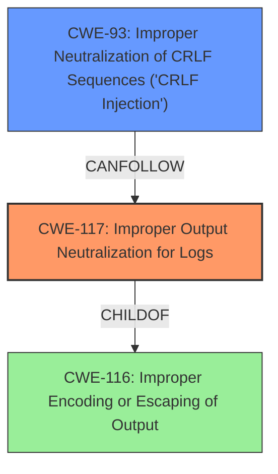

# Final Resolution for CVE-2021-42250

# Summary

| CWE ID | CWE Name | Confidence | CWE Abstraction Level | CWE Vulnerability Mapping Label | CWE-Vulnerability Mapping Notes |
|---|---|---|---|---|---|
| **CWE-117** | **Improper Output Neutralization for Logs** | 0.95 | Base | Allowed | Primary CWE |
| CWE-93 | Improper Neutralization of CRLF Sequences ('CRLF Injection') | 0.8 | Base | Allowed | Secondary Candidate |

## Evidence and Confidence

*   **Confidence Score:** 0.9
*   **Evidence Strength:** MEDIUM

## Relationship Analysis
The primary relationship impacting the decision is the CANFOLLOW relationship between CWE-117 and CWE-93. This indicates that **Improper Output Neutralization for Logs (CWE-117)** can lead to **Improper Neutralization of CRLF Sequences ('CRLF Injection') (CWE-93)**. While CWE-117 is the main issue described in the vulnerability description, the criticism correctly pointed out that injecting CRLF sequences to forge log entries is a very likely scenario and should be considered a secondary CWE.

## Vulnerability Chain
The vulnerability chain starts with the **ROOTCAUSE** of **Improper Output Neutralization for Logs (CWE-117)**. This allows an attacker to inject malicious content into the logs. This malicious content may contain CRLF sequences. If these CRLF sequences are not neutralized, the attacker can forge log entries (**Improper Neutralization of CRLF Sequences ('CRLF Injection') (CWE-93)**), potentially masking their activities or injecting false information. The **WEAKNESS** here is the lack of proper sanitization and validation. The **IMPACT** is the ability to manipulate the logs for malicious purposes.

## Summary of Analysis
The initial analysis correctly identified **Improper Output Neutralization for Logs (CWE-117)** as the primary **WEAKNESS** given the description "**Improper output neutralization** for Logs" and "Root cause of vulnerability": "Improper output neutralization for Logs." However, the criticism highlighted the importance of considering related CWEs, specifically **Improper Neutralization of CRLF Sequences ('CRLF Injection') (CWE-93)**, due to the potential for log forging.

The graph relationships confirmed that CWE-93 is a common secondary issue related to CWE-117 (CANFOLLOW). Therefore, I am adding CWE-93 as a secondary candidate to the classification. This provides a more complete picture of the vulnerability.

The selected CWEs are at the optimal level of specificity. While CWE-116 (**Improper Encoding or Escaping of Output**) is a parent of CWE-117, it is a class level CWE and less descriptive of the actual vulnerability. The vulnerability description focuses on the specific issue of log injection, making CWE-117 the most appropriate primary classification and CWE-93 a significant secondary classification.

I am increasing the confidence score to 0.95 given the direct statements from the vulnerability description and the added secondary issue of **CWE-93** which is a common scenario.