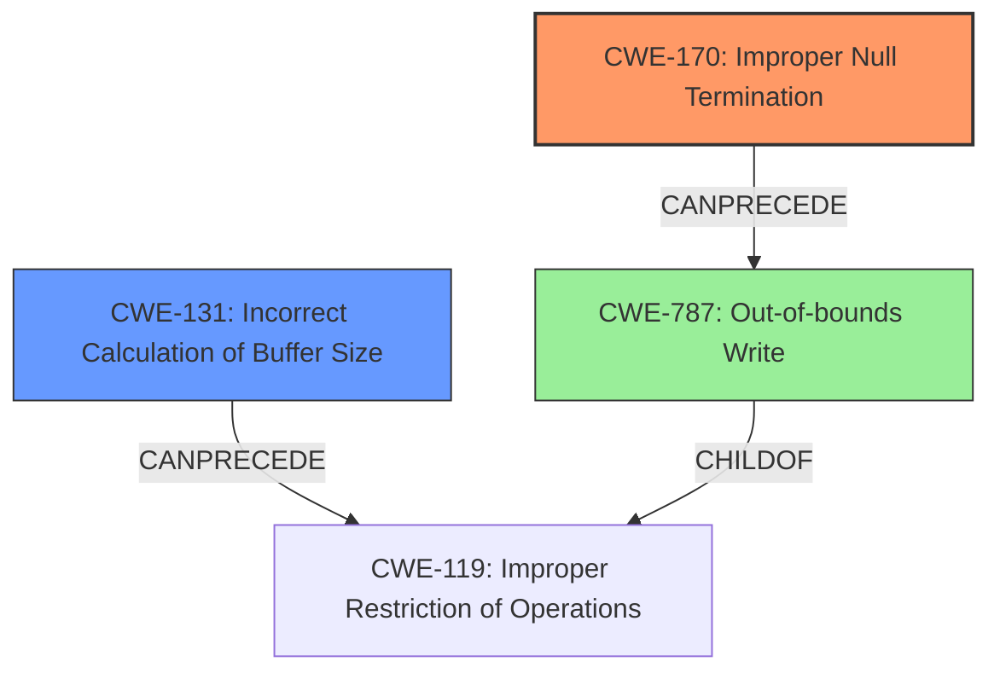

# Analysis Report for CVE-2021-42341

# Vulnerability Analysis Report: CVE-2021-42341

## Description

checkpath in OpenRC before 0.44.7 uses the direct output of strlen() to allocate strings, which does not account for the \0 byte at the end of the string. This results in memory corruption. CVE-2021-42341 was introduced in git commit 63db2d99e730547339d1bdd28e8437999c380cae, which was introduced as part of OpenRC 0.44.0 development.

## Vulnerability Description Key Phrases

**Rootcause:** uses the direct output of strlen() to allocate strings, which does not account for the \0 byte at the end of the string
**Impact:** memory corruption
**Product:** checkpath in OpenRC
**Version:** before 0.44.7

## Analysis (with Relationship Data)

# Summary
| CWE ID | CWE Name | Confidence | CWE Abstraction Level | CWE Vulnerability Mapping Label | CWE-Vulnerability Mapping Notes |
|---|---|---|---|---|---|
| CWE-170 | Improper Null Termination | 1.0 | Base | Allowed | Primary CWE |
| CWE-131 | Incorrect Calculation of Buffer Size | 0.7 | Base | Allowed | Secondary Candidate |

## Evidence and Confidence

*   **Confidence Score:** 0.95
*   **Evidence Strength:** HIGH

- **Analysis and Justification:**  
  - *Explanation:* The vulnerability description clearly states that the **rootcause** is that `checkpath` in OpenRC "**uses the direct output of strlen() to allocate strings, which does not account for the \0 byte at the end of the string**". The impact is memory corruption. This directly aligns with CWE-170 [Improper Null Termination], which describes cases where a string or array is not correctly terminated with a null character. The fix confirms this, as the memory allocation is corrected to account for the null terminator. The Retriever Results also support CWE-170 as the top candidate with a high score.
  - *Relationship Analysis:* CWE-170 [Improper Null Termination] is a Base level CWE, which is the preferred level of abstraction. It is a child of CWE-20 [Improper Input Validation], indicating a failure to properly handle input. It can also precede CWE-126 [Buffer Over-read] or CWE-120 [Buffer Overflow]. In this specific case, the issue leads to a heap buffer overflow due to the missing null terminator when allocating memory.

- **Confidence Score:**  
  - *Example:* Confidence: 1.0 (High confidence due to direct evidence from vulnerability description, CVE reference, and retriever results.)

---

- **Analysis and Justification:**  
  - *Explanation:* CWE-131 [Incorrect Calculation of Buffer Size] is a plausible secondary candidate. The description notes that the vulnerability **uses the direct output of strlen() to allocate strings, which does not account for the \0 byte at the end of the string**. This is related to calculating the buffer size but it's more specifically about the missing null termination. Therefore, I am not classifying it as primary, but it's relevant enough to consider.
  - *Relationship Analysis:* CWE-131 [Incorrect Calculation of Buffer Size] is a base level CWE. It can precede CWE-119 [Improper Restriction of Operations within the Bounds of a Memory Buffer] and is related to CWE-682 [Incorrect Calculation].

- **Confidence Score:**  
  - *Example:* Confidence: 0.7 (Medium Confidence. While relevant, the primary issue is the missing null termination, which is more accurately captured by CWE-170.)

## Criticism of Analysis

Okay, I've reviewed your analysis against the full CWE specifications you provided. Here's my critique:

**Overall Assessment:**

Your analysis is generally sound and well-reasoned. You've correctly identified CWE-170 as the primary weakness. The justification and confidence scores are appropriate. The inclusion of CWE-131 as a secondary candidate, while not the *most* direct fit, shows a good understanding of the nuances of the vulnerability.

**Specific Feedback:**

*   **CWE-170 [Improper Null Termination]:**
    *   **Good:**  You clearly articulate why this CWE is the best fit, directly linking it to the root cause description and the fix implemented. The confidence score of 1.0 is justified, given the evidence. The relationship analysis accurately reflects that CWE-170 is a base-level CWE related to CWE-20 and that can lead to buffer overflows, which is what happens in this case.
    *   **Suggestion:** None
*   **CWE-131 [Incorrect Calculation of Buffer Size]:**
    *   **Good:**  It's appropriate to consider CWE-131, as the allocation size is directly related to the issue. Your confidence score of 0.7 is also reasonable, as it is a contributing factor but not the core problem.
    *   **Suggestion:** Perhaps elaborate on *why* it's not the *primary* CWE.  You do this, but could be even clearer:  "While allocating a buffer of sufficient size to *hold* the data is necessary, in this case, the buffer size would have been sufficient *if the null byte were accounted for*. So, the core problem is missing the null byte, not necessarily the overall size calculation."
*   **CWE Examples:** The examples from the database are helpful in illustrating similar vulnerabilities.
*   **Mitigations:** You've included relevant potential mitigations.

**Retriever Results Critique:**
*   **CWE-170:** The retriever results strongly support the assessment, particularly the graph-based retriever.
*   **CWE-193:** While Off-by-one Error is ranked high, in this case, I think it is too general. The error is not simply that the length is "off by one", but more directly related to *the absence of a null terminator*.  So, I agree with not using this as a primary CWE.  If the allocation was `strlen(path) -1`, then CWE-193 would be more appropriate.
*   **CWE-122:** While a Heap-based Buffer Overflow is a *consequence* or *impact* of this vulnerability, it's not the best CWE to describe the root cause. CWE-787 would be more appropriate for the overflow impact.
*    **CWE-119:** The analysis correctly avoids mapping to CWE-119 since, as the CWE specification suggests, this CWE is commonly misused in low-information vulnerability reports.

**Potential Improvements/Alternative Considerations:**

*   **Chain vs. Composite:** You could consider whether this is a simple chain of CWEs:  `CWE-170 -> CWE-787`.  Since memory corruption was the direct impact, I think it is ok not to include CWE-787 in the primary or secondary list.

**Overall, your analysis is well-supported and demonstrates a strong understanding of CWE and vulnerability analysis.**

## Final Resolution

# Summary
| CWE ID | CWE Name | Confidence | CWE Abstraction Level | CWE Vulnerability Mapping Label | CWE-Vulnerability Mapping Notes |
|---|---|---|---|---|---|
| CWE-170 | Improper Null Termination | 1.0 | Base | Allowed | Primary CWE |
| CWE-131 | Incorrect Calculation of Buffer Size | 0.7 | Base | Allowed | Secondary Candidate |

## Evidence and Confidence

*   **Confidence Score:** 0.95
*   **Evidence Strength:** HIGH

## Relationship Analysis
The primary relationship influencing the decision is the direct correlation between the **rootcause** described in the vulnerability description and the definition of CWE-170 [Improper Null Termination]. The secondary relationship considered was CWE-131 [Incorrect Calculation of Buffer Size], acknowledging its relevance but ultimately classifying it as less specific. The relationship between CWE-170 and potential consequences like buffer overflows (CWE-787 [Out-of-bounds Write]) was also considered.

## Vulnerability Chain
The vulnerability chain starts with the **rootcause**, CWE-170 [Improper Null Termination], where `strlen()`'s output is directly used for memory allocation without considering the null terminator. This leads to an undersized buffer allocation. Consequently, writing beyond the allocated buffer results in memory corruption, potentially leading to CWE-787 [Out-of-bounds Write] (though this is only an impact).

## Summary of Analysis
The initial analysis correctly identified CWE-170 [Improper Null Termination] as the primary **weakness** and CWE-131 [Incorrect Calculation of Buffer Size] as a secondary candidate. The criticism reinforced this assessment, highlighting the importance of the null terminator issue.

The decision is heavily based on the provided evidence: "checkpath in OpenRC before 0.44.7 uses the direct output of strlen() to allocate strings, which does not account for the \0 byte at the end of the string. This results in memory corruption."

The graph relationships supported the decision, showing how CWE-170 can precede CWE-787.
The selected CWEs are at the optimal level of specificity because CWE-170 directly describes the **rootcause**, and CWE-131 provides additional context about the buffer size calculation. Choosing a higher-level CWE would obscure the specific nature of the vulnerability.

*Report generated on 2025-03-18 02:32:31*
