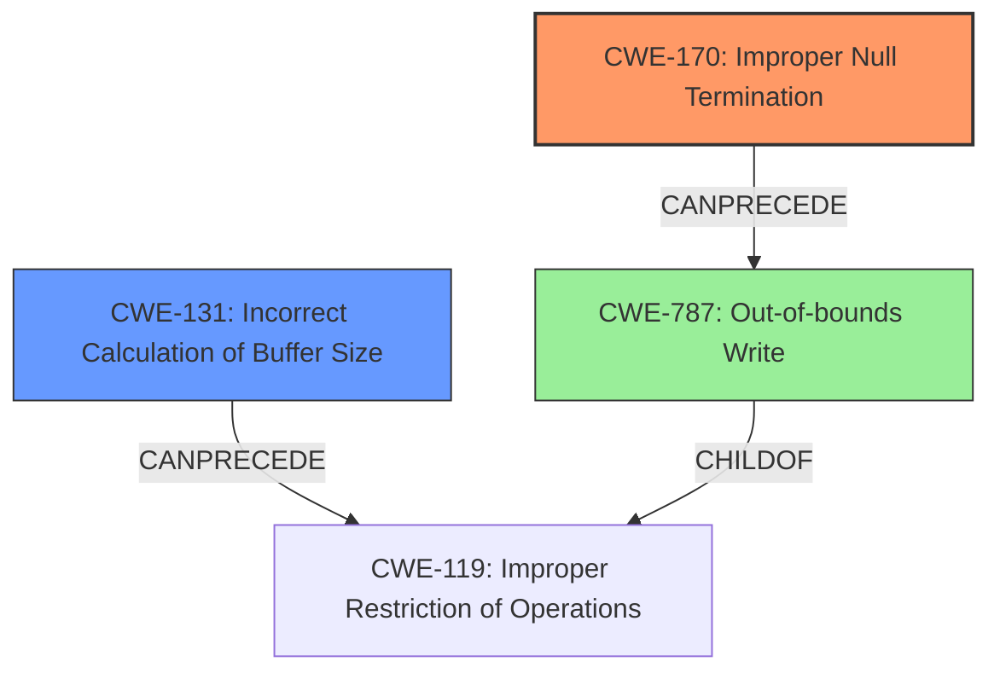

# Final Resolution for CVE-2021-42341

# Summary
| CWE ID | CWE Name | Confidence | CWE Abstraction Level | CWE Vulnerability Mapping Label | CWE-Vulnerability Mapping Notes |
|---|---|---|---|---|---|
| CWE-170 | Improper Null Termination | 1.0 | Base | Allowed | Primary CWE |
| CWE-131 | Incorrect Calculation of Buffer Size | 0.7 | Base | Allowed | Secondary Candidate |

## Evidence and Confidence

*   **Confidence Score:** 0.95
*   **Evidence Strength:** HIGH

## Relationship Analysis
The primary relationship influencing the decision is the direct correlation between the **rootcause** described in the vulnerability description and the definition of CWE-170 [Improper Null Termination]. The secondary relationship considered was CWE-131 [Incorrect Calculation of Buffer Size], acknowledging its relevance but ultimately classifying it as less specific. The relationship between CWE-170 and potential consequences like buffer overflows (CWE-787 [Out-of-bounds Write]) was also considered.

## Vulnerability Chain
The vulnerability chain starts with the **rootcause**, CWE-170 [Improper Null Termination], where `strlen()`'s output is directly used for memory allocation without considering the null terminator. This leads to an undersized buffer allocation. Consequently, writing beyond the allocated buffer results in memory corruption, potentially leading to CWE-787 [Out-of-bounds Write] (though this is only an impact).

## Summary of Analysis
The initial analysis correctly identified CWE-170 [Improper Null Termination] as the primary **weakness** and CWE-131 [Incorrect Calculation of Buffer Size] as a secondary candidate. The criticism reinforced this assessment, highlighting the importance of the null terminator issue.

The decision is heavily based on the provided evidence: "checkpath in OpenRC before 0.44.7 uses the direct output of strlen() to allocate strings, which does not account for the \0 byte at the end of the string. This results in memory corruption."

The graph relationships supported the decision, showing how CWE-170 can precede CWE-787.
The selected CWEs are at the optimal level of specificity because CWE-170 directly describes the **rootcause**, and CWE-131 provides additional context about the buffer size calculation. Choosing a higher-level CWE would obscure the specific nature of the vulnerability.