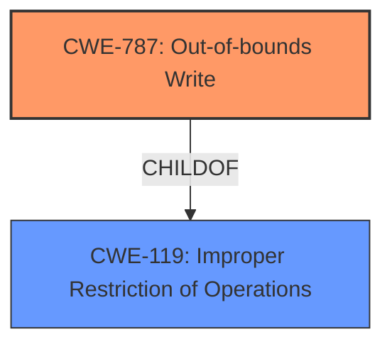

# Analysis Report for CVE-2021-42526

# Vulnerability Analysis Report: CVE-2021-42526

## Description

Adobe Premiere Elements 20210809.daily.2242976 (and earlier) is affected by a memory corruption vulnerability due to insecure handling of a malicious file, potentially resulting in arbitrary code execution in the context of the current user. User interaction is required to exploit this vulnerability.

## Vulnerability Description Key Phrases

**Rootcause:** insecure handling
**Weakness:** memory corruption
**Impact:** arbitrary code execution
**Vector:** malicious file
**Product:** Adobe Premiere Elements
**Version:** 20210809.daily.2242976 (and earlier)

## Analysis (with Relationship Data)

# Summary
| CWE ID | CWE Name | Confidence | CWE Abstraction Level | CWE Vulnerability Mapping Label | CWE-Vulnerability Mapping Notes |
|---|---|---|---|---|---|
| CWE-787 | Out-of-bounds Write | 0.9 | Base | Primary | Allowed |
| CWE-119 | Improper Restriction of Operations within the Bounds of a Memory Buffer | 0.6 | Class | Secondary | Discouraged |

## Evidence and Confidence

*   **Confidence Score:** 0.8
*   **Evidence Strength:** HIGH

- **Analysis and Justification:**
  - *Explanation:* The vulnerability description indicates a **memory corruption** due to **insecure handling** of a malicious file, leading to arbitrary code execution. The "CVE Reference Links Content Summary" explicitly states "Access of Memory Location After End of Buffer" and "**Out-of-bounds write**". This directly aligns with CWE-787 (Out-of-bounds Write), which describes the product writing data past the end or before the beginning of the intended buffer. This is a base-level CWE, and its usage is 'Allowed' according to MITRE. While CWE-119 (Improper Restriction of Operations within the Bounds of a Memory Buffer) is the primary CWE match for similar CVE descriptions, CWE-787 provides a more specific description of the **root cause** due to the out-of-bounds write.
  
  - *Relationship Analysis:* CWE-787 is a base-level CWE. It is related to CWE-119 as a child. CWE-787 can lead to other issues like privilege escalation or code execution (as the description also indicates)

- **Confidence Score:**
  - *Example:* Confidence: 0.9 (High evidence from technical description and CVE reference materials)

---

## Criticism of Analysis

Okay, here's a detailed review of the provided CWE analysis, incorporating the full CWE specifications:

**Overall Assessment:**

The analysis is generally strong.  The primary CWE selection of CWE-787 (Out-of-bounds Write) is well-justified, and the explanation clearly articulates why it's a more precise fit than the broader CWE-119. The confidence level is also appropriate given the information available.

**Specific Points and Suggestions:**

1.  **CWE-787: Out-of-bounds Write (Primary)**

    *   **Strengths:** The analysis correctly identifies "Access of Memory Location After End of Buffer" and "Out-of-bounds write" from the CVE reference links as direct indicators of CWE-787.  The explanation of how this leads to memory corruption and potentially arbitrary code execution is accurate. The analysis also clearly states that CWE-787 is a base-level CWE and its usage is 'Allowed' according to MITRE.

    *   **Suggestions:** While the explanation is good, you could strengthen the connection further by explicitly mentioning the conditions under which code execution becomes possible. For instance:
        *   "An out-of-bounds write can overwrite critical program data, function pointers, or return addresses on the stack, enabling an attacker to control the program's execution flow."
    *   **Mitigation Consideration:** Review the specified mitigations and consider those most applicable to this vulnerability.  For example, given that user interaction is required, more robust input validation (even though not the root cause) could help prevent malicious files from reaching the vulnerable code.

2.  **CWE-119: Improper Restriction of Operations within the Bounds of a Memory Buffer (Secondary)**

    *   **Strengths:** The analysis acknowledges that CWE-119 is a broader, class-level CWE that is often the initial match for buffer-related vulnerabilities.  It correctly states that mapping to a more specific CWE like CWE-787 is preferred.
    *   **Weaknesses:** The confidence level of 0.6 might be slightly too high. While CWE-119 is related, the analysis clearly favors CWE-787. A confidence level of 0.5 or even slightly lower might better reflect the supporting evidence.
    *   **Mapping Guidance Adherence:** The analysis *explicitly follows* the "Mapping Guidance" for CWE-119, which *discourages* its use when more specific CWEs are available.  This is excellent.
    *   **Mitigation Consideration:** The mitigations for CWE-119 are more general.  While language selection and using vetted libraries are always good practices, they are not directly targeted at this specific instance.

3.  **CWE Examples from Database:**

    *   The examples provided for CWE-119 are relevant and demonstrate the variety of ways in which improper memory boundary restrictions can manifest.
    *   Consider adding examples of CWE-787 as further validation.

4.  **Retriever Results:**

    *   The Retriever Results identify several other potential CWEs, which were deemed incorrect.
    *   CWE-788 Access of Memory Location After End of Buffer: While this might seem similar, CWE-787 is more accurate because it specifies a *write* is occurring.
    *   CWE-416 Use After Free: No evidence supports this, as the memory is being corrupted by a write, not by being freed prematurely.
    *   CWE-457 Use of Uninitialized Variable: Not directly related to the identified root cause of out-of-bounds writing.
    *   CWE-379 Creation of Temporary File in Directory with Insecure Permissions: Irrelevant given the description.
    *   CWE-190 Integer Overflow or Wraparound: No evidence supports an integer overflow leading to the vulnerability.
    *   CWE-125 Out-of-bounds Read: The main issue is related to writing data, not reading data.
    *   CWE-415 Double Free: No evidence supports this.
    *   CWE-843 Access of Resource Using Incompatible Type ('Type Confusion'): No evidence supports type confusion.
    *   CWE-122 Heap-based Buffer Overflow: This is very similar, if it could be determined the overflow happened on the heap this would be an alternative to CWE-787.

5.  **General Strengths:**

    *   **Clear Justification:** The reasoning behind the CWE selections is well-articulated and easy to follow.
    *   **Comprehensive Use of Information:** The analysis effectively utilizes the vulnerability description, CVE reference links, and retriever results.
    *   **Correct Abstraction Level:** The primary CWE is at the appropriate (Base) level of abstraction.
    *   **Adherence to CWE Guidance:** The analysis correctly interprets and applies the usage guidelines for CWE-119.

**Revised Summary Table (Incorporating Suggestions)**

| CWE ID | CWE Name | Confidence | CWE Abstraction Level | CWE Vulnerability Mapping Label | CWE-Vulnerability Mapping Notes |
|---|---|---|---|---|---|
| CWE-787 | Out-of-bounds Write | 0.9 | Base | Primary | Allowed |
| CWE-119 | Improper Restriction of Operations within the Bounds of a Memory Buffer | 0.5 | Class | Secondary | Discouraged |

**Conclusion:**

This is a well-reasoned and accurate CWE analysis. The primary CWE selection is excellent, and the explanation is clear and concise. The minor suggestions provided above are intended to further strengthen the analysis and demonstrate a deeper understanding of the vulnerability's potential impact and relevant mitigations.

## Final Resolution

# Summary
| CWE ID | CWE Name | Confidence | CWE Abstraction Level | CWE Vulnerability Mapping Label | CWE-Vulnerability Mapping Notes |
|---|---|---|---|---|---|
| CWE-787 | Out-of-bounds Write | 0.9 | Base | Primary | Allowed |
| CWE-119 | Improper Restriction of Operations within the Bounds of a Memory Buffer | 0.5 | Class | Secondary | Discouraged |

## Evidence and Confidence

*   **Confidence Score:** 0.9
*   **Evidence Strength:** HIGH

## Relationship Analysis
The primary relationship influencing the decision is the parent-child relationship between CWE-119 (Improper Restriction of Operations within the Bounds of a Memory Buffer) and CWE-787 (Out-of-bounds Write). CWE-787 is a child of CWE-119, providing a more specific description of the **weakness**. This specificity is crucial because the vulnerability description explicitly mentions an "out-of-bounds write," making CWE-787 a more accurate representation of the **root cause**. The chain relationships (CANPRECEDE, CANFOLLOW) are less relevant in this direct classification, but they highlight potential consequences and related vulnerabilities. The abstraction levels also guided the selection, favoring the Base level CWE-787 over the Class level CWE-119.

## Vulnerability Chain
The vulnerability chain starts with the **insecure handling** of a malicious file. This leads to an **out-of-bounds write** (CWE-787), which corrupts memory. The corrupted memory can then lead to arbitrary code execution. Therefore, the chain is: Malicious File -> **Out-of-bounds Write** (CWE-787) -> Memory Corruption -> Arbitrary Code Execution. The **root cause** is the **insecure handling** that allows the **out-of-bounds write** to occur.

## Summary of Analysis
The initial analysis and criticism both correctly identify CWE-787 (Out-of-bounds Write) as the primary CWE. The decision is strongly supported by the vulnerability description and the "CVE Reference Links Content Summary," which explicitly mentions "Access of Memory Location After End of Buffer" and "**Out-of-bounds write**". The relationship analysis, particularly the child-of relationship between CWE-787 and CWE-119, reinforces the choice of the more specific CWE-787. The abstraction level (Base) of CWE-787 further supports its selection. The decision to assign CWE-119 as secondary with a lower confidence is based on its broader nature and the MITRE guidance that discourages its use when more specific CWEs are available. The selection of CWE-787 is at the optimal level of specificity, accurately reflecting the technical details of the vulnerability.

*Report generated on 2025-03-18 02:33:10*
