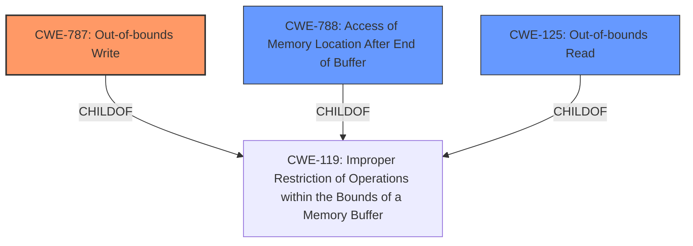

# Final Resolution for CVE-2021-42527

# Summary
| CWE ID | CWE Name | Confidence | CWE Abstraction Level | CWE Vulnerability Mapping Label | CWE-Vulnerability Mapping Notes |
|---|---|---|---|---|---|
| CWE-787 | Out-of-bounds Write | 0.85 | Base | Allowed | Primary CWE: An out-of-bounds write can cause a **memory corruption** vulnerability leading to arbitrary code execution. |
| CWE-788 | Access of Memory Location After End of Buffer | 0.70 | Base | Allowed | Secondary Candidate: The vulnerability involves accessing memory locations outside the intended buffer, which aligns with CWE-788. |
| CWE-125 | Out-of-bounds Read | 0.65 | Base | Allowed | Secondary Candidate: Out-of-bounds read can cause a **memory corruption** vulnerability. |

## Evidence and Confidence

*   **Confidence Score:** 0.85
*   **Evidence Strength:** HIGH

## Relationship Analysis
The decision was primarily influenced by the need to select the most specific and appropriate CWE, moving away from the discouraged CWE-788. The relationship analysis focused on the parent-child relationship between CWE-787, CWE-788 and CWE-119. CWE-787 (Out-of-bounds Write) is a child of CWE-119 (Improper Restriction of Operations within the Bounds of a Memory Buffer), and CWE-788 is a sibling of CWE-787 also a child of CWE-119. Given the high impact of arbitrary code execution, it is more likely that an out-of-bounds write (CWE-787) is the root cause, making it a more specific and suitable choice than the broader CWE-788. The selection of CWE-787 as the primary CWE reflects a move towards greater specificity, in line with the recommendations of the CWE specifications.

## Vulnerability Chain
The vulnerability chain starts with the **insecure handling of a malicious file** which leads to **memory corruption** (CWE-787), potentially resulting in arbitrary code execution. The missing link in this chain is input validation. A potential chain could involve CWE-20 (Improper Input Validation) leading to CWE-787 (Out-of-bounds Write). The malicious file might contain crafted data that isn't properly validated, resulting in the out-of-bounds write. The ultimate impact is arbitrary code execution in the context of the current user.

## Summary of Analysis
The analysis was refined based on the criticism to prioritize CWE-787 (Out-of-bounds Write) over CWE-788 (Access of Memory Location After End of Buffer), recognizing the "Discouraged" usage of CWE-788 and the higher likelihood of a write operation being the root cause of arbitrary code execution. The vulnerability description mentions **memory corruption** due to **insecure handling of a malicious file**, which aligns with the potential for an out-of-bounds write to overwrite critical data structures or code pointers.

The decision to select CWE-787 as the primary CWE is justified by the high-impact arbitrary code execution and the need to ensure a specific CWE is chosen over a discouraged one when applicable. The graph relationships influenced the final selection by highlighting the parent-child relationship between CWE-787 and CWE-119, and by considering CWE-788 as a related CWE.

Mitigation strategies include using memory-safe languages, employing robust input validation to prevent crafted files from triggering out-of-bounds writes, and utilizing compiler-based buffer overflow detection mechanisms. The selected CWEs are at the optimal level of specificity, with CWE-787 representing the root cause of the **memory corruption** and potential arbitrary code execution.