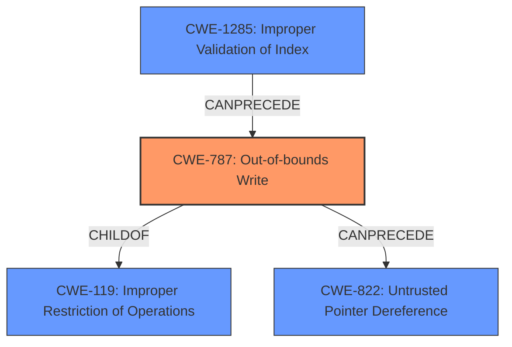

# Final Resolution for CVE-2021-42554

# Summary

| CWE ID | CWE Name | Confidence | CWE Abstraction Level | CWE Vulnerability Mapping Label | CWE-Vulnerability Mapping Notes |
|---|---|---|---|---|---|
| **CWE-787** | **Out-of-bounds Write** | 1.0 | Base | Primary | Allowed |
| CWE-1285 | Improper Validation of Specified Index, Position, or Offset in Input | 0.6 | Base | Secondary Candidate | Allowed. Contributes to root cause. |
| CWE-822 | Untrusted Pointer Dereference | 0.4 | Base | Secondary Candidate | Allowed. Potential consequence of CWE-787 if specific pointers within SMRAM are overwritten. |

## Evidence and Confidence

*   **Confidence Score:** 0.8
*   **Evidence Strength:** MEDIUM

## Relationship Analysis
The primary CWE is **CWE-787 (Out-of-bounds Write)**, which is a base-level CWE and a child of the class-level CWE **CWE-119 (Improper Restriction of Operations within the Bounds of a Memory Buffer)**. The selection of **CWE-787** is more specific and appropriate given the explicit mention of out-of-bounds write in the CVE summary.

**CWE-1285** can precede **CWE-787** if the incorrect index validation is the source of the out-of-bounds write.

**CWE-822 (Untrusted Pointer Dereference)** is a potential consequence of **CWE-787**, where the out-of-bounds write corrupts a pointer, leading to its dereference.

## Vulnerability Chain
The vulnerability chain starts with a potential improper validation of an index or offset (**CWE-1285**), leading to an out-of-bounds write (**CWE-787**) in SMRAM. This write can then potentially overwrite a pointer with attacker-controlled data, leading to an untrusted pointer dereference (**CWE-822**).

The sequence: **CWE-1285** (Improper validation, if it exists) -> **CWE-787** (Out-of-bounds write) -> **CWE-822** (Untrusted Pointer Dereference, potentially).

Missing links: The presence of CWE-1285 is not explicitly stated, but it's a common cause of CWE-787. The existence of a pointer to overwrite is also an assumption for **CWE-822**.

## Summary of Analysis
The initial analysis correctly identified **CWE-787 (Out-of-bounds Write)** as the primary weakness. The criticism highlighted the speculative nature of **CWE-822 (Untrusted Pointer Dereference)**, which is valid.

The analysis is based on the vulnerability description: "An SMM memory corruption vulnerability in FvbServicesRuntimeDxe allows a possible attacker to write fixed or predictable data to SMRAM." The CVE Reference Links Content Summary also mentions an "**Out-of-bounds Write**" due to "**improper bounds checking**."

The graph relationships influenced the selection by highlighting that **CWE-787** is a specific type of memory corruption (**CWE-119**) and can lead to further issues like **CWE-822**. The addition of **CWE-1285** as a potential cause adds to the chain.

The selected CWEs are at the optimal level of specificity. **CWE-787** directly describes the out-of-bounds write, and **CWE-822** captures a potential consequence if a pointer is overwritten. **CWE-1285** is a plausible root cause, contributing to the **CWE-787**.

The confidence score is slightly decreased to 0.8 due to the speculative nature of the secondary CWEs.

I am including **CWE-1285 (Improper Validation of Specified Index, Position, or Offset in Input)** with a confidence of 0.6 as a secondary candidate. It is a base-level CWE. The "improper bounds checking" mentioned in the CVE summary suggests that the index or offset used for writing to SMRAM might not be properly validated. This could directly lead to the out-of-bounds write (**CWE-787**).

I am decreasing the confidence of **CWE-822** to 0.4 due to the speculative nature of the assessment.