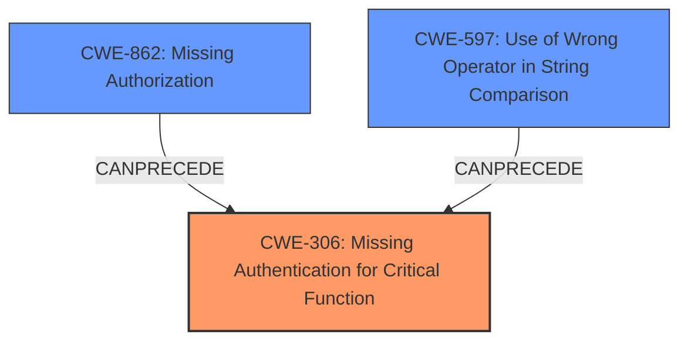

# Analysis Report for CVE-2021-42557

# Vulnerability Analysis Report: CVE-2021-42557

## Description

In Jeedom through 4.1.19, a bug allows a remote attacker to bypass API access and retrieve users credentials.

## Vulnerability Description Key Phrases

**Weakness:** bug
**Impact:** bypass API access and retrieve users credentials
**Attacker:** remote attacker
**Product:** Jeedom
**Version:** through 4.1.19

## Analysis (with Relationship Data)

# Summary
| CWE ID | CWE Name | Confidence | CWE Abstraction Level | CWE Vulnerability Mapping Label | CWE-Vulnerability Mapping Notes |
|---|---|---|---|---|---|
| CWE-306 | Missing Authentication for Critical Function | 0.9 | Base | Primary | Allowed |
| CWE-597 | Use of Wrong Operator in String Comparison | 0.7 | Variant | Secondary | Allowed |
| CWE-200 | Exposure of Sensitive Information to an Unauthorized Actor | 0.5 | Class | Secondary | Discouraged |

## Evidence and Confidence

*   **Confidence Score:** 0.8
*   **Evidence Strength:** HIGH

- **Analysis and Justification:**
  - *Explanation:* "The vulnerability description indicates that a **bug** allows a remote attacker to bypass API access and retrieve user credentials in Jeedom through 4.1.19. The CVE reference summary highlights the root cause as a **type juggling issue** due to the use of a loose comparison (`==`) instead of a strict comparison (`===`) in the `jeedom::apiAccess` function. This allows an attacker to bypass authentication by providing an integer `0` as the API key, leading to unauthorized API access and the retrieval of sensitive information, including user credentials. The primary weakness is the lack of proper authentication for a critical function, aligning with CWE-306 (Missing Authentication for Critical Function). The use of a loose comparison operator in string comparison, is also a contributing factor, aligning with CWE-597."

  - *Relationship Analysis:* "CWE-306 is a Base level CWE that directly addresses the absence of authentication. CWE-597 is a variant that explains the specific type of **bug**, namely, a loose comparison operator, which is the root cause of the authentication bypass. CWE-200 is a Class that highlights the impact of the vulnerability. The attacker can retrieve users credentials."

- **Confidence Score:**
  - Confidence: 0.9 (High evidence from technical description and CVE reference materials supporting CWE-306)
  - Confidence: 0.7 (Supporting evidence from technical description and CVE reference materials supporting CWE-597)
  - Confidence: 0.5 (Supporting evidence from technical description and CVE reference materials supporting CWE-200)

---

## Criticism of Analysis

Okay, I've reviewed the provided analysis, including the full CWE specifications. Here's my critique:

**Overall Assessment:**

The analysis is generally sound, but some improvements can be made to the CWE selections and the confidence scores. The primary CWE, CWE-306, is appropriate. The choice of CWE-597 as a secondary CWE is also correct. However, the inclusion of CWE-200 is questionable, given its discouraged usage and better alternatives.

**Detailed Review:**

1.  **CWE-306: Missing Authentication for Critical Function**

    *   **Assessment:** Correct and well-justified.  The description of the vulnerability clearly indicates a bypass of authentication for a critical API function.
    *   **Confidence:** 0.9 is a good confidence score here, given the direct evidence from the vulnerability description and CVE details.
    *   **CWE Specification Alignment:** The vulnerability aligns well with the description and observed examples of CWE-306.  The mitigations for CWE-306 are also relevant (e.g., centralized authentication, avoiding custom authentication routines).
    *   **Suggested Improvement:**  None.
2.  **CWE-597: Use of Wrong Operator in String Comparison**

    *   **Assessment:** Correct and relevant as a contributing factor. The description explicitly mentions the use of `==` instead of `===`, leading to type juggling.
    *   **Confidence:** 0.7 is reasonable. While it's a direct cause, it's a *component* of the larger authentication bypass.
    *   **CWE Specification Alignment:**  The description perfectly matches the CWE-597 description. The suggested mitigation (using strict comparison) is the recommended fix for this specific issue.  The example of CVE-2021-42557 also appears to be the same CVE.
    *   **Suggested Improvement:** None.
3.  **CWE-200: Exposure of Sensitive Information to an Unauthorized Actor**

    *   **Assessment:** Questionable. As the CWE specifications state, CWE-200 is often misused as a catch-all for loss of confidentiality. The core issue is *how* the information was exposed.  In this case, the primary weakness is the *bypass* of authentication that *led* to the exposure. Because the attacker can execute arbitrary commands in the web server, this is a possible attack vector that is not directly related to information handling, which is what CWE-200's mapping guidance warns against.
    *   **Confidence:** 0.5 is appropriate, given the weaker connection and the recommended usage of other CWEs.
    *   **CWE Specification Alignment:** The specification clearly discourages using CWE-200 directly and suggests looking into "improper authorization (CWE-285), insecure permissions (CWE-732), improper authentication (CWE-287), etc."
    *   **Suggested Improvement:**  Consider replacing CWE-200 with CWE-862 *Missing Authorization* OR CWE-863 *Incorrect Authorization*. In this case, because the type juggling effectively *bypasses* the authentication routine, leading to *no* authorization check being done for the API call, CWE-862 is a more appropriate choice. If you want to keep a CWE related to the storage of credentials and the plaintext storage of these credentials, consider using CWE-256 *Plaintext Storage of a Password*.
    *   **Revised Confidence:** If using CWE-862, set the confidence to 0.6-0.7 since it's a direct consequence of the bypass. If using CWE-256, set the confidence to 0.5, since the analysis provided doesn't specify how the credentials are saved, but that they are disclosed once the API is bypassed.

**Additional Observations and Suggestions:**

*   **CWE Prioritization:**  The order of CWEs reflects their importance. CWE-306 *must* be first.  If CWE-200 is replaced with CWE-862, then CWE-862 should be second, as it represents the immediate failure following the type juggling. CWE-597 should then be third, as it's the *cause* of the failed authentication.
*   **Exploitability:** The "Remote Command Execution" impact should be strongly emphasized in the analysis. This makes the vulnerability much more critical than simply retrieving credentials.
*   **Automated Analysis:**  It is important to keep in mind that automated analysis tools may find CWEs that are related, but not perfectly matched. In these scenarios, manual validation of the suggested CWEs is needed.

**Revised Summary Table (with suggested changes):**

| CWE ID  | CWE Name                                        | Confidence | CWE Abstraction Level | CWE Vulnerability Mapping Label | CWE-Vulnerability Mapping Notes |
| :------- | :---------------------------------------------- | :--------- | :---------------------- | :------------------------------ | :------------------------------ |
| CWE-306  | Missing Authentication for Critical Function   | 0.9       | Base                    | Primary                         | Allowed                         |
| CWE-862  | Missing Authorization                          | 0.7       | Class                    | Secondary                       | Allowed-with-Review             |
| CWE-597  | Use of Wrong Operator in String Comparison    | 0.7       | Variant                 | Secondary                       | Allowed                         |

OR

| CWE ID  | CWE Name                                        | Confidence | CWE Abstraction Level | CWE Vulnerability Mapping Label | CWE-Vulnerability Mapping Notes |
| :------- | :---------------------------------------------- | :--------- | :---------------------- | :------------------------------ | :------------------------------ |
| CWE-306  | Missing Authentication for Critical Function   | 0.9       | Base                    | Primary                         | Allowed                         |
| CWE-597  | Use of Wrong Operator in String Comparison    | 0.7       | Variant                 | Secondary                       | Allowed                         |
| CWE-256  | Plaintext Storage of a Password   | 0.5       | Base                    | Secondary                       | Allowed             |

By implementing these suggested improvements, the analysis will be more precise and aligned with the CWE's intended usage and mapping guidance. Remember to review all changes against the CWE specifications to ensure accuracy.

## Final Resolution

# Summary
| CWE ID | CWE Name | Confidence | CWE Abstraction Level | CWE Vulnerability Mapping Label | CWE-Vulnerability Mapping Notes |
|---|---|---|---|---|---|
| CWE-306 | Missing Authentication for Critical Function | 0.9 | Base | Primary | Allowed |
| CWE-862 | Missing Authorization | 0.7 | Class | Secondary | Allowed-with-Review |
| CWE-597 | Use of Wrong Operator in String Comparison | 0.7 | Variant | Secondary | Allowed |

## Evidence and Confidence

*   **Confidence Score:** 0.8
*   **Evidence Strength:** HIGH

## Relationship Analysis
The primary weakness is **CWE-306 (Missing Authentication for Critical Function)**, which is a Base level CWE and directly addresses the core issue of absent authentication. **CWE-597 (Use of Wrong Operator in String Comparison)** is a Variant level CWE that explains the specific mechanism by which authentication is bypassed (type juggling via loose comparison). **CWE-862 (Missing Authorization)** is a Class level CWE that accurately describes the immediate consequence of the authentication bypass, which is the absence of proper authorization checks.

## Vulnerability Chain
The vulnerability chain starts with **CWE-597 (Use of Wrong Operator in String Comparison)**, which allows an attacker to bypass authentication (**CWE-306 (Missing Authentication for Critical Function)**). This leads to **CWE-862 (Missing Authorization)**, because after the authentication bypass there is no authorization that occurs, resulting in unauthorized access to sensitive user credentials. The final impact is the retrieval of these credentials, leading to a loss of confidentiality.

## Summary of Analysis
The initial analysis correctly identified **CWE-306 (Missing Authentication for Critical Function)** and **CWE-597 (Use of Wrong Operator in String Comparison)**. However, the inclusion of **CWE-200 (Exposure of Sensitive Information to an Unauthorized Actor)** was questionable because it's a high-level impact rather than a root cause.

The criticism suggested replacing **CWE-200 (Exposure of Sensitive Information to an Unauthorized Actor)** with **CWE-862 (Missing Authorization)**, which is a more accurate representation of the authorization failure that occurs after the authentication bypass. This is based on the evidence that the type juggling effectively bypasses the authentication routine, leading to *no* authorization check being done for the API call.

The graph relationships support this decision, as **CWE-597 (Use of Wrong Operator in String Comparison)** directly precedes **CWE-306 (Missing Authentication for Critical Function)**, which in turn leads to **CWE-862 (Missing Authorization)**.

The selected CWEs are at the optimal level of specificity. **CWE-306 (Missing Authentication for Critical Function)** is a Base level CWE that directly addresses the core issue. **CWE-597 (Use of Wrong Operator in String Comparison)** is a Variant level CWE that explains the specific mechanism of the bypass. **CWE-862 (Missing Authorization)** is a Class level CWE that represents the immediate consequence of the failed authentication.

The vulnerability description states that "a **bug** allows a remote attacker to bypass API access and retrieve users credentials." This directly supports the selection of **CWE-306 (Missing Authentication for Critical Function)** and **CWE-862 (Missing Authorization)**. The CVE reference summary highlights the root cause as a "**type juggling issue** due to the use of a loose comparison (`==`) instead of a strict comparison (`===`) in the `jeedom::apiAccess` function," which directly supports the selection of **CWE-597 (Use of Wrong Operator in String Comparison)**.

*Report generated on 2025-03-17 01:07:15*
