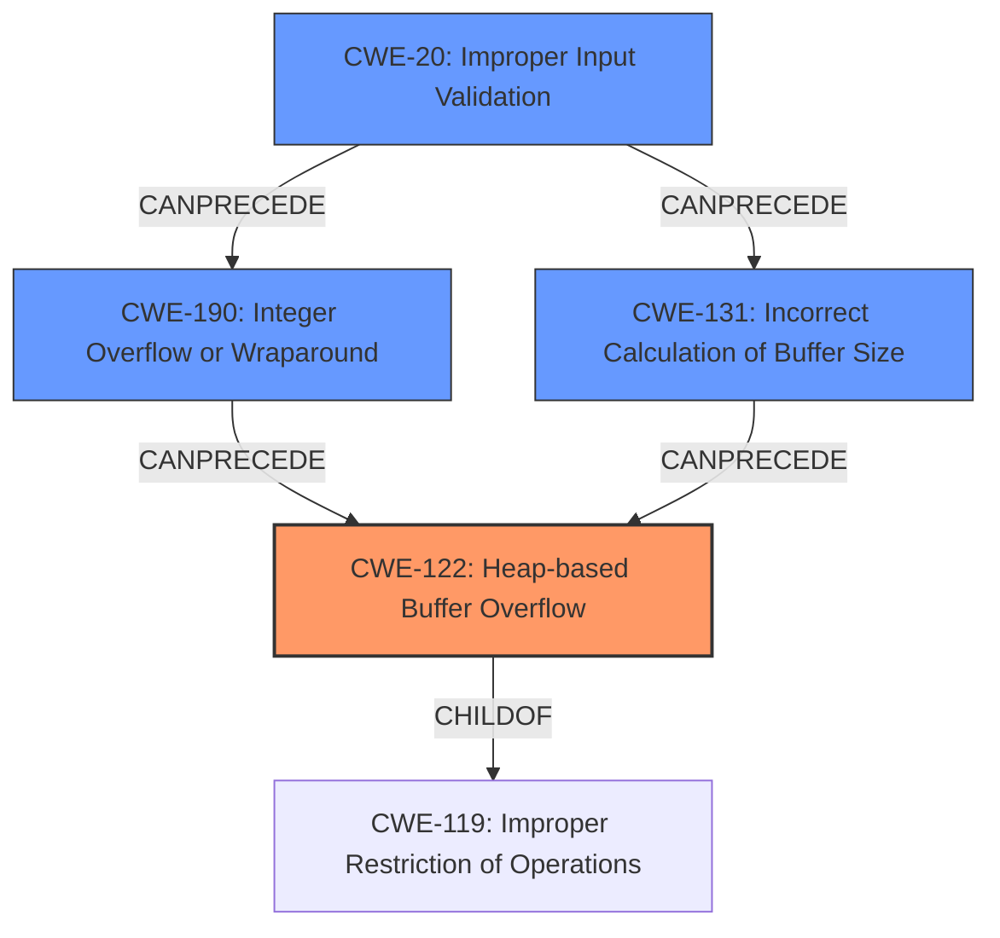

# Final Resolution for CVE-2021-42585

# Summary
| CWE ID  | CWE Name                    | Confidence | CWE Abstraction Level | CWE Vulnerability Mapping Label | CWE-Vulnerability Mapping Notes |
|---------|-----------------------------|------------|-----------------------|---------------------------------|-----------------------------------|
| CWE-122 | Heap-based Buffer Overflow  | 0.95       | Variant               | Allowed                         | Primary CWE                       |
| CWE-190 | Integer Overflow or Wraparound | 0.60       | Base                 | Allowed                         | Secondary Candidate               |
| CWE-131 | Incorrect Calculation of Buffer Size | 0.50       | Base                 | Allowed                         | Secondary Candidate               |
| CWE-20 | Improper Input Validation | 0.30       | Class                 | Discouraged                         | Chain Mapping                     |

## Evidence and Confidence

*   **Confidence Score:** 0.90
*   **Evidence Strength:** HIGH

## Relationship Analysis
The primary CWE is CWE-122 (**CWE-122: Heap-based Buffer Overflow**), a variant of CWE-119 (**CWE-119: Improper Restriction of Operations within the Bounds of a Memory Buffer**). The secondary candidates, CWE-190 (**CWE-190: Integer Overflow or Wraparound**) and CWE-131 (**CWE-131: Incorrect Calculation of Buffer Size**), can precede CWE-122, contributing to the vulnerability chain. CWE-20 (**CWE-20: Improper Input Validation**) is considered as an initial entry point in the chain, potentially leading to CWE-190 or CWE-131. The abstraction levels influenced the selection by focusing on specific weaknesses (Variant and Base) over broader categories (Class).

## Vulnerability Chain
The chain of weaknesses is as follows:
1.  **CWE-20: Improper Input Validation**: A crafted DWG file injects a large size.
2.  **CWE-190: Integer Overflow or Wraparound**: The large size triggers an integer overflow during buffer size calculation.
3.  **CWE-131: Incorrect Calculation of Buffer Size**: The integer overflow results in a smaller-than-expected buffer allocation.
4.  **CWE-122: Heap-based Buffer Overflow**: When data is written to the undersized buffer using `memcpy`, a heap overflow occurs.

This chain maps the sequence from the initial flaw (improper input validation) to the final impact (heap buffer overflow).

## Summary of Analysis
The initial analysis correctly identified CWE-122 as the primary weakness due to the explicit mention of a "heap buffer overflow" in the vulnerability description. The choice of CWE-122 is strongly supported by the evidence: "The vulnerability description explicitly states '**heap buffer overflow**' in `copy_compressed_bytes`... The CVE Reference Links Content Summary confirms this, stating 'The primary vulnerability is a heap buffer overflow, where the `memcpy` function writes data past the allocated buffer.'"
The secondary candidates, CWE-190 and CWE-131, are plausible contributing factors because the description also indicates "The overflow occurs due to an incorrect calculation of buffer size when decompressing data."
CWE-20 was added to represent the start of the vulnerability chain, as the crafted DWG file and its potentially malicious inputs leads to an integer overflow and incorrect buffer size calculation.

The graph relationships influenced the final selection by emphasizing the chain of events, starting from input validation to the ultimate heap overflow. The selected CWEs are at the optimal level of specificity, providing a clear and accurate representation of the vulnerability.