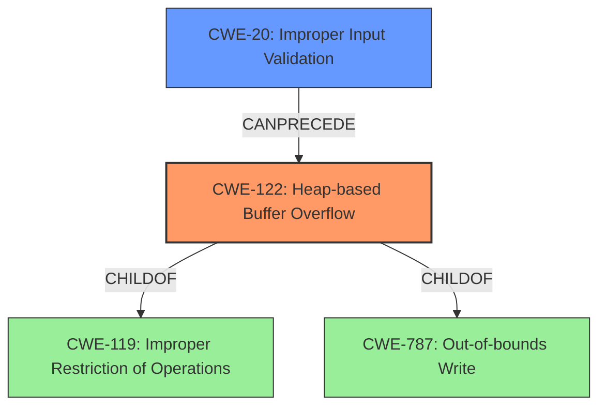

# Analysis Report for CVE-2021-42586

# Vulnerability Analysis Report: CVE-2021-42586

## Description

A heap buffer overflow was discovered in copy_bytes in decode_r2007.c in dwgread before 0.12.4 via a crafted dwg file.

## Vulnerability Description Key Phrases

**Rootcause:** heap buffer overflow
**Vector:** crafted dwg file
**Product:** dwgread
**Version:** before 0.12.4
**Component:** copy_bytes in decode_r2007.c

## Analysis (with Relationship Data)

# Summary
| CWE ID | CWE Name | Confidence | CWE Abstraction Level | CWE Vulnerability Mapping Label | CWE-Vulnerability Mapping Notes |
|---|---|---|---|---|---|
| CWE-122 | Heap-based Buffer Overflow | 0.95 | Variant | Primary | Allowed |
| CWE-787 | Out-of-bounds Write | 0.6 | Base | Secondary | Allowed |

## Evidence and Confidence

*   **Confidence Score:** 0.9
*   **Evidence Strength:** HIGH

- **Analysis and Justification:**  
  - *Explanation:* The vulnerability description clearly states a "**heap buffer overflow**" in `copy_bytes` function due to a crafted dwg file. The CVE Reference Links Content Summary reinforces this by detailing that the overflow occurs because `section->data_size` might exceed the allocated `section_page->uncomp_size`. This leads to writing beyond the allocated buffer. CWE-122 (Heap-based Buffer Overflow) is a Variant-level CWE that precisely describes this condition where the buffer overflow occurs in the heap. While CWE-787 (Out-of-bounds Write) is also applicable as a general case of writing outside the allocated memory, CWE-122 is more specific and therefore more appropriate. The MITRE mapping guidance allows the use of CWE-122 for heap overflow conditions.
  
  - *Relationship Analysis:* CWE-122 is a variant of CWE-119 (Improper Restriction of Operations within the Bounds of a Memory Buffer). It is also related to CWE-787 (Out-of-bounds Write) as it is a specific type of out-of-bounds write occurring in the heap.

- **Confidence Score:**  
  - Confidence: 0.95 (High confidence due to the explicit mention of "heap buffer overflow" and supporting details from the CVE reference)

---

## Criticism of Analysis

Okay, let's review the provided CWE analysis for the heap buffer overflow vulnerability in `dwgread`.

**Summary Table**

| CWE ID | CWE Name | Confidence | CWE Abstraction Level | CWE Vulnerability Mapping Label | CWE-Vulnerability Mapping Notes |
|---|---|---|---|---|---|
| CWE-122 | Heap-based Buffer Overflow | 0.95 | Variant | Primary | Allowed |
| CWE-787 | Out-of-bounds Write | 0.6 | Base | Secondary | Allowed |

**Overall Assessment:**

The primary CWE mapping to CWE-122 (Heap-based Buffer Overflow) is **accurate and appropriate**. The provided justification is sound. The analysis correctly identifies that the overflow occurs specifically in the heap, making CWE-122 a more precise and preferred mapping than the more general CWE-787 (Out-of-bounds Write). The confidence level is also well-justified given the explicit mention of "heap buffer overflow" in the vulnerability description and corroborating details in the CVE references.

The secondary mapping to CWE-787 is also reasonable, as CWE-122 is a child of CWE-787, indicating a more specific type of out-of-bounds write.

**Detailed Critique:**

1.  **CWE-122 (Heap-based Buffer Overflow):**

    *   **Confidence:** Excellent. The analysis provides strong reasoning for selecting this CWE. The description directly matches the vulnerability.
    *   **Justification:** The explanation is clear and concise. It highlights the location of the buffer in the heap and the cause of the overflow (exceeding allocated size).
    *   **Relationship Analysis:** The analysis correctly notes the relationship to CWE-119 and CWE-787.
    *   **CWE Examples:** The provided examples from the CWE database for CWE-122 are relevant and illustrate various scenarios in which heap overflows can occur.
    *   **CWE Specifications:** The inclusion of the CWE specification helps validate the choice and provides context.

2.  **CWE-787 (Out-of-bounds Write):**

    *   **Confidence:** Acceptable. While applicable, it is less specific than CWE-122.
    *   **Justification:** The justification is correct: CWE-787 is a more general case of writing outside allocated memory.
    *   **CWE Specifications:** The CWE specification and mapping guidance are correctly followed.
    *   **Alternative suggestion**: Remove this as a secondary mapping. The specific cause is a heap-based buffer overflow, so just listing CWE-122 is acceptable and cleaner.

**Review of Retriever Results:**

The retriever results are interesting, but the analysis correctly prioritizes the actual root cause over the suggestions. Let's analyze some of the top results:

*   **CWE-190 (Integer Overflow or Wraparound):** While integer overflows can *lead* to buffer overflows, they are not the primary cause here, based on the given information. If the root cause was that the size calculation had an integer overflow, this would be a more correct mapping
*   **CWE-193 (Off-by-one Error):** This is a *possible* contributing factor, but not the main vulnerability. It might be related to how the buffer size is calculated or used in the `copy_bytes` function. This could be included as a contributing factor with a lower confidence.
*   **CWE-126 (Buffer Over-read):** Not relevant here, as the vulnerability is an out-of-bounds *write*, not a read.
*   **CWE-130 (Improper Handling of Length Parameter Inconsistency):** Potentially relevant. This could be the underlying reason for the size mismatch between `section->data_size` and `section_page->uncomp_size`. If the analysis could show that the vulnerability stems from an incorrect length parameter, this would increase the confidence in CWE-130.
*   **CWE-131 (Incorrect Calculation of Buffer Size):** Potentially relevant.  If the analysis could show the incorrect calculation of the allocated `section_page->uncomp_size`, it would increase the confidence in CWE-131.
*   **CWE-120 (Buffer Copy without Checking Size of Input):** This is a valid consideration. It's a "classic" buffer overflow scenario and could be a good option if the code performs a direct copy without any size checks. However, without more details on the specific code, CWE-122 and CWE-787 are more direct mappings of the immediate issue.
*   **CWE-122 (Heap-based Buffer Overflow):** CORRECT, already chosen as the primary.
*   **CWE-191 (Integer Underflow (Wrap or Wraparound)):** Similar to CWE-190, an integer underflow might contribute to the problem, but is unlikely to be the primary cause based on the provided description.
*   **CWE-124 (Buffer Underwrite ('Buffer Underflow')):** Irrelevant; this is an overflow, not an underflow.
*   **CWE-121 (Stack-based Buffer Overflow):** Inapplicable, as the vulnerability is heap-based, not stack-based.

**Suggestions for Improvement:**

1.  **If available, provide more details about the code in `copy_bytes`:** Specifically, how are `section->data_size` and `section_page->uncomp_size` used? Is there any input validation? Are there any size checks before the copy operation? This would help clarify whether other CWEs like CWE-130 or CWE-131 are relevant and increase confidence levels.
2.  **Explain the relationship between crafted DWG file and the invalid section size:** How exactly does the crafted DWG file lead to `section->data_size` exceeding `section_page->uncomp_size`? What part of the DWG file format is being exploited?
3.  **Simplify the mapping:** Remove CWE-787 as a secondary mapping.
4.  **Consider a Chain:** You could add a chain to describe that Improper Input Validation (something like CWE-20) leads to the Heap Overflow (CWE-122).

**Conclusion:**

The analysis is generally well-reasoned and accurate. The primary CWE mapping is excellent. Incorporating the suggestions above would further strengthen the analysis and provide a more complete picture of the vulnerability.

## Final Resolution

# Summary
| CWE ID | CWE Name | Confidence | CWE Abstraction Level | CWE Vulnerability Mapping Label | CWE-Vulnerability Mapping Notes |
|---|---|---|---|---|---|
| CWE-122 | Heap-based Buffer Overflow | 0.95 | Variant | Primary | Allowed |
| CWE-20   | Improper Input Validation | 0.6  | Class   | Secondary Candidate  | Allowed-with-Review |

## Evidence and Confidence

*   **Confidence Score:** 0.9
*   **Evidence Strength:** MEDIUM

## Relationship Analysis
The primary weakness is **CWE-122 (Heap-based Buffer Overflow)** which is a variant of **CWE-119 (Improper Restriction of Operations within the Bounds of a Memory Buffer)** and related to **CWE-787 (Out-of-bounds Write)**. The criticism suggested considering **CWE-20 (Improper Input Validation)** as a possible cause that precedes **CWE-122 (Heap-based Buffer Overflow)** in the vulnerability chain.

## Vulnerability Chain
The vulnerability chain starts with a crafted DWG file, which leads to improper handling of input, specifically the section size. This lack of input validation (**CWE-20**) allows `section->data_size` to exceed `section_page->uncomp_size`. Consequently, when the `copy_bytes` function copies data, it writes beyond the allocated buffer in the heap, resulting in a **CWE-122 (Heap-based Buffer Overflow)**.

## Summary of Analysis
The initial analysis correctly identified **CWE-122 (Heap-based Buffer Overflow)** as the primary **WEAKNESS**. The vulnerability description explicitly mentions a "heap buffer overflow," making this a strong and specific match.

The criticism raised a valid point about potentially including **CWE-20 (Improper Input Validation)** in the chain. The crafted DWG file suggests that the vulnerability stems from a failure to properly validate the input size. The vulnerability description indicates "...in copy_bytes in decode_r2007.c in dwgread before 0.12.4 via a crafted dwg file,". This confirms that a crafted file is the initial vector.

Therefore, I agree with the criticism to consider **CWE-20 (Improper Input Validation)** as a secondary candidate. The chain of events starts with the crafted DWG file bypassing input validation (**CWE-20**) and leading to the **HEAP OVERFLOW** (**CWE-122**).
I am removing **CWE-787 (Out-of-bounds Write)** since **CWE-122 (Heap-based Buffer Overflow)** is a specific instance of it.

The selection of **CWE-122 (Heap-based Buffer Overflow)** as the primary **WEAKNESS** is at the optimal level of specificity because it directly describes the type and location of the buffer overflow. Adding **CWE-20 (Improper Input Validation)** provides additional context and accurately represents the vulnerability chain.

*Report generated on 2025-03-18 02:46:22*
