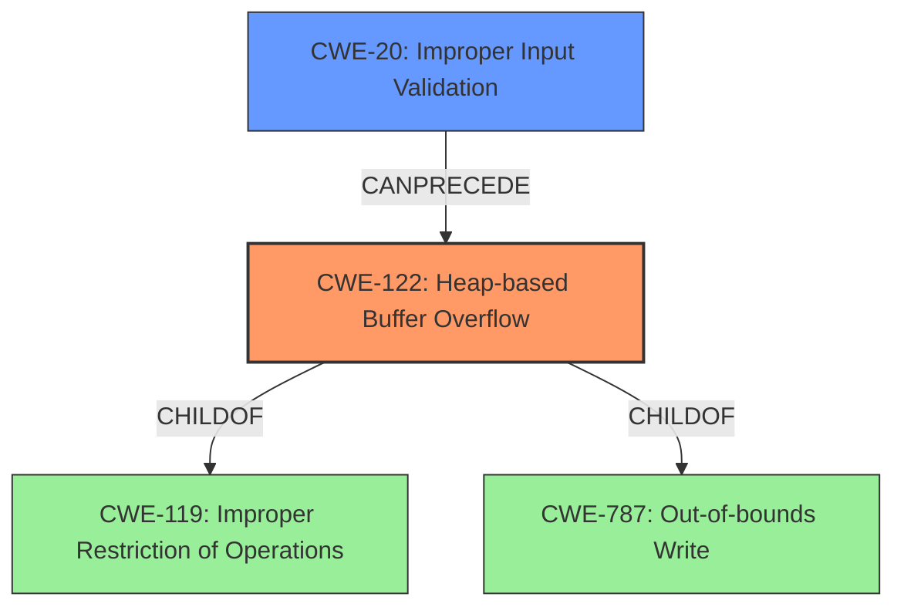

# Final Resolution for CVE-2021-42586

# Summary
| CWE ID | CWE Name | Confidence | CWE Abstraction Level | CWE Vulnerability Mapping Label | CWE-Vulnerability Mapping Notes |
|---|---|---|---|---|---|
| CWE-122 | Heap-based Buffer Overflow | 0.95 | Variant | Primary | Allowed |
| CWE-20   | Improper Input Validation | 0.6  | Class   | Secondary Candidate  | Allowed-with-Review |

## Evidence and Confidence

*   **Confidence Score:** 0.9
*   **Evidence Strength:** MEDIUM

## Relationship Analysis
The primary weakness is **CWE-122 (Heap-based Buffer Overflow)** which is a variant of **CWE-119 (Improper Restriction of Operations within the Bounds of a Memory Buffer)** and related to **CWE-787 (Out-of-bounds Write)**. The criticism suggested considering **CWE-20 (Improper Input Validation)** as a possible cause that precedes **CWE-122 (Heap-based Buffer Overflow)** in the vulnerability chain.

## Vulnerability Chain
The vulnerability chain starts with a crafted DWG file, which leads to improper handling of input, specifically the section size. This lack of input validation (**CWE-20**) allows `section->data_size` to exceed `section_page->uncomp_size`. Consequently, when the `copy_bytes` function copies data, it writes beyond the allocated buffer in the heap, resulting in a **CWE-122 (Heap-based Buffer Overflow)**.

## Summary of Analysis
The initial analysis correctly identified **CWE-122 (Heap-based Buffer Overflow)** as the primary **WEAKNESS**. The vulnerability description explicitly mentions a "heap buffer overflow," making this a strong and specific match.

The criticism raised a valid point about potentially including **CWE-20 (Improper Input Validation)** in the chain. The crafted DWG file suggests that the vulnerability stems from a failure to properly validate the input size. The vulnerability description indicates "...in copy_bytes in decode_r2007.c in dwgread before 0.12.4 via a crafted dwg file,". This confirms that a crafted file is the initial vector.

Therefore, I agree with the criticism to consider **CWE-20 (Improper Input Validation)** as a secondary candidate. The chain of events starts with the crafted DWG file bypassing input validation (**CWE-20**) and leading to the **HEAP OVERFLOW** (**CWE-122**).
I am removing **CWE-787 (Out-of-bounds Write)** since **CWE-122 (Heap-based Buffer Overflow)** is a specific instance of it.

The selection of **CWE-122 (Heap-based Buffer Overflow)** as the primary **WEAKNESS** is at the optimal level of specificity because it directly describes the type and location of the buffer overflow. Adding **CWE-20 (Improper Input Validation)** provides additional context and accurately represents the vulnerability chain.