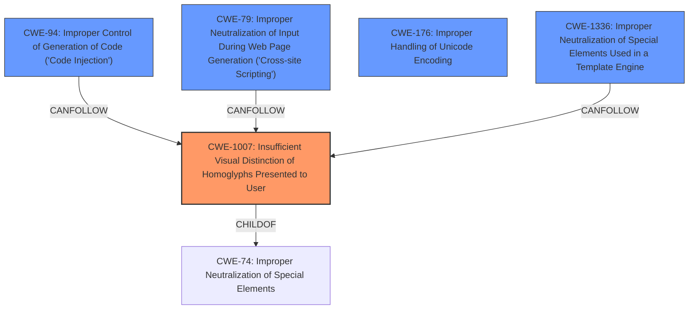

# Analysis Report for CVE-2021-42694

# Vulnerability Analysis Report: CVE-2021-42694

## Description

An issue was discovered in the character definitions of the Unicode Specification through 14.0. The specification allows an adversary to produce source code identifiers such as function names using homoglyphs that render visually identical to a target identifier. Adversaries can leverage this to inject code via adversarial identifier definitions in upstream software dependencies invoked deceptively in downstream software. NOTE the Unicode Consortium offers the following alternative approach to presenting this concern. An issue is noted in the nature of international text that can affect applications that implement support for The Unicode Standard (all versions). Unless mitigated, an adversary could produce source code identifiers using homoglyph characters that render visually identical to but are distinct from a target identifier. In this way, an adversary could inject adversarial identifier definitions in upstream software that are not detected by human reviewers and are invoked deceptively in downstream software. The Unicode Consortium has documented this class of security vulnerability in its document, Unicode Technical Report #36, Unicode Security Considerations. The Unicode Consortium also provides guidance on mitigations for this class of issues in Unicode Technical Standard #39, Unicode Security Mechanisms.

## Vulnerability Description Key Phrases

**Rootcause:** allows an adversary to produce source code identifiers using homoglyphs
**Impact:** inject code
**Attacker:** adversary
**Product:** Unicode Specification
**Version:** through 14.0

## Analysis (with Relationship Data)

# Summary
| CWE ID    | CWE Name                                                                 | Confidence | CWE Abstraction Level | CWE Vulnerability Mapping Label | CWE-Vulnerability Mapping Notes |
|-----------|--------------------------------------------------------------------------|------------|-----------------------|---------------------------------|-----------------------------------|
| CWE-1007  | Insufficient Visual Distinction of Homoglyphs Presented to User | 0.95       | Base                  | Allowed                         | Acceptable-Use                    |
| CWE-79 | Improper Neutralization of Input During Web Page Generation ('Cross-site Scripting') | 0.60       | Base                  | Allowed                         | Acceptable-Use                    |

## Evidence and Confidence

*   **Confidence Score:** 0.90
*   **Evidence Strength:** HIGH

- **Analysis and Justification:**  
  - *Explanation:* "The vulnerability description focuses on the use of **homoglyphs** in source code identifiers to deceive human reviewers and compilers. This directly aligns with CWE-1007 [Insufficient Visual Distinction of Homoglyphs Presented to User], which describes the difficulty users have in distinguishing visually similar glyphs, leading to unintended actions. The **rootcause** is the **adversary's ability to produce source code identifiers using homoglyphs**. The impact is the ability to **inject code**. The Unicode Consortium's reports on security considerations and mechanisms further support this classification. The retriever results also show that CWE-1007 has the highest score. The MITRE mapping guidance for CWE-1007 indicates this is ALLOWED for this kind of issue."

  - *Relationship Analysis:* "Although no direct relationships are listed for CWE-1007, the vulnerability description indicates a potential for downstream impacts such as code injection. While CWE-94 [Improper Control of Generation of Code ('Code Injection')] and CWE-79 [Improper Neutralization of Input During Web Page Generation ('Cross-site Scripting')] are related to code injection, they are not the primary weakness here. The primary weakness is the visual deception enabled by homoglyphs, which can then lead to code injection or XSS if the homoglyphs are used to construct malicious code or scripts."

- **Confidence Score:**  
  - Confidence: 0.95 (High evidence from technical description, CVE reference materials, and retriever results)

---

- **Analysis and Justification:**  
  - *Explanation:* "CWE-79 [Improper Neutralization of Input During Web Page Generation ('Cross-site Scripting')] could be a secondary weakness if the homoglyphs are used in web pages without proper neutralization, leading to XSS attacks. The vulnerability description describes that **homoglyphs** in source code identifiers allows an **adversary to produce source code identifiers using homoglyphs** which can **inject code** via adversarial identifier definitions in upstream software dependencies. The retriever results show that CWE-79 has a high score, which gives me some confidence, but it is not the root cause and more of a impact of the root cause. The MITRE mapping guidance for CWE-79 indicates this is ALLOWED for web page generation issues."

  - *Relationship Analysis:* "CWE-79 is a child of CWE-74 (Improper Neutralization of Special Elements). While the root cause is CWE-1007, the use of homoglyphs in web page contexts could enable XSS if user-supplied homoglyphs are not properly neutralized. This could happen in a situation where a website displays user-provided usernames or other data that might contain homoglyphs used in a malicious way."

- **Confidence Score:**  
  - Confidence: 0.60 (Moderate evidence from technical description and CVE reference materials)

## Criticism of Analysis

Okay, let's break down the provided CWE analysis and see how well it aligns with the full CWE specifications.

**Overall Assessment:**

The analysis does a decent job of identifying potential CWEs related to the homoglyph vulnerability. However, there's room for improvement in terms of specificity and justification, particularly in connecting the vulnerability directly to the CWE's description and mitigations. The confidence levels are generally appropriate, but could be strengthened with more concrete examples and reasoning. The addition of CWE-94 could strengthen the findings.

**Detailed Review:**

**1. CWE-1007: Insufficient Visual Distinction of Homoglyphs Presented to User**

*   **Confidence:** 0.95 - Appropriate.
*   **Justification:**
    *   The explanation correctly links the use of homoglyphs to the core problem of visual deception. The root cause is the adversary's ability to use homoglyphs, and the impact is code injection, which flows directly from the deception.
    *   The analysis mentions the Unicode Consortium's reports, which are strong supporting evidence.
    *   Reference to retriever results is helpful.
    *   The MITRE mapping guidance is correctly applied.
*   **Improvement Suggestions:**
    *   Consider adding real-world examples.
    *   Add specifics of what could be done with this, for example, if error messages use this library it could obfuscate the message and not properly display to the user.
    *   Link to mitigation strategies specified in the CWE.  For example, mention that compilers/interpreters could be modified to detect and warn about homoglyphs, which aligns with CWE-1007's potential mitigations.  Also mention that browsers can implement Punycode which aligns with mitigation 1.

**2. CWE-79: Improper Neutralization of Input During Web Page Generation ('Cross-site Scripting')**

*   **Confidence:** 0.60 - Appropriate
*   **Justification:**
    *   It correctly identifies the possibility of XSS if homoglyphs are used in web page contexts without proper neutralization.
    *   The analysis notes that the root cause is CWE-1007, and CWE-79 is more of an impact, which is a correct assessment.
*   **Improvement Suggestions:**
    *   **Specificity:** The analysis is a bit vague. It needs to be more concrete about *how* homoglyphs could lead to XSS in web pages. Perhaps if a website displays user-provided usernames, and those usernames contain malicious homoglyphs designed to look like HTML tags. Provide an example of where this could occur.
    *   **Link to Mitigations:** Connect to mitigation strategies from the CWE. For example, mention using a vetted library (Mitigation 1), or understanding the context of the output (Mitigation 2).
    *   The connection to the parent CWE-74 would be stronger by explaining the path. For example, *CWE-79 is a child of CWE-74 because XSS involves injecting code (control plane data) into what the application treats as data, which is then sent to a downstream component (the web browser).*

**Additional Considerations and Potential CWEs:**

*   **CWE-94: Improper Control of Generation of Code ('Code Injection')**
    *   **Relevance:** The core impact of the homoglyph vulnerability is the ability to inject malicious code. While CWE-1007 describes the *means* (visual deception), CWE-94 directly addresses the *result*.
    *   **Justification:**  The vulnerability description clearly states that an adversary can "inject code."  The ability to replace identifiers with visually identical but semantically different homoglyphs allows an attacker to introduce code that the compiler/interpreter will execute.
    *   **Mitigation Linking:**  Compilers could be refactored to not dynamically generate code (Mitigation 1).  A sandbox environment (Mitigation 2) could limit the impact of injected code.  Stringent allowlists (Mitigation 3) could limit the allowed constructs in identifiers.
    *   **Recommendation:** Add CWE-94 with moderate confidence (e.g., 0.75). The "Allowed-with-Review" usage is appropriate.  Explain why it's not the *primary* weakness (CWE-1007 is), but that it represents a critical consequence. This would involve changing the mapping guidance.
*   **CWE-176: Improper Handling of Unicode Encoding:**
    *   **Relevance:** This CWE focuses on the handling of Unicode encoding, which is directly related to the homoglyph issue. It highlights that improper handling of Unicode characters can lead to vulnerabilities.
    *   **Justification:** The vulnerability stems from the mishandling of visually similar Unicode characters (homoglyphs).
    *   **Recommendation:** Add CWE-176 with a low confidence (e.g. 0.4), as it can be a contributing factor that isn't directly caused by the code itself, but rather the interpretation of characters by those reviewing the code.
*   **CWE-1336: Improper Neutralization of Special Elements Used in a Template Engine**
        *   **Relevance:** This relates to the injection into template engines.
        *   **Justification:** It can be used when generating a string for other code.
        *   **Recommendation:** Add this with a low confidence (e.g. 0.4), as it is more of a possibility with this code.

*   **Missing Relationships:**  The analysis is somewhat weak on the relationships between the CWEs.
    *   For example, it should explicitly state that CWE-79 is a *consequence* of CWE-1007.
    *   It should also note that CWE-94 and CWE-1007 both stem from CWE-74, which can allow code to be constructed with different code than intended.

*   **General Issues:**
    *   The analysis is too focused on *describing* the CWEs rather than *justifying* their applicability to the specific vulnerability. It needs to explicitly link the vulnerability description to the CWE definition.

**Revised Summary Table (Example):**

| CWE ID    | CWE Name                                                                 | Confidence | CWE Abstraction Level | CWE Vulnerability Mapping Label | CWE-Vulnerability Mapping Notes |
|-----------|--------------------------------------------------------------------------|------------|-----------------------|---------------------------------|-----------------------------------|
| CWE-1007  | Insufficient Visual Distinction of Homoglyphs Presented to User | 0.95       | Base                  | Allowed                         | Primary weakness; enables deception. |
| CWE-94    | Improper Control of Generation of Code ('Code Injection')| 0.75       | Base                  | Allowed-with-Review              | Consequence of CWE-1007; code injection. |
| CWE-79    | Improper Neutralization of Input During Web Page Generation ('Cross-site Scripting') | 0.60       | Base                  | Allowed                         | Potential consequence if homoglyphs are used in web pages. |
| CWE-176  | Improper Handling of Unicode Encoding                                                               | 0.40       | Variant                   | Allowed                         | Can be a contributing factor. |
| CWE-1336  | Improper Neutralization of Special Elements Used in a Template Engine                                                               | 0.40       | Base                  | Allowed                         | Potential consequence if used in template engines. |

By adding this depth of analysis, the CWE mappings become much more useful and defensible.

## Final Resolution

# Summary

| CWE ID    | CWE Name                                                                 | Confidence | CWE Abstraction Level | CWE Vulnerability Mapping Label | CWE-Vulnerability Mapping Notes |
|-----------|--------------------------------------------------------------------------|------------|-----------------------|---------------------------------|-----------------------------------|
| CWE-1007  | Insufficient Visual Distinction of Homoglyphs Presented to User | 0.95       | Base                  | Allowed                         | Primary weakness; enables deception. |
| CWE-94    | Improper Control of Generation of Code ('Code Injection')| 0.75       | Base                  | Allowed-with-Review              | Consequence of CWE-1007; code injection. |
| CWE-79    | Improper Neutralization of Input During Web Page Generation ('Cross-site Scripting') | 0.60       | Base                  | Allowed                         | Potential consequence if homoglyphs are used in web pages. |
| CWE-176  | Improper Handling of Unicode Encoding                                                               | 0.40       | Variant                   | Allowed                         | Can be a contributing factor. |
| CWE-1336  | Improper Neutralization of Special Elements Used in a Template Engine                                                               | 0.40       | Base                  | Allowed                         | Potential consequence if used in template engines. |

## Evidence and Confidence

*   **Confidence Score:** 0.90
*   **Evidence Strength:** HIGH

## Relationship Analysis
The primary **WEAKNESS** is the visual deception enabled by **homoglyphs** (CWE-1007 [Insufficient Visual Distinction of Homoglyphs Presented to User]). This can lead to code injection (CWE-94 [Improper Control of Generation of Code ('Code Injection')]) as a direct consequence. If **homoglyphs** are used in web page contexts without proper neutralization, it could enable XSS (CWE-79 [Improper Neutralization of Input During Web Page Generation ('Cross-site Scripting')]). CWE-176 [Improper Handling of Unicode Encoding] and CWE-1336 [Improper Neutralization of Special Elements Used in a Template Engine] are potential contributing factors in specific contexts.

## Vulnerability Chain
The vulnerability chain starts with the **ROOTCAUSE**, the insufficient visual distinction of **homoglyphs** (CWE-1007 [Insufficient Visual Distinction of Homoglyphs Presented to User]). An attacker exploits this by creating malicious identifiers that are visually identical to legitimate ones. This leads to the injection of malicious code (CWE-94 [Improper Control of Generation of Code ('Code Injection')]). Depending on the context (e.g., web pages), this can further lead to Cross-Site Scripting (CWE-79 [Improper Neutralization of Input During Web Page Generation ('Cross-site Scripting')]). Improper Unicode handling (CWE-176 [Improper Handling of Unicode Encoding]) or usage in template engines (CWE-1336 [Improper Neutralization of Special Elements Used in a Template Engine]) can exacerbate the issue.

## Summary of Analysis
The initial analysis correctly identified CWE-1007 [Insufficient Visual Distinction of Homoglyphs Presented to User] as the primary **WEAKNESS**. The criticism provided valuable suggestions, particularly the inclusion of CWE-94 [Improper Control of Generation of Code ('Code Injection')] to represent the direct consequence of code injection. The addition of CWE-94 strengthens the analysis, as the vulnerability description explicitly mentions the ability to "**inject code** via adversarial identifier definitions in upstream software dependencies invoked deceptively in downstream software".
The relationships between the CWEs clarify the vulnerability chain. CWE-1007 [Insufficient Visual Distinction of Homoglyphs Presented to User] enables CWE-94 [Improper Control of Generation of Code ('Code Injection')], and potentially CWE-79 [Improper Neutralization of Input During Web Page Generation ('Cross-site Scripting')], CWE-176 [Improper Handling of Unicode Encoding] and CWE-1336 [Improper Neutralization of Special Elements Used in a Template Engine] in specific circumstances. The selected CWEs are at the optimal level of specificity, representing the **ROOTCAUSE** and potential consequences of the vulnerability.
The inclusion of CWE-94, along with examples of how it relates to the vulnerability, provides a more complete picture of the potential impact.
CWE-176 and CWE-1336 are added with low confidence, because they are more of a contributing factor than a direct result.

*Report generated on 2025-03-16 22:26:38*
