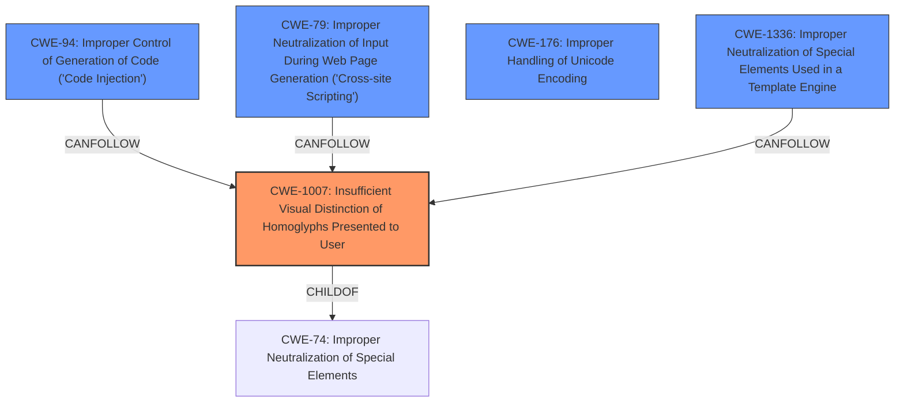

# Final Resolution for CVE-2021-42694

# Summary

| CWE ID    | CWE Name                                                                 | Confidence | CWE Abstraction Level | CWE Vulnerability Mapping Label | CWE-Vulnerability Mapping Notes |
|-----------|--------------------------------------------------------------------------|------------|-----------------------|---------------------------------|-----------------------------------|
| CWE-1007  | Insufficient Visual Distinction of Homoglyphs Presented to User | 0.95       | Base                  | Allowed                         | Primary weakness; enables deception. |
| CWE-94    | Improper Control of Generation of Code ('Code Injection')| 0.75       | Base                  | Allowed-with-Review              | Consequence of CWE-1007; code injection. |
| CWE-79    | Improper Neutralization of Input During Web Page Generation ('Cross-site Scripting') | 0.60       | Base                  | Allowed                         | Potential consequence if homoglyphs are used in web pages. |
| CWE-176  | Improper Handling of Unicode Encoding                                                               | 0.40       | Variant                   | Allowed                         | Can be a contributing factor. |
| CWE-1336  | Improper Neutralization of Special Elements Used in a Template Engine                                                               | 0.40       | Base                  | Allowed                         | Potential consequence if used in template engines. |

## Evidence and Confidence

*   **Confidence Score:** 0.90
*   **Evidence Strength:** HIGH

## Relationship Analysis
The primary **WEAKNESS** is the visual deception enabled by **homoglyphs** (CWE-1007 [Insufficient Visual Distinction of Homoglyphs Presented to User]). This can lead to code injection (CWE-94 [Improper Control of Generation of Code ('Code Injection')]) as a direct consequence. If **homoglyphs** are used in web page contexts without proper neutralization, it could enable XSS (CWE-79 [Improper Neutralization of Input During Web Page Generation ('Cross-site Scripting')]). CWE-176 [Improper Handling of Unicode Encoding] and CWE-1336 [Improper Neutralization of Special Elements Used in a Template Engine] are potential contributing factors in specific contexts.

## Vulnerability Chain
The vulnerability chain starts with the **ROOTCAUSE**, the insufficient visual distinction of **homoglyphs** (CWE-1007 [Insufficient Visual Distinction of Homoglyphs Presented to User]). An attacker exploits this by creating malicious identifiers that are visually identical to legitimate ones. This leads to the injection of malicious code (CWE-94 [Improper Control of Generation of Code ('Code Injection')]). Depending on the context (e.g., web pages), this can further lead to Cross-Site Scripting (CWE-79 [Improper Neutralization of Input During Web Page Generation ('Cross-site Scripting')]). Improper Unicode handling (CWE-176 [Improper Handling of Unicode Encoding]) or usage in template engines (CWE-1336 [Improper Neutralization of Special Elements Used in a Template Engine]) can exacerbate the issue.

## Summary of Analysis
The initial analysis correctly identified CWE-1007 [Insufficient Visual Distinction of Homoglyphs Presented to User] as the primary **WEAKNESS**. The criticism provided valuable suggestions, particularly the inclusion of CWE-94 [Improper Control of Generation of Code ('Code Injection')] to represent the direct consequence of code injection. The addition of CWE-94 strengthens the analysis, as the vulnerability description explicitly mentions the ability to "**inject code** via adversarial identifier definitions in upstream software dependencies invoked deceptively in downstream software".
The relationships between the CWEs clarify the vulnerability chain. CWE-1007 [Insufficient Visual Distinction of Homoglyphs Presented to User] enables CWE-94 [Improper Control of Generation of Code ('Code Injection')], and potentially CWE-79 [Improper Neutralization of Input During Web Page Generation ('Cross-site Scripting')], CWE-176 [Improper Handling of Unicode Encoding] and CWE-1336 [Improper Neutralization of Special Elements Used in a Template Engine] in specific circumstances. The selected CWEs are at the optimal level of specificity, representing the **ROOTCAUSE** and potential consequences of the vulnerability.
The inclusion of CWE-94, along with examples of how it relates to the vulnerability, provides a more complete picture of the potential impact.
CWE-176 and CWE-1336 are added with low confidence, because they are more of a contributing factor than a direct result.