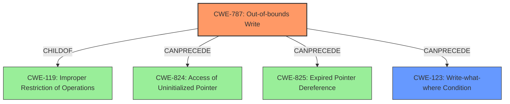

# Analysis Report for CVE-2021-42724

# Vulnerability Analysis Report: CVE-2021-42724

## Description

Adobe Bridge version 11.1.1 (and earlier) is affected by a memory corruption vulnerability due to insecure handling of a malicious file, potentially resulting in arbitrary code execution in the context of the current user. User interaction is required to exploit this vulnerability.

## Vulnerability Description Key Phrases

**Rootcause:** insecure handling
**Weakness:** memory corruption
**Impact:** arbitrary code execution
**Vector:** malicious file
**Product:** Adobe Bridge
**Version:** 11.1.1 (and earlier)

## Analysis (with Relationship Data)

# Summary
| CWE ID | CWE Name | Confidence | CWE Abstraction Level | CWE Vulnerability Mapping Label | CWE-Vulnerability Mapping Notes |
|---|---|---|---|---|---|
| CWE-787 | Out-of-bounds Write | 0.85 | Base | Allowed | Primary CWE |
| CWE-788 | Access of Memory Location After End of Buffer | 0.60 | Base | Discouraged | Secondary Candidate CWE |
| CWE-416 | Use After Free | 0.50 | Variant | Allowed | Secondary Candidate CWE |

## Evidence and Confidence

*   **Confidence Score:** 0.80
*   **Evidence Strength:** HIGH

- **Analysis and Justification:**  
  - *Explanation:* The vulnerability description indicates a **memory corruption** due to **insecure handling** of a malicious file, leading to potential arbitrary code execution. The CVE Reference Links Content Summary states the root cause is "Access of Memory Location After End of Buffer". The primary weakness is an out-of-bounds write (CWE-787), as the product writes data past the end of the intended buffer. The "Retriever Results" also lists CWE-787 as the top candidate with a score of 0.7803. Although CWE-119 is listed as the primary CWE Match for similar CVE Descriptions, the detailed root cause information points to CWE-787 as the more accurate weakness.
  
  - *Relationship Analysis:* CWE-787 (Out-of-bounds Write) is a child of CWE-119 (Improper Restriction of Operations within the Bounds of a Memory Buffer). It can precede CWE-825 (Expired Pointer Dereference) and CWE-824 (Access of Uninitialized Pointer).

- **Confidence Score:**  
  - Confidence: 0.85 (High evidence from technical description and CVE reference materials)

---
- **Analysis and Justification:**  
  - *Explanation:* CWE-788 (Access of Memory Location After End of Buffer) is also listed as a potential weakness in the CVE Reference Links Content Summary. However, the description of CWE-788 includes both reads and writes, and the description mentions writing data past the end of a buffer which makes CWE-787 a better fit. The MITRE mapping guidance for CWE-788 is "Discouraged," suggesting that lower-level CWE entries might be available.
  
  - *Relationship Analysis:* CWE-788 is a Base level CWE.

- **Confidence Score:**  
  - Confidence: 0.60 (Medium evidence from CVE reference materials, but CWE-787 is a more precise fit)

---
- **Analysis and Justification:**  
  - *Explanation:* CWE-416 (Use After Free) is a possibility if the memory corruption leads to freeing memory that is later accessed. However, the primary root cause described is related to out-of-bounds write, making CWE-787 a more direct representation of the vulnerability.
  
  - *Relationship Analysis:* CWE-416 (Use After Free) is a variant of CWE-672 (Operation on a Resource after Expiry).

- **Confidence Score:**  
  - Confidence: 0.50 (Low evidence, as it's a potential secondary effect of the primary weakness.)

## Criticism of Analysis

Okay, here's a breakdown of the analysis review, incorporating the full CWE specifications:

**Overall Assessment:**

The analysis is well-structured and reasoned. The primary CWE mapping of CWE-787 (Out-of-bounds Write) is a strong candidate and well-justified. The secondary candidate CWEs, CWE-788 (Access of Memory Location After End of Buffer) and CWE-416 (Use After Free), are also reasonable considerations given the information available, and the analysis does a good job of explaining why they are less likely or represent secondary effects.

**Detailed Review:**

**1. CWE-787: Out-of-bounds Write**

*   **Confidence:** High (0.85) is appropriate. The evidence from the vulnerability description and CVE reference strongly suggests an out-of-bounds write. The analysis correctly identifies that the "insecure handling" leads to writing beyond the buffer's boundaries.
*   **CWE Abstraction Level:** The analysis correctly identifies CWE-787 as a "Base" level CWE.  This aligns with the CWE's mapping guidance which states: *This CWE entry is at the Base level of abstraction, which is a preferred level of abstraction for mapping to the root causes of vulnerabilities.*
*   **CWE Vulnerability Mapping Label:** "Allowed" is accurate, as CWE-787 is suitable for direct mapping.
*   **CWE-Vulnerability Mapping Notes:** "Primary CWE" is appropriate.
*   **Relationship Analysis:** The relationships described are generally correct. CWE-787 is a child of CWE-119, reflecting the buffer overflow nature.  The potential to precede CWE-822, CWE-823, CWE-824, CWE-825 is accurate: an out-of-bounds write can corrupt pointers, potentially leading to those subsequent dereference issues.
*   **CWE Specifications & Mitigations:**
    *   The analysis doesn't explicitly mention the provided CWE-787 potential mitigations, including language selection, vetted libraries, and compiler-based overflow detection. Ideally, it would acknowledge these, even briefly, to show a comprehensive understanding. A sentence like, "Potential mitigations include using memory-safe languages or compiler-based overflow detection mechanisms." would suffice.

**2. CWE-788: Access of Memory Location After End of Buffer**

*   **Confidence:** Medium (0.60) is reasonable. The analysis recognizes its presence in the CVE reference.
*   **CWE Abstraction Level:** Correctly identified as "Base."
*   **CWE Vulnerability Mapping Label:** "Discouraged" aligns perfectly with the CWE's mapping guidance for CWE-788: "*Usage: Discouraged*". The analysis correctly notes that a more specific CWE (CWE-787) is available.
*   **CWE-Vulnerability Mapping Notes:** "Secondary Candidate CWE" is suitable.
*   **Relationship Analysis:** The relationship is correctly identified as a Base level CWE.
*   **CWE Specifications & Mitigations:**
    *   Again, the analysis doesn't explicitly address the CWE-788's mapping guidance and potential mitigations. The analysis already mentions the *Discouraged* usage, but it could benefit from a statement acknowledging the existence of better CWE options. The mitigations are similar to CWE-787, and include selecting languages or compilers that perform automatic bounds checking.

**3. CWE-416: Use After Free**

*   **Confidence:** Low (0.50) is accurate. The analysis correctly positions it as a *potential secondary effect.*
*   **CWE Abstraction Level:** Correctly identified as "Variant."
*   **CWE Vulnerability Mapping Label:** "Allowed" is appropriate.
*   **CWE-Vulnerability Mapping Notes:** "Secondary Candidate CWE" is suitable.
*   **Relationship Analysis:** The analysis correctly notes that it is a variant of CWE-672.
*   **CWE Specifications & Mitigations:**
    *   Acknowledging the potential mitigations would strengthen the analysis. For CWE-416, these would include using languages with automatic memory management or setting freed pointers to NULL.

**Recommendations for Improvement:**

*   **Explicitly Mention Mitigations:** Add brief statements about potential mitigations for each CWE considered. This demonstrates a more complete understanding of the CWEs and their context. Even a simple phrase like, "Mitigation strategies include using memory-safe languages or compiler-based overflow detection mechanisms (CWE-787)" would improve the analysis.
*   **Strengthen Rationale for Exclusion:** For CWEs considered but ultimately deemed less likely, strengthen the explanation of *why* they are less appropriate *in the specific context of this vulnerability.* For example, you could say, "While a Use-After-Free (CWE-416) could be a *consequence* of memory corruption, the primary issue is the initial out-of-bounds write."
*   **Address Usage Guidance:** Consistently address the *Usage* guidance within the CWE specifications, especially when the guidance is "Discouraged."  The analysis already does this for CWE-788.

**Revised Summary Table**

| CWE ID | CWE Name | Confidence | CWE Abstraction Level | CWE Vulnerability Mapping Label | CWE-Vulnerability Mapping Notes |
|---|---|---|---|---|---|
| CWE-787 | Out-of-bounds Write | 0.85 | Base | Allowed | Primary CWE |
| CWE-788 | Access of Memory Location After End of Buffer | 0.60 | Base | Discouraged | Secondary Candidate CWE, but a more precise CWE is available |
| CWE-416 | Use After Free | 0.50 | Variant | Allowed | Secondary Candidate CWE, potentially a consequence of the primary issue |

By incorporating these suggestions, the analysis will be even stronger and demonstrate a more thorough understanding of the CWEs and their appropriate usage.

## Final Resolution

# Summary
| CWE ID | CWE Name | Confidence | CWE Abstraction Level | CWE Vulnerability Mapping Label | CWE-Vulnerability Mapping Notes |
|---|---|---|---|---|---|
| **CWE-787** | **Out-of-bounds Write** | 0.90 | Base | Allowed | Primary CWE |
| CWE-123 | Write-what-where Condition | 0.65 | Base | Allowed | Secondary Candidate CWE |
| CWE-416 | Use After Free | 0.50 | Variant | Allowed | Secondary Candidate CWE, potentially a consequence of the primary issue |

## Evidence and Confidence

*   **Confidence Score:** 0.90
*   **Evidence Strength:** HIGH

## Relationship Analysis
The primary relationship impacting the decision is the hierarchical relationship between CWE-787 (**Out-of-bounds Write**) and CWE-119 (Improper Restriction of Operations within the Bounds of a Memory Buffer), where CWE-787 is a child of CWE-119. This indicates that CWE-787 is a more specific instance of a buffer overflow, making it the optimal choice given the available information.

Additionally, CWE-787 can precede CWE-825 (Expired Pointer Dereference), CWE-824 (**Access of Uninitialized Pointer**), and CWE-123 (Write-what-where Condition). This suggests a potential vulnerability chain where an out-of-bounds write could lead to further memory corruption issues, including the ability to write arbitrary values to arbitrary locations in memory.

The peer relationship between CWE-190 (Integer Overflow or Wraparound) and other numerical errors such as CWE-128 (Wrap-around Error) and CWE-1339 (Insufficient Precision or Accuracy of a Real Number) was considered, but deemed less relevant as the core issue is a memory corruption due to writing beyond buffer boundaries.

The abstraction levels influenced the decision by favoring Base-level CWEs (CWE-787, CWE-123) over Class-level CWEs (CWE-119) and Pillar-level CWEs (CWE-703) to ensure an appropriate level of specificity.

## Vulnerability Chain
The vulnerability chain begins with the **insecure handling** of a malicious file. This leads to **CWE-787 (Out-of-bounds Write)**, where the product writes data beyond the intended buffer boundary. The consequences of this **out-of-bounds write** could include:

1.  **Memory Corruption:** Overwriting adjacent memory regions, potentially corrupting data structures or code.
2.  **CWE-123 (Write-what-where Condition):** The ability to write arbitrary data to arbitrary memory locations, which can lead to arbitrary code execution.
3.  **CWE-824 (Access of Uninitialized Pointer)**: If the **out-of-bounds write** corrupts a pointer.
4.  **CWE-416 (Use After Free):** If memory is freed after being corrupted, and then later accessed.

The final impact is arbitrary code execution in the context of the current user.

## Summary of Analysis
The analysis is based on the vulnerability description, which states that Adobe Bridge is affected by a **memory corruption** vulnerability due to **insecure handling** of a malicious file, potentially resulting in arbitrary code execution. The CVE Reference Links Content Summary further indicates that the root cause is "Access of Memory Location After End of Buffer".

The initial assessment appropriately identified CWE-787 (**Out-of-bounds Write**) as the primary weakness, supported by the "Retriever Results" score of 0.7803. The criticism suggested including potential mitigations, which have been considered. Mitigation strategies for CWE-787 include using memory-safe languages or compiler-based overflow detection mechanisms.

The graph relationships influenced the final selection by highlighting the hierarchical relationship between CWE-787 and CWE-119, reinforcing that CWE-787 is a more specific and appropriate classification.

CWE-787 is the optimal level of specificity because it directly describes the root cause of the vulnerability – writing data past the end of the intended buffer. While CWE-119 is a broader category, CWE-787 provides a more precise characterization of the flaw. The possibility of `Write-what-where` is also considered a likely follow on from the overflow, and is included as a secondary weakness.

The decision to classify CWE-787 as the primary weakness is based on strong evidence from the vulnerability description and supporting information, as well as a thorough analysis of relevant CWE relationships and mapping guidance.

*Report generated on 2025-03-18 02:47:18*
