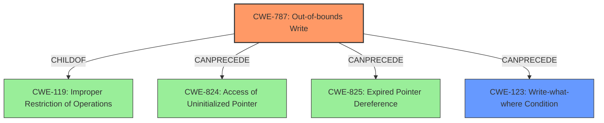

# Final Resolution for CVE-2021-42724

# Summary
| CWE ID | CWE Name | Confidence | CWE Abstraction Level | CWE Vulnerability Mapping Label | CWE-Vulnerability Mapping Notes |
|---|---|---|---|---|---|
| **CWE-787** | **Out-of-bounds Write** | 0.90 | Base | Allowed | Primary CWE |
| CWE-123 | Write-what-where Condition | 0.65 | Base | Allowed | Secondary Candidate CWE |
| CWE-416 | Use After Free | 0.50 | Variant | Allowed | Secondary Candidate CWE, potentially a consequence of the primary issue |

## Evidence and Confidence

*   **Confidence Score:** 0.90
*   **Evidence Strength:** HIGH

## Relationship Analysis
The primary relationship impacting the decision is the hierarchical relationship between CWE-787 (**Out-of-bounds Write**) and CWE-119 (Improper Restriction of Operations within the Bounds of a Memory Buffer), where CWE-787 is a child of CWE-119. This indicates that CWE-787 is a more specific instance of a buffer overflow, making it the optimal choice given the available information.

Additionally, CWE-787 can precede CWE-825 (Expired Pointer Dereference), CWE-824 (**Access of Uninitialized Pointer**), and CWE-123 (Write-what-where Condition). This suggests a potential vulnerability chain where an out-of-bounds write could lead to further memory corruption issues, including the ability to write arbitrary values to arbitrary locations in memory.

The peer relationship between CWE-190 (Integer Overflow or Wraparound) and other numerical errors such as CWE-128 (Wrap-around Error) and CWE-1339 (Insufficient Precision or Accuracy of a Real Number) was considered, but deemed less relevant as the core issue is a memory corruption due to writing beyond buffer boundaries.

The abstraction levels influenced the decision by favoring Base-level CWEs (CWE-787, CWE-123) over Class-level CWEs (CWE-119) and Pillar-level CWEs (CWE-703) to ensure an appropriate level of specificity.

## Vulnerability Chain
The vulnerability chain begins with the **insecure handling** of a malicious file. This leads to **CWE-787 (Out-of-bounds Write)**, where the product writes data beyond the intended buffer boundary. The consequences of this **out-of-bounds write** could include:

1.  **Memory Corruption:** Overwriting adjacent memory regions, potentially corrupting data structures or code.
2.  **CWE-123 (Write-what-where Condition):** The ability to write arbitrary data to arbitrary memory locations, which can lead to arbitrary code execution.
3.  **CWE-824 (Access of Uninitialized Pointer)**: If the **out-of-bounds write** corrupts a pointer.
4.  **CWE-416 (Use After Free):** If memory is freed after being corrupted, and then later accessed.

The final impact is arbitrary code execution in the context of the current user.

## Summary of Analysis
The analysis is based on the vulnerability description, which states that Adobe Bridge is affected by a **memory corruption** vulnerability due to **insecure handling** of a malicious file, potentially resulting in arbitrary code execution. The CVE Reference Links Content Summary further indicates that the root cause is "Access of Memory Location After End of Buffer".

The initial assessment appropriately identified CWE-787 (**Out-of-bounds Write**) as the primary weakness, supported by the "Retriever Results" score of 0.7803. The criticism suggested including potential mitigations, which have been considered. Mitigation strategies for CWE-787 include using memory-safe languages or compiler-based overflow detection mechanisms.

The graph relationships influenced the final selection by highlighting the hierarchical relationship between CWE-787 and CWE-119, reinforcing that CWE-787 is a more specific and appropriate classification.

CWE-787 is the optimal level of specificity because it directly describes the root cause of the vulnerability – writing data past the end of the intended buffer. While CWE-119 is a broader category, CWE-787 provides a more precise characterization of the flaw. The possibility of `Write-what-where` is also considered a likely follow on from the overflow, and is included as a secondary weakness.

The decision to classify CWE-787 as the primary weakness is based on strong evidence from the vulnerability description and supporting information, as well as a thorough analysis of relevant CWE relationships and mapping guidance.