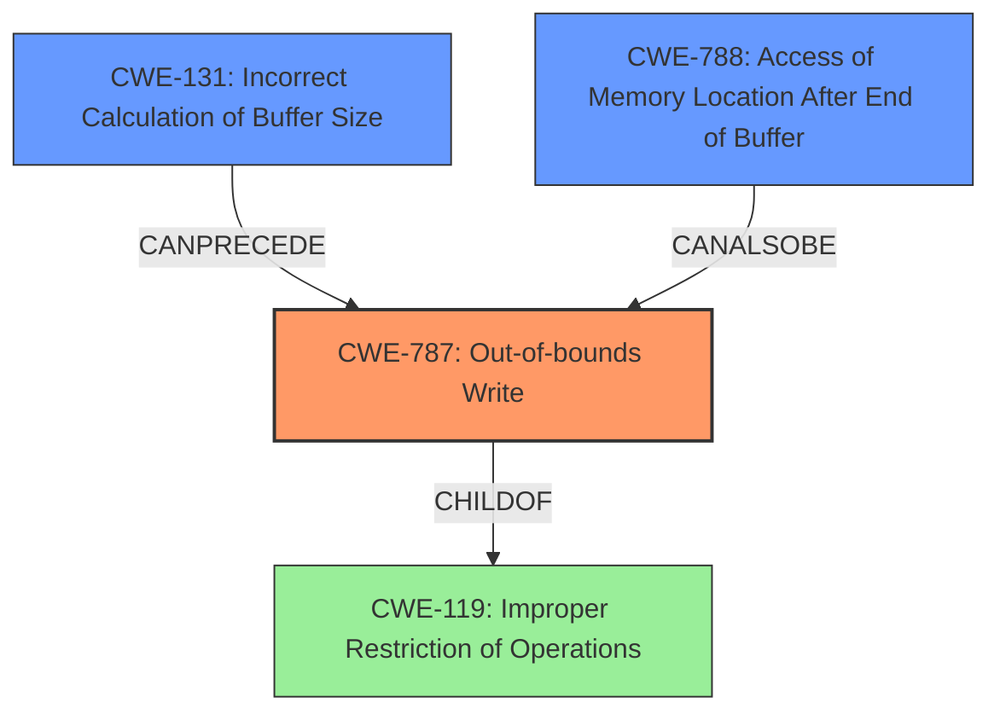

# Analysis Report for CVE-2021-42725

# Vulnerability Analysis Report: CVE-2021-42725

## Description

Adobe Bridge version 11.1.1 (and earlier) is affected by a memory corruption vulnerability due to insecure handling of a malicious M4A file, potentially resulting in arbitrary code execution in the context of the current user. User interaction is required to exploit this vulnerability.

## Vulnerability Description Key Phrases

**Rootcause:** insecure handling
**Weakness:** memory corruption
**Impact:** arbitrary code execution
**Vector:** malicious M4A file
**Product:** Adobe Bridge
**Version:** 11.1.1 (and earlier)

## Analysis (with Relationship Data)

# Summary
| CWE ID | CWE Name | Confidence | CWE Abstraction Level | CWE Vulnerability Mapping Label | CWE-Vulnerability Mapping Notes |
|---|---|---|---|---|---|
| CWE-787 | Out-of-bounds Write | 0.85 | Base |  | Allowed |
| CWE-788 | Access of Memory Location After End of Buffer | 0.75 | Base |  | Discouraged |
| CWE-119 | Improper Restriction of Operations within the Bounds of a Memory Buffer | 0.6 | Class |  | Discouraged |

## Evidence and Confidence

*   **Confidence Score:** 0.8
*   **Evidence Strength:** HIGH

- **Analysis and Justification:**  
  - *Explanation:* The vulnerability description states a "**memory corruption**" issue due to "**insecure handling** of a malicious M4A file," leading to potential arbitrary code execution. The CVE reference link content summary indicates that the root cause for similar CVEs is "Access of Memory Location After End of Buffer" (CWE-788) and "Out-of-bounds Write" (CWE-787). The description explicitly mentions the potential for arbitrary code execution, which strongly suggests a memory corruption issue that allows for writing beyond the buffer's boundaries. CWE-787 (Out-of-bounds Write) is a base-level CWE, and its mapping guidance is "Allowed." This CWE accurately describes the vulnerability where writing beyond the intended buffer can lead to code execution. While CWE-119 (Improper Restriction of Operations within the Bounds of a Memory Buffer) is listed as the primary CWE match for similar vulnerabilities, it is a class-level CWE and is discouraged when more specific CWEs are available. The retriever results also list CWE-787 with a high score.

  - *Relationship Analysis:* CWE-787 is a base-level weakness and is a child of CWE-119. It can also precede other weaknesses such as CWE-825 (Expired Pointer Dereference) and CWE-824 (Access of Uninitialized Pointer). The relationship graph shows that CWE-787 can lead to a variety of memory corruption issues.

- **Confidence Score:**
  - Confidence: 0.85 (High confidence due to explicit mention of memory corruption and out-of-bounds write in CVE details)

---

- **Analysis and Justification:**  
  - *Explanation:* CWE-788 (Access of Memory Location After End of Buffer) is also listed in the CVE reference link content summary as a root cause for similar CVEs. This CWE describes reading or writing to a buffer using an index or pointer that references a memory location after the end of the buffer. While the primary symptom described is a write, an access after the end of the buffer is also possible and could contribute to the **memory corruption**. Although CWE-788 is a plausible contributing factor, it is secondary to the more direct out-of-bounds write. The mapping guidance for CWE-788 is "Discouraged" because lower-level CWE entries might be available, further supporting the decision to prioritize CWE-787.

  - *Relationship Analysis:* CWE-788 is a base-level weakness. There are no direct relationships found.

- **Confidence Score:**
  - Confidence: 0.75 (Medium confidence; vulnerability details and CVE references suggest this as a contributing factor)

---

- **Analysis and Justification:**  
  - *Explanation:* CWE-119 (Improper Restriction of Operations within the Bounds of a Memory Buffer) is a class-level CWE that encompasses a broad range of memory buffer issues. Although it's the primary CWE match for similar CVE descriptions, it's less specific than CWE-787 and CWE-788. The mapping guidance for CWE-119 is "Discouraged" because it's often misused when lower-level CWEs could be used instead. Given the availability of more precise CWEs, CWE-119 is a less suitable primary mapping, although it remains a relevant general category.

  - *Relationship Analysis:* CWE-119 is a class-level weakness with many child CWEs, including CWE-787 and CWE-125 (Out-of-bounds Read).

- **Confidence Score:**
  - Confidence: 0.6 (Low confidence; a general category that is less specific than other available options)

## Criticism of Analysis

Okay, here's a review of the provided CWE analysis, considering the full CWE specifications.

**Overall Assessment:**

The analysis is well-structured and demonstrates a good understanding of CWE concepts. The prioritization of CWE-787 (Out-of-bounds Write) is generally correct, given the available information. The explanations for each CWE and the confidence scores are reasonable. However, there are some points for improvement, particularly in exploring the nuances of each CWE and considering potential contributing factors or related weaknesses that might form a chain.

**Detailed Review:**

**1.  CWE-787: Out-of-bounds Write**

*   **Confidence:** The 0.85 confidence score is justified, considering the "arbitrary code execution" impact, which directly aligns with the potential of out-of-bounds writes.
*   **Justification:** The explanation clearly states the connection between memory corruption and out-of-bounds writes. It correctly identifies the Allowed mapping guidance.
*   **Relationship Analysis:**  The relationship analysis is a bit limited. While it mentions CWE-119, it could benefit from elaborating on potential *causes* of the out-of-bounds write. For example:
    *   **CWE-131 (Incorrect Calculation of Buffer Size):** If the buffer allocation was based on a faulty calculation, it could lead to an undersized buffer, making an out-of-bounds write more likely.
    *   **CWE-129 (Improper Validation of Array Index):** If the vulnerability involves array indexing, insufficient validation of the index could directly cause a write outside the allocated region.
    *    **CWE-120 (Classic Buffer Overflow):** Although not described precisely in those terms, if a buffer copy is happening without proper size checks, then this could be the primary cause.
*   **Mitigations:**  The analysis does not explicitly mention mitigations for CWE-787, which is a notable omission.  Referring to the CWE specifications, the following mitigations should be highlighted:
    *   **Language Selection:** Using memory-safe languages.
    *   **Safe Libraries:** Using safe string handling libraries (if the write involves strings).
    *   **Compiler/OS Protections:**  Mentioning the use of /GS flag in Visual Studio, or similar mechanisms.
    *   **Input Validation:** As an indirect mitigation, robust input validation (if applicable) to limit the size or content of data written to the buffer.

**2.  CWE-788: Access of Memory Location After End of Buffer**

*   **Confidence:** The 0.75 confidence is appropriate. It's a contributing factor, but not the primary.
*   **Justification:**  The explanation correctly identifies CWE-788 as a potential contributing factor, specifically regarding *access* after the end of the buffer. However, the text highlights a write. This is a key difference. Is the access really a read? This needs to be clarified. The documentation does state that both read and write are possible.
*   **Relationship Analysis:**  The relationship analysis is weak. Since CVE content summary listed it as a "root cause for similar CVEs", more thought should be given to describing the vulnerability.
*   **Mitigations:** The analysis does not explicitly mention mitigations for CWE-788, which is a notable omission. Referring to the CWE specifications, if a read or write, then the following mitigations should be highlighted:
    *   **Language Selection:** Using memory-safe languages.
    *   **Safe Libraries:** Using safe string handling libraries (if the write involves strings).
    *   **Input Validation:** As an indirect mitigation, robust input validation (if applicable) to limit the size or content of data accessed.

**3.  CWE-119: Improper Restriction of Operations within the Bounds of a Memory Buffer**

*   **Confidence:** The 0.6 confidence is correct.  It's too general to be the primary CWE, but it represents the broad category the vulnerability falls into.
*   **Justification:** The analysis correctly notes its class-level nature and the discouraged usage.
*   **Relationship Analysis:** Good mention of child CWEs.
*   **Mitigations:**  The analysis does not explicitly mention mitigations for CWE-119, which is a notable omission.  Referring to the CWE specifications, the following mitigations should be highlighted:
    *   **Language Selection:** Using memory-safe languages.
    *   **Safe Libraries:** Using safe string handling libraries (if the write involves strings).
    *   **Compiler/OS Protections:**  Mentioning the use of /GS flag in Visual Studio, or similar mechanisms.
    *   **Input Validation:** As an indirect mitigation, robust input validation (if applicable) to limit the size or content of data written to the buffer.

**4. CWE Examples from Database**

*   These examples are useful for providing context and demonstrating how similar vulnerabilities have been classified in the past. The inclusion of similar Adobe Bridge vulnerabilities is especially helpful.
*   This section is very helpful and improves the quality of the analysis.

**Specific Recommendations:**

*   **Explore Potential Chains:**  Consider whether a chain of weaknesses led to the out-of-bounds write. Was there a calculation error, a type conversion issue, or a lack of input validation that contributed to the vulnerability?  Identifying these chains provides a more complete picture and can suggest more targeted mitigations.
*   **Elaborate on Mitigations:** For each CWE, explicitly mention relevant mitigations as described in the CWE specifications. This adds practical value to the analysis.
*   **Differentiate between Reads and Writes:** Pay close attention to whether the access is a read or a write. Use CWE-125 (Out-of-bounds Read) if the vulnerability is primarily about reading sensitive information from outside the buffer, and CWE-787 if it primarily concerns writing.
*   **Be Specific with CWE-119:** Avoid relying on CWE-119 if a more specific child CWE can be identified.

**Revised Summary Table (Example):**

| CWE ID   | CWE Name                                                              | Confidence | CWE Abstraction Level | CWE Vulnerability Mapping Label | CWE-Vulnerability Mapping Notes                                                                                                                                                                                                                                             |
| :------- | :-------------------------------------------------------------------- | :--------- | :---------------------- | :----------------------------- | :---------------------------------------------------------------------------------------------------------------------------------------------------------------------------------------------------------------------------------------------------------------------- |
| CWE-787  | Out-of-bounds Write                                                   | 0.85       | Base                    | Allowed                        | Primary cause of the vulnerability, leading to arbitrary code execution.  Caused by insecure handling of M4A file and insufficient size checks. Mitigations: Memory-safe languages, safe libraries, compiler/OS protections.                             |
| CWE-788  | Access of Memory Location After End of Buffer                       | 0.75       | Base                    | Discouraged                    | Contributing factor. Access may be read or write. Mitigations: Language Selection, Safe Libraries, Input Validation.                                                                                                                                 |
| CWE-119  | Improper Restriction of Operations within the Bounds of a Memory Buffer | 0.6        | Class                   | Discouraged                    | General category encompassing memory buffer issues; less specific than CWE-787. Mitigations: Memory-safe languages, safe libraries, compiler/OS protections.                                                                                                     |
| CWE-131 | Incorrect Calculation of Buffer Size                                                                   | 0.5        | Base                    | Allowed                   | A faulty buffer allocation size might have contributed to CWE-787.                                                                                                                      |
| CWE-129 | Improper Validation of Array Index                                                                   | 0.5        | Variant                    | Allowed                   | If the M4A parsing involves array indexing, an insufficient array index validation can cause the CWE-787.                                                                                                                      |

By incorporating these suggestions, the analysis becomes more precise, actionable, and aligned with best practices for CWE mapping.

## Final Resolution

# Summary
| CWE ID | CWE Name | Confidence | CWE Abstraction Level | CWE Vulnerability Mapping Label | CWE-Vulnerability Mapping Notes |
|---|---|---|---|---|---|
| **CWE-787** | **Out-of-bounds Write** | 0.85 | Base | Allowed | Primary CWE |
| **CWE-131** | **Incorrect Calculation of Buffer Size** | 0.65 | Base | Allowed | Secondary Candidate |
| **CWE-788** | **Access of Memory Location After End of Buffer** | 0.6 | Base | Discouraged | Secondary Candidate |

## Evidence and Confidence

*   **Confidence Score:** 0.8
*   **Evidence Strength:** MEDIUM

## Relationship Analysis
The primary relationship influencing the decision is the child-of relationship between CWE-787 (**Out-of-bounds Write**) and CWE-119 (**Improper Restriction of Operations within the Bounds of a Memory Buffer**). CWE-787 is a more specific case of CWE-119, and since the vulnerability description indicates an out-of-bounds write, CWE-787 is the more appropriate choice. The criticism suggests also considering CWE-131 (**Incorrect Calculation of Buffer Size**) as a potential cause of the **out-of-bounds write**, forming a chain.

## Vulnerability Chain
The vulnerability chain starts with the insecure handling of a malicious M4A file. This could involve an **incorrect calculation of buffer size** (CWE-131), leading to an **out-of-bounds write** (CWE-787), which results in **memory corruption** and potential arbitrary code execution. **Access of memory location after end of buffer** (CWE-788) could be a consequence of the out-of-bounds write.

## Summary of Analysis
The initial analysis correctly identified CWE-787 (**Out-of-bounds Write**) as the primary weakness. The criticism raised valid points about potential contributing factors like CWE-131 (**Incorrect Calculation of Buffer Size**) and the need for more detailed relationship analysis.

The vulnerability description explicitly mentions "memory corruption" and the potential for "arbitrary code execution," which strongly suggests an **out-of-bounds write**. The CVE reference link content summary also points to "Access of Memory Location After End of Buffer" (CWE-788) and "Out-of-bounds Write" (CWE-787) as root causes for similar CVEs. The relationship analysis further supports the selection of CWE-787 as the primary CWE, given its base-level abstraction and direct relevance to the described impact.

The decision to include CWE-131 as a secondary CWE is based on the possibility that the buffer allocation was based on a faulty calculation, leading to an undersized buffer and facilitating the **out-of-bounds write**. CWE-788 is included as there's a possibility of accessing the memory location after the end of the buffer after the write, though this is secondary.

The selected CWEs are at the optimal level of specificity because they accurately represent the root cause and contributing factors of the vulnerability, based on the available evidence and relationship analysis. While more details about the specific implementation could lead to even more specific CWEs, the current classification provides a solid foundation for understanding and mitigating the vulnerability.

*Report generated on 2025-03-18 02:48:21*
