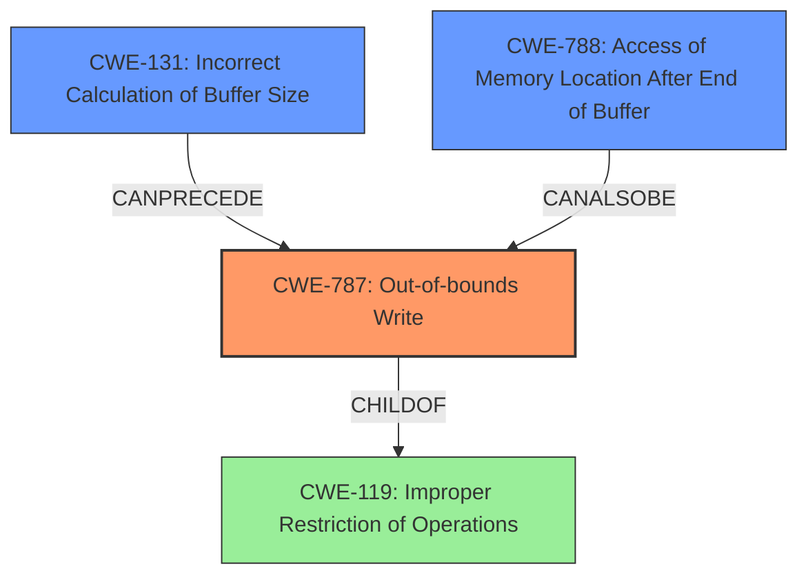

# Final Resolution for CVE-2021-42725

# Summary
| CWE ID | CWE Name | Confidence | CWE Abstraction Level | CWE Vulnerability Mapping Label | CWE-Vulnerability Mapping Notes |
|---|---|---|---|---|---|
| **CWE-787** | **Out-of-bounds Write** | 0.85 | Base | Allowed | Primary CWE |
| **CWE-131** | **Incorrect Calculation of Buffer Size** | 0.65 | Base | Allowed | Secondary Candidate |
| **CWE-788** | **Access of Memory Location After End of Buffer** | 0.6 | Base | Discouraged | Secondary Candidate |

## Evidence and Confidence

*   **Confidence Score:** 0.8
*   **Evidence Strength:** MEDIUM

## Relationship Analysis
The primary relationship influencing the decision is the child-of relationship between CWE-787 (**Out-of-bounds Write**) and CWE-119 (**Improper Restriction of Operations within the Bounds of a Memory Buffer**). CWE-787 is a more specific case of CWE-119, and since the vulnerability description indicates an out-of-bounds write, CWE-787 is the more appropriate choice. The criticism suggests also considering CWE-131 (**Incorrect Calculation of Buffer Size**) as a potential cause of the **out-of-bounds write**, forming a chain.

## Vulnerability Chain
The vulnerability chain starts with the insecure handling of a malicious M4A file. This could involve an **incorrect calculation of buffer size** (CWE-131), leading to an **out-of-bounds write** (CWE-787), which results in **memory corruption** and potential arbitrary code execution. **Access of memory location after end of buffer** (CWE-788) could be a consequence of the out-of-bounds write.

## Summary of Analysis
The initial analysis correctly identified CWE-787 (**Out-of-bounds Write**) as the primary weakness. The criticism raised valid points about potential contributing factors like CWE-131 (**Incorrect Calculation of Buffer Size**) and the need for more detailed relationship analysis.

The vulnerability description explicitly mentions "memory corruption" and the potential for "arbitrary code execution," which strongly suggests an **out-of-bounds write**. The CVE reference link content summary also points to "Access of Memory Location After End of Buffer" (CWE-788) and "Out-of-bounds Write" (CWE-787) as root causes for similar CVEs. The relationship analysis further supports the selection of CWE-787 as the primary CWE, given its base-level abstraction and direct relevance to the described impact.

The decision to include CWE-131 as a secondary CWE is based on the possibility that the buffer allocation was based on a faulty calculation, leading to an undersized buffer and facilitating the **out-of-bounds write**. CWE-788 is included as there's a possibility of accessing the memory location after the end of the buffer after the write, though this is secondary.

The selected CWEs are at the optimal level of specificity because they accurately represent the root cause and contributing factors of the vulnerability, based on the available evidence and relationship analysis. While more details about the specific implementation could lead to even more specific CWEs, the current classification provides a solid foundation for understanding and mitigating the vulnerability.