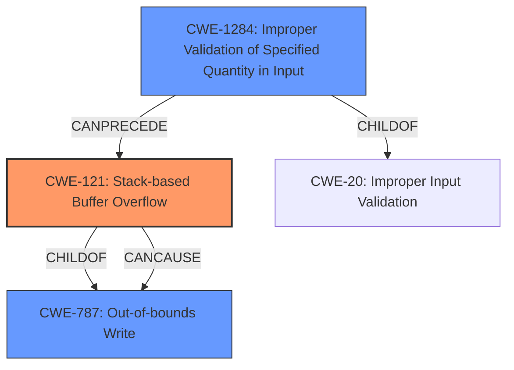

# Analysis Report for CVE-2021-42727

# Vulnerability Analysis Report: CVE-2021-42727

## Description

Adobe Bridge 11.1.1 (and earlier) is affected by a stack overflow vulnerability due to insecure handling of a crafted file, potentially resulting in arbitrary code execution in the context of the current user. Exploitation requires user interaction in that a victim must open a crafted file in Bridge.

## Vulnerability Description Key Phrases

**Rootcause:** insecure handling
**Weakness:** stack overflow
**Impact:** arbitrary code execution
**Vector:** crafted file
**Product:** Adobe Bridge
**Version:** 11.1.1 (and earlier)

## Analysis (with Relationship Data)

# Summary
| CWE ID  | CWE Name                          | Confidence | CWE Abstraction Level | CWE Vulnerability Mapping Label | CWE-Vulnerability Mapping Notes |
| :------- | :--------------------------------- | :--------- | :-------------------- | :------------------------------ | :------------------------------ |
| CWE-121 | Stack-based Buffer Overflow         | 0.95       | Variant               | Allowed                         | Primary CWE                     |
| CWE-787 | Out-of-bounds Write               | 0.75       | Base                  | Allowed                         | Secondary Candidate                     |
| CWE-1284 | Improper Validation of Specified Quantity in Input | 0.60       | Base                  | Allowed                         | Secondary Candidate                     |

## Evidence and Confidence

*   **Confidence Score:** 0.90
*   **Evidence Strength:** HIGH

- **Analysis and Justification:**
  - *Explanation:* "The vulnerability is described as a **stack overflow** due to **insecure handling** of a crafted file in Adobe Bridge. This directly aligns with CWE-121 (Stack-based Buffer Overflow), which is a variant of buffer overflow specifically occurring on the stack. The description mentions a crafted file, suggesting that the **insecure handling** likely involves processing the file's contents in a way that leads to overflowing a stack-allocated buffer. The impact is arbitrary code execution, a common consequence of stack overflows. The retriever results also list CWE-121 as a high scoring candidate."
  - *Relationship Analysis:* "CWE-121 is a variant of CWE-119 (Improper Restriction of Operations within the Bounds of a Memory Buffer), providing a more specific classification. The relationship analysis indicates that CWE-121 can be caused by improper input validation (CWE-20) or buffer copy without checking size (CWE-120). It can also lead to privilege escalation (CWE-269)."

- **Confidence Score:**
  - Confidence: 0.95 (High confidence due to precise match with vulnerability description and supporting retriever results.)

---

- **Analysis and Justification:**
  - *Explanation:* "CWE-787 (Out-of-bounds Write) describes a scenario where data is written past the end or before the beginning of the intended buffer. While CWE-121 is more specific to stack-based overflows, CWE-787 is a more general case of out-of-bounds write, and the stack overflow itself is a type of out-of-bounds write. The 'CVE Reference Links Content Summary' mentions 'Access of Memory Location After End of Buffer (CWE-788)' related to out-of-bounds access, which supports the possibility of an out-of-bounds write being involved, although the primary issue is the stack overflow. The retriever results also list CWE-787 as a high scoring candidate, but less than CWE-121."

  - *Relationship Analysis:* "CWE-787 is a child of CWE-119 (Improper Restriction of Operations within the Bounds of a Memory Buffer). The graph relationships show CWE-787 CanFollow CWE-825 (Expired Pointer Dereference) and CanPrecede CWE-269 (Privilege Management)."

- **Confidence Score:**
  - Confidence: 0.75 (Medium-High confidence, as it's a related but less specific weakness than CWE-121. Evidence supports the presence of out-of-bounds write, but the primary weakness is the stack overflow.)

---

- **Analysis and Justification:**
  - *Explanation:* "The crafted file attack vector, combined with the **insecure handling**, suggests a potential lack of proper input validation regarding the size or structure of the file's contents. This could lead to the stack overflow if the input specifies an unexpectedly large size that is not adequately checked before being processed. This aligns with CWE-1284 (Improper Validation of Specified Quantity in Input). If the crafted file specifies an invalid size or length that's not validated, leading to the buffer overflow, then CWE-1284 would be applicable. The **insecure handling** of the crafted file can indicate the missing validation of size."

  - *Relationship Analysis:* "CWE-1284 is a child of CWE-20 (Improper Input Validation). The relationship analysis indicates that CWE-1284 can precede CWE-789 (Uncontrolled Memory Allocation)."

- **Confidence Score:**
  - Confidence: 0.60 (Medium Confidence, as the description indicates **insecure handling**, which could include a lack of proper input validation regarding the size of the data in the crafted file.)

## Criticism of Analysis

Okay, I've reviewed the analysis and the provided CWE specifications. Here's my critique:

**Overall Assessment:**

The analysis is generally good, demonstrating a solid understanding of the vulnerability and the relevant CWEs. The confidence scores are justified, and the explanations are clear. However, some minor adjustments could be made to increase precision and avoid potential misinterpretations of CWE usage.

**Specific Comments:**

**1. CWE-121 (Stack-based Buffer Overflow):**

*   **Confidence:** The 0.95 confidence is appropriate given the vulnerability description that explicitly mentions "stack overflow." This is the most accurate primary CWE.
*   **Justification:** Sound rationale for selecting CWE-121.
*   **CWE Selection Alignment with CWE Specifications:** Excellent. The description aligns directly with CWE-121's definition.
*   **Mitigations:** The suggested mitigations are appropriate (using safer languages or libraries, compiler-based protections).

**2. CWE-787 (Out-of-bounds Write):**

*   **Confidence:** The 0.75 confidence is reasonable.  While a stack overflow *is* a form of out-of-bounds write, CWE-121 is more specific.  It's good that this analysis acknowledges the potential for out-of-bounds write *as a consequence* of the stack overflow.
*   **Justification:** The justification is valid. CWE-787 is a parent of CWE-121, making it a related, but less specific, weakness.
*   **CWE Selection Alignment with CWE Specifications:** Correct. This reflects that the stack overflow *results* in a write beyond the allocated buffer.
*   **Mitigations:** The suggested mitigations are appropriate, even though they largely overlap with CWE-121.

**3. CWE-1284 (Improper Validation of Specified Quantity in Input):**

*   **Confidence:** A confidence of 0.60 is appropriate. This is a *possible*, but not definite, contributing factor.  The "insecure handling" of the crafted file *could* involve a failure to validate the size or length of data within the file before processing it.
*   **Justification:** The rationale is good, emphasizing the "insecure handling" leading to potential missing size validation.
*   **CWE Selection Alignment with CWE Specifications:** The connection to improper input validation and specifically specified quantity is valid but relies on an *inference* about the nature of the insecure handling.
*   **Mitigations:** Appropriate mitigations, focusing on strict input validation.

**Recommendations for Improvement:**

*   **Emphasize the Chain of Events:** Explicitly state the potential chain of events:  Improper input validation (potentially CWE-1284) leads to a stack-based buffer overflow (CWE-121), which results in an out-of-bounds write (CWE-787).
*   **CWE-119 Avoidance:** As CWE-119 is discouraged, it is good the analysis did not make that the primary CWE.
*   **CVE Reference Links Content Summary:**  The analysis of the CVE reference links content summary is good, particularly in highlighting the connection to out-of-bounds access. However, it's also important to note the *limitations* of this summary.  It's based on *similar* vulnerabilities, not the *actual* CVE-2021-42727.
*   **Clarify Relationship between Weakness, Rootcause, and Impact:**  The "Vulnerability Description Key Phrases" section is useful, but it could be clarified.
    *   The *root cause* is more nuanced than just "insecure handling". It's the specific *type* of insecure handling that's important (e.g., missing size validation, unbounded copy).
    *   "Weakness" is a general term.  It is better to state *vulnerability* and *weakness*.
*   **Alternative CWE Considerations (Minor):**
    * Consider *CWE-120: Buffer Copy without Checking Size of Input ('Classic Buffer Overflow')* - if the handling of the file involves directly copying data from the crafted file into a buffer without checking sizes. While CWE-121 is more specific about the stack allocation, CWE-120 focuses on the unchecked copy operation. However, given the information, this would be less specific than CWE-121.

**Revised Summary Table (incorporating suggestions):**

| CWE ID  | CWE Name                          | Confidence | CWE Abstraction Level | CWE Vulnerability Mapping Label | CWE-Vulnerability Mapping Notes                                                                                                                                                     |
| :------- | :--------------------------------- | :--------- | :-------------------- | :------------------------------ | :-------------------------------------------------------------------------------------------------------------------------------------------------------------------------------- |
| CWE-121 | Stack-based Buffer Overflow         | 0.95       | Variant               | Allowed                         | Primary CWE: Directly reflects the reported stack overflow.                                                                                                                               |
| CWE-787 | Out-of-bounds Write               | 0.75       | Base                  | Allowed                         | Secondary Candidate: Consequence of the stack overflow.                                                                                                                                   |
| CWE-1284 | Improper Validation of Specified Quantity in Input | 0.60       | Base                  | Allowed                         | Secondary Candidate: Possible contributing factor if the size/length of data in the crafted file is not validated. The insecure handling of a crafted file can indicate the missing validation of size. |

By implementing these suggestions, the analysis can achieve a higher level of precision and clarity, ultimately resulting in more effective vulnerability management.

## Final Resolution

# Summary
| CWE ID  | CWE Name                          | Confidence | CWE Abstraction Level | CWE Vulnerability Mapping Label | CWE-Vulnerability Mapping Notes |
| :------- | :--------------------------------- | :--------- | :-------------------- | :------------------------------ | :------------------------------ |
| **CWE-121** | **Stack-based Buffer Overflow**         | 0.95       | Variant               | Allowed                         | Primary **CWE**: Directly reflects the reported **stack overflow**.                                                                                                                               |
| **CWE-787** | **Out-of-bounds Write**               | 0.75       | Base                  | Allowed                         | Secondary Candidate: Consequence of the **stack overflow**.                                                                                                                                   |
| **CWE-1284** | **Improper Validation of Specified Quantity in Input** | 0.60       | Base                  | Allowed                         | Secondary Candidate: Possible contributing factor if the size/length of data in the crafted file is not validated. The **insecure handling** of a crafted file can indicate the missing validation of size. |

## Evidence and Confidence

*   **Confidence Score:** 0.90
*   **Evidence Strength:** HIGH

## Relationship Analysis
The analysis correctly identifies CWE-121 as the primary weakness due to the explicit mention of "stack overflow" in the vulnerability description. CWE-787 is considered a secondary candidate as a consequence of the stack overflow, representing the out-of-bounds write that occurs when the buffer is overflowed. CWE-1284 is also considered as a secondary candidate because the "insecure handling" of the crafted file suggests a potential lack of proper input validation regarding the size or structure of the file's contents.

The hierarchical relationship is that CWE-121 is a variant of CWE-119 (which is intentionally avoided) and a child of CWE-787. CWE-1284 is a child of CWE-20 (Improper Input Validation). The chain relationship is that CWE-1284 can precede CWE-121, which then leads to CWE-787.

## Vulnerability Chain
The vulnerability chain starts with a crafted file that is handled insecurely. This **insecure handling** could involve a failure to validate the size or length of data within the file (CWE-1284). This missing validation can then lead to a stack-based buffer overflow (CWE-121), which in turn results in an out-of-bounds write (CWE-787). The final impact is arbitrary code execution.

CWE-1284 (Improper Validation of Specified Quantity in Input) -> CWE-121 (Stack-based Buffer Overflow) -> CWE-787 (**Out-of-bounds Write**) -> Arbitrary code execution.

## Summary of Analysis
The initial analysis and criticism provided a solid foundation for classifying this vulnerability. The vulnerability description explicitly mentions a "stack overflow," making CWE-121 the most appropriate primary **CWE**. The confidence score of 0.95 reflects this direct match. The analysis correctly identifies CWE-787 as a secondary candidate, representing the out-of-bounds write that is a consequence of the stack overflow. The consideration of CWE-1284 is also justified, as the "insecure handling" of the crafted file suggests a potential lack of proper input validation.

The graph relationships influenced the final selection by highlighting the hierarchical relationship between CWE-121 and CWE-787. The chain relationship also helped to clarify the sequence of events leading to the vulnerability.

The selected **CWE**s are at the optimal level of specificity because they directly reflect the technical details of the vulnerability. CWE-121 is specific to stack-based overflows, while CWE-787 and CWE-1284 represent related but less specific weaknesses that contribute to the overall vulnerability.

The evidence from the vulnerability description is: "Adobe Bridge 11.1.1 (and earlier) is affected by a **stack overflow** vulnerability due to **insecure handling** of a crafted file, potentially resulting in arbitrary code execution in the context of the current user."
Based on this, I agree with the assessment.

*Report generated on 2025-03-18 02:59:34*
