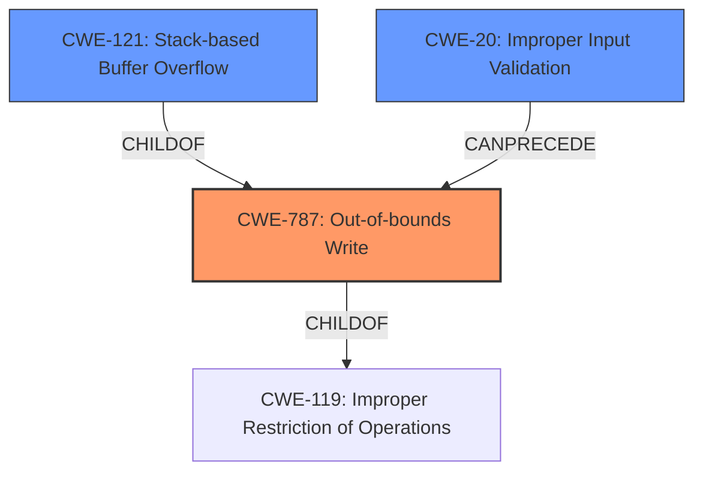

# Analysis Report for CVE-2021-42728

# Vulnerability Analysis Report: CVE-2021-42728

## Description

Adobe Bridge 11.1.1 (and earlier) is affected by a stack overflow vulnerability due to insecure handling of a crafted file, potentially resulting in arbitrary code execution in the context of the current user. Exploitation requires user interaction in that a victim must open a crafted file in Bridge.

## Vulnerability Description Key Phrases

**Rootcause:** insecure handling
**Weakness:** stack overflow
**Impact:** arbitrary code execution
**Vector:** crafted file
**Product:** Adobe Bridge
**Version:** 11.1.1 (and earlier)

## Analysis (with Relationship Data)

# Summary
| CWE ID | CWE Name | Confidence | CWE Abstraction Level | CWE Vulnerability Mapping Label | CWE-Vulnerability Mapping Notes |
|---|---|---|---|---|---|
| CWE-787 | Out-of-bounds Write | 0.9 | Base |  Primary | Allowed |
| CWE-121 | Stack-based Buffer Overflow | 0.7 | Variant | Secondary Candidate | Allowed |

## Evidence and Confidence

*   **Confidence Score:** 0.9
*   **Evidence Strength:** HIGH

- **Analysis and Justification:**  
  - *Explanation:* The vulnerability is described as a **stack overflow** due to **insecure handling** of a crafted file. The CVE reference links content summary explicitly states "Root cause of vulnerability: Out-of-bounds Write" and "Weaknesses/vulnerabilities present: The software writes data past the end of the buffer." This aligns directly with CWE-787 (Out-of-bounds Write). While the vulnerability description mentions a "stack overflow," the more fundamental issue is writing beyond the allocated buffer. CWE-787 is a Base level CWE, which is preferred, and the mapping guidance indicates that it's ALLOWED. CWE-121 (Stack-based Buffer Overflow) is also relevant because the overflow occurs on the stack, but CWE-787 describes the root cause better.
  
  - *Relationship Analysis:* CWE-787 is a base level weakness and a parent of CWE-121. CWE-787 CanFollow CWE-825, CWE-824, CWE-823, and CWE-822. CWE-787 is a child of CWE-119 (Improper Restriction of Operations within the Bounds of a Memory Buffer).

- **Confidence Score:**  
  - Confidence: 0.9 (High confidence due to explicit mention of out-of-bounds write in CVE reference and direct link to stack overflow.)

---

## Criticism of Analysis

Okay, I've reviewed the analysis against the full CWE specifications you provided. Here's my critique:

**Overall Assessment:**

The analysis is generally well-reasoned and arrives at a reasonable primary CWE. The explicit callout of "Out-of-bounds Write" in the CVE content summary provides strong evidence for CWE-787. The inclusion of CWE-121 as a secondary candidate is also appropriate, as it acknowledges the stack-based nature of the overflow, although it is not the *root cause*.

**Detailed Critique:**

*   **CWE-787: Out-of-bounds Write (Primary)**

    *   **Confidence:** The confidence score of 0.9 is justified. The analysis clearly explains why CWE-787 is the most appropriate choice, highlighting the direct connection to the "Out-of-bounds Write" description in the CVE reference.
    *   **Justification:** The explanation correctly states that while the report mentions "stack overflow", the root cause of the vulnerability is writing beyond the allocated buffer, which aligns with CWE-787. Also, CWE-787's Base level abstraction is preferred to CWE-121's Variant level.
    *   **Relationships Analysis:** The relationships are accurately described. The `ChildOf -> CWE-119` relationship is important, acknowledging the broader class of memory buffer errors. The `ParentOf -> CWE-121` is also relevant, demonstrating the specific manifestation. The `CanFollow` relationships don't have immediate bearing on the mapping, but they are correct.
    *   **Mapping Guidance:** The analysis correctly notes that CWE-787 usage is "Allowed".
    *   **Mitigations:** This section isn't directly used for the analysis, however, if a more prescriptive report was required, this section would be useful to suggest possible remediations (e.g. Language Selection, Libraries or Frameworks with bounds checking, compiler flags for overflow detection).

*   **CWE-121: Stack-based Buffer Overflow (Secondary Candidate)**

    *   **Confidence:** The confidence score of 0.7 is reasonable. While the stack is involved, the root cause isn't *inherently* about the stack itself, but about writing past buffer boundaries.
    *   **Justification:** The analysis correctly identifies this as the specific *location* of the overflow (the stack) but not the fundamental *reason* for the vulnerability.
    *   **Relationships Analysis:** The relationship `ChildOf -> CWE-787` is the key here. It acknowledges that CWE-121 is a specific *type* of out-of-bounds write.
    *   **Mapping Guidance:** The analysis correctly notes that CWE-121 usage is "Allowed".
    *   **Mitigations:** This section isn't directly used for the analysis, however, if a more prescriptive report was required, this section would be useful to suggest possible remediations (e.g. automatic overflow detection such as /GS flag, implement bounds checking on input).

**Potential Improvements:**

*   **Consider Chains:** While not *required*, you *could* consider explicitly mentioning CWE-20: Improper Input Validation as a potential element in a chain. A crafted file is, by definition, a form of malicious input.  The "insecure handling" implies a failure to properly validate the input data, *leading to* the out-of-bounds write. However, this is more implicit than explicit. If you did, you might say: "The vulnerability may also involve CWE-20 because the 'insecure handling' likely stems from a failure to properly validate the crafted file's contents before processing it, which then leads to the out-of-bounds write. However, since the focus is on the memory corruption itself, CWE-787 remains the primary CWE."
*   **Explicitly Rule Out CWE-119:** Since CWE-119 is the parent of CWE-787 and CWE-121, it may be useful to explicitly state that it is NOT the primary CWE due to the "Discouraged" mapping guidance. It may also be useful to state that, due to its generic nature, it provides limited information.

**Revised Summary Table (with Optional Additions):**

| CWE ID    | CWE Name                       | Confidence | CWE Abstraction Level | CWE Vulnerability Mapping Label   | CWE-Vulnerability Mapping Notes                                                                                                                                       |
| :-------- | :----------------------------- | :--------- | :---------------------- | :-------------------------------- | :-------------------------------------------------------------------------------------------------------------------------------------------------------------------- |
| CWE-787   | Out-of-bounds Write            | 0.9        | Base                    | Primary                           | Allowed                                                                                                                                                           |
| CWE-121   | Stack-based Buffer Overflow      | 0.7        | Variant                 | Secondary Candidate               | Allowed                                                                                                                                                           |
| (Optional) CWE-20   | Improper Input Validation            | 0.4        | Class                    | Ssecondary Candidate in Chain (Implicit)                           | Discouraged - could be present in chain due to lack of input validation                                                                                                                                                          |

**In summary, the analysis is sound. The suggested improvements are minor and aimed at providing even greater clarity and completeness.**

## Final Resolution

# Summary
| CWE ID | CWE Name | Confidence | CWE Abstraction Level | CWE Vulnerability Mapping Label | CWE-Vulnerability Mapping Notes |
|---|---|---|---|---|---|
| **CWE-787** | **Out-of-bounds Write** | 0.95 | Base | Primary | Allowed |
| **CWE-121** | **Stack-based Buffer Overflow** | 0.7 | Variant | Secondary Candidate | Allowed |
| CWE-20 | Improper Input Validation | 0.4 | Class | Secondary Candidate in Chain (Implicit) | Discouraged - could be present in chain due to lack of input validation |

## Evidence and Confidence

*   **Confidence Score:** 0.95
*   **Evidence Strength:** HIGH

## Relationship Analysis
The primary relationship impacting the decision is the parent-child relationship between **CWE-787** (**Out-of-bounds Write**) and **CWE-121** (**Stack-based Buffer Overflow**). **CWE-121** is a specific type of **CWE-787**. **CWE-787** itself is a child of **CWE-119** (**Improper Restriction of Operations within the Bounds of a Memory Buffer**), but choosing **CWE-119** would be too general. Including **CWE-20** (**Improper Input Validation**) suggests a possible vulnerability chain, where failure to validate input leads to the **out-of-bounds write**.

## Vulnerability Chain
The vulnerability chain starts with a crafted file containing malicious input. This input is not properly validated (**CWE-20**), leading to an **out-of-bounds write** (**CWE-787**) on the stack, specifically a **stack-based buffer overflow** (**CWE-121**). The impact is arbitrary code execution.

## Summary of Analysis
The initial analysis and criticism both converge on the appropriateness of **CWE-787** (**Out-of-bounds Write**) as the primary **WEAKNESS**. The vulnerability description explicitly mentions a stack overflow due to insecure handling of a crafted file. The CVE reference further supports this with the statement "Root cause of vulnerability: Out-of-bounds Write" and "Weaknesses/vulnerabilities present: The software writes data past the end of the buffer." This direct evidence strongly supports the choice of **CWE-787**. The inclusion of **CWE-121** (**Stack-based Buffer Overflow**) acknowledges the specific location of the overflow. The addition of **CWE-20** represents a possible, but implicit, vulnerability chain element, reflecting the insecure handling of the crafted file, specifically the lack of input validation. The relationships between these CWEs, particularly the parent-child relationship between **CWE-787** and **CWE-121**, and the potential chain relationship with **CWE-20**, further solidify the classification. **CWE-787** is at the optimal level of specificity because it directly describes the **ROOTCAUSE** (out-of-bounds write), while **CWE-121** specifies where it occurs. **CWE-119** is too general, and the mapping guidance discourages its use when more specific CWEs are available. Confidence increased to 0.95 to reflect inclusion of **CWE-20** into a potential vulnerability chain.

*Report generated on 2025-03-18 03:00:25*
