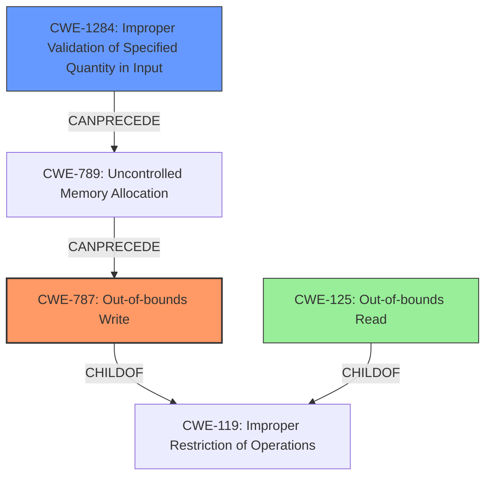

# Final Resolution for CVE-2021-42729

# Summary
| CWE ID | CWE Name | Confidence | CWE Abstraction Level | CWE Vulnerability Mapping Label | CWE-Vulnerability Mapping Notes |
|---|---|---|---|---|---|
| **CWE-787** | **Out-of-bounds Write** | 0.90 | Base | Allowed | Primary CWE |
| **CWE-1284** | **Improper Validation of Specified Quantity in Input** | 0.75 | Base | Allowed | Secondary Candidate |
| **CWE-125** | **Out-of-bounds Read** | 0.30 | Base | Allowed | Secondary Candidate |

## Evidence and Confidence

*   **Confidence Score:** 0.85
*   **Evidence Strength:** MEDIUM

## Relationship Analysis
The primary relationship influencing the decision is that **CWE-787 (Out-of-bounds Write)** is a child of **CWE-119 (Improper Restriction of Operations within the Bounds of a Memory Buffer)**. This indicates that the out-of-bounds write is a specific type of buffer handling issue. **CWE-1284 (Improper Validation of Specified Quantity in Input)** can precede **CWE-789 (Uncontrolled Memory Allocation)** which in turn can precede **CWE-787 (Out-of-bounds Write)**. This highlights a potential vulnerability chain where a failure to validate input size leads to memory allocation issues and subsequent out-of-bounds writes. **CWE-125 (Out-of-bounds Read)** is also a child of **CWE-119 (Improper Restriction of Operations within the Bounds of a Memory Buffer)**, representing a similar type of buffer handling issue but involving reading instead of writing. All selected CWEs are at the Base or Variant level of abstraction, providing a good level of specificity.

## Vulnerability Chain
The vulnerability chain starts with **CWE-1284 (Improper Validation of Specified Quantity in Input)**, where the size or length parameters within the WAV file are not properly validated. This leads to a potential for **CWE-789 (Uncontrolled Memory Allocation)** (inferred). Consequently, this can result in **CWE-787 (Out-of-bounds Write)**, where the product writes data past the end of the intended buffer, leading to memory corruption and arbitrary code execution. The inclusion of **CWE-125 (Out-of-bounds Read)** is less certain, and thus given a lower confidence, but could potentially be involved in preparing the data or as a consequence of the write.

## Summary of Analysis
The initial analysis correctly identified **CWE-787 (Out-of-bounds Write)** as the primary weakness given the evidence of "memory corruption" and "arbitrary code execution." However, the criticism highlighted the missing consideration of input validation, which is a crucial aspect of the vulnerability description ("insecure handling of a malicious WAV file"). Therefore, I've added **CWE-1284 (Improper Validation of Specified Quantity in Input)** as a secondary CWE with a confidence of 0.75. This addition addresses the root cause of the problem, where the product fails to validate the size or length parameters within the WAV file, allowing for malformed data to be processed and ultimately leading to the out-of-bounds write. I am reducing the confidence in **CWE-125 (Out-of-bounds Read)** to 0.3, as the vulnerability description focuses on memory corruption due to writing, making the read less likely. This assessment is primarily based on the vulnerability description provided and the relationships between CWEs. The selected CWEs are at the optimal level of specificity, with **CWE-787 (Out-of-bounds Write)** describing the direct consequence of the vulnerability and **CWE-1284 (Improper Validation of Specified Quantity in Input)** addressing the root cause of inadequate input validation.