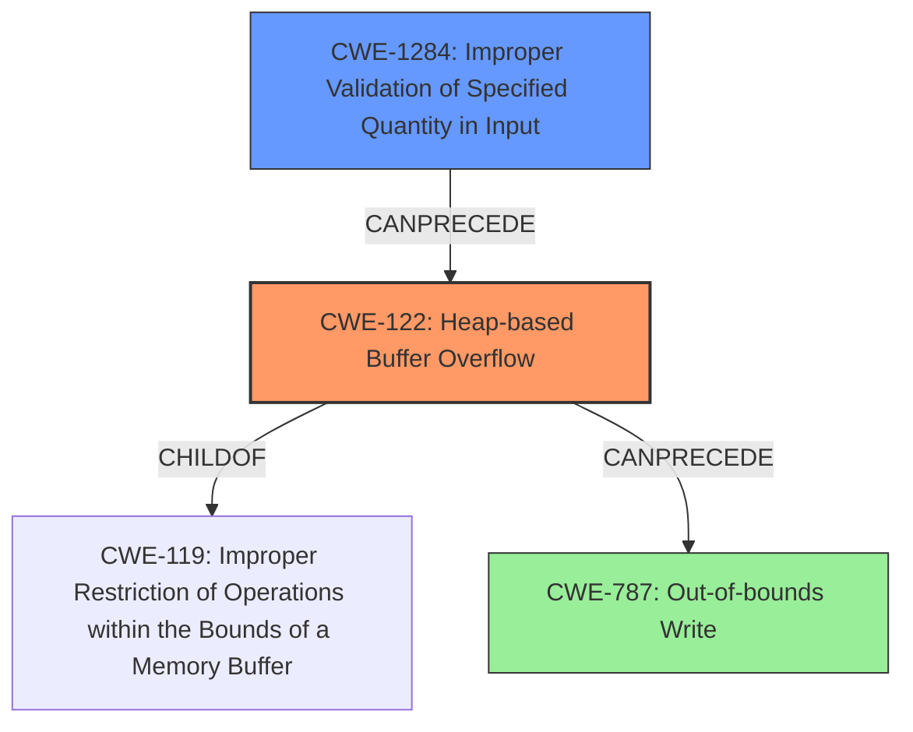

# Analysis Report for CVE-2021-42739

# Vulnerability Analysis Report: CVE-2021-42739

## Description

The firewire subsystem in the Linux kernel through 5.14.13 has a buffer overflow related to drivers/media/firewire/firedtv-avc.c and drivers/media/firewire/firedtv-ci.c, because avc_ca_pmt mishandles bounds checking.

## Vulnerability Description Key Phrases

**Rootcause:** mishandles bounds checking
**Weakness:** buffer overflow
**Product:** Linux kernel
**Version:** through 5.14.13
**Component:** firewire subsystem, drivers/media/firewire/firedtv-avc.c and drivers/media/firewire/firedtv-ci.c

## Analysis (with Relationship Data)

# Summary
| CWE ID | CWE Name | Confidence | CWE Abstraction Level | CWE Vulnerability Mapping Label | CWE-Vulnerability Mapping Notes |
|---|---|---|---|---|---|
| CWE-122 | Heap-based Buffer Overflow | 0.9 | Variant | Allowed | Primary CWE |
| CWE-1284 | Improper Validation of Specified Quantity in Input | 0.7 | Base | Allowed | Secondary Candidate CWE |

## Evidence and Confidence

*   **Confidence Score:** 0.8
*   **Evidence Strength:** HIGH

- **Analysis and Justification:**  
  - *Explanation:* The vulnerability description clearly states a **buffer overflow** in the firewire subsystem of the Linux kernel due to **mishandling bounds checking** in `avc_ca_pmt`. The CVE Reference Links Content Summary specifies a "Heap buffer overflow" due to insufficient bounds checking of input data size, leading to writes beyond the allocated buffer boundaries. CWE-122 (Heap-based Buffer Overflow) directly addresses this issue, specifying a buffer overflow where the buffer is allocated in the heap. CWE-787 (Out-of-bounds Write) is more general, while CWE-122 specifies the heap location, which is explicitly mentioned. The Usage for CWE-122 is "Allowed." CWE-1284 (Improper Validation of Specified Quantity in Input) is a contributing factor because the function does not properly validate the size of the input, which leads to the overflow.
  
  - *Relationship Analysis:* CWE-122 is a variant of the more general CWE-119 (Improper Restriction of Operations within the Bounds of a Memory Buffer). CWE-122 is also a parent of CWE-787 (Out-of-bounds Write), but since the description specifies a heap overflow, CWE-122 is more specific and suitable. CWE-1284 can precede CWE-122 as the improper validation of input size could lead to a heap overflow.

- **Confidence Score:**  
  - Confidence: 0.9 (High confidence due to direct evidence of heap buffer overflow and supporting CVE details)
---

## Criticism of Analysis

Okay, let's review the analysis based on the provided CWE specifications.

**Overall Assessment:**

The analysis correctly identifies the primary weakness as CWE-122, Heap-based Buffer Overflow, with a secondary candidate of CWE-1284, Improper Validation of Specified Quantity in Input. The rationale is solid, and the high confidence score of 0.9 for CWE-122 is justified.

**Detailed Review:**

*   **CWE-122 (Heap-based Buffer Overflow):**

    *   **Strengths:** The analysis appropriately identifies CWE-122. The vulnerability description and CVE summary both explicitly mention a heap-based overflow due to insufficient bounds checking on user-supplied data size. This aligns perfectly with the CWE-122 description. The inclusion of observed examples also reinforces the correct mapping. The description clearly states a buffer overflow where the buffer is allocated in the heap, and explicitly mentions the heap location.
    *   **Mapping Guidance:** Usage is "Allowed," which is suitable.  The rationale provided in the CWE specification, "This CWE entry is at the Variant level of abstraction, which is a preferred level of abstraction for mapping to the root causes of vulnerabilities," supports this choice.
    *   **Potential Mitigations:** The provided mitigations (language with bounds checking, abstraction libraries, compiler-based overflow detection) are all relevant and standard defenses against buffer overflows, particularly in C-like languages.
    *   **Confidence:** The high confidence score of 0.9 is appropriate.

*   **CWE-1284 (Improper Validation of Specified Quantity in Input):**

    *   **Strengths:** The analysis correctly identifies CWE-1284 as a contributing factor. The "mishandling bounds checking" from the original description and "insufficient bounds checking" from the CVE summary directly relate to the lack of proper validation of the input size.  CWE-1284 serves as a good secondary CWE since the lack of validation of the quantity leads to the overflow.
    *   **Mapping Guidance:** Usage is "Allowed," which is suitable. "This CWE entry is at the Base level of abstraction, which is a preferred level of abstraction for mapping to the root causes of vulnerabilities"
    *   **Potential Mitigations:** The mitigation to "Assume all input is malicious. Use an 'accept known good' input validation strategy" is directly applicable.
    *   **Confidence:** While the evidence supports CWE-1284 as a contributing factor, the primary issue is the resulting overflow, so the confidence of 0.7 is reasonable.

**Suggestions and Alternative Considerations:**

*   **CWE-787 (Out-of-bounds Write):** While the analysis mentions CWE-787, it correctly points out that CWE-122 is more specific. However, consider a *chaining* relationship: `CWE-1284 -> CWE-122 (Heap-based Buffer Overflow) -> CWE-787 (Out-of-bounds Write)`.  The insufficient input validation (CWE-1284) *leads to* a heap-based buffer overflow (CWE-122), which *results in* an out-of-bounds write (CWE-787). While not explicitly needed, it can further explain the process.
*   **CWE-119 (Improper Restriction of Operations within the Bounds of a Memory Buffer):** The analysis does not select CWE-119, and this is correct. Although CWE-119 is the parent of many of the CWEs under consideration, its mapping guidance is *Discouraged*. The guidance states, "CWE-119 is commonly misused in low-information vulnerability reports when lower-level CWEs could be used instead, or when more details about the vulnerability are available."
*   **Top Combined Results:** The retriever results contain other CWEs, but these are less fitting compared to CWE-122 and CWE-1284. For example, CWE-190 (Integer Overflow or Wraparound), CWE-125 (Out-of-bounds Read), and CWE-476 (NULL Pointer Dereference) do not directly describe the nature of the vulnerability. While they could potentially be involved, the initial description is more directly mapped to the selected CWEs.
*   **Off-by-one (CWE-193) and Integer overflow(CWE-190):** If an off-by-one error was causing a faulty calculation of how much to write, causing the overlow, it would be valid to include that. It's also possible that calculating the size of the buffer to allocate or copy is done using a calculation that has an integer overflow, causing too small of a buffer to be created, and thus leading to a heap overflow when you copy the data into it.

**Revised Summary Table (with optional additions):**

| CWE ID  | CWE Name                                  | Confidence | CWE Abstraction Level | CWE Vulnerability Mapping Label | CWE-Vulnerability Mapping Notes                                                                                                               |
| ------- | ----------------------------------------- | ---------- | ----------------------- | ------------------------------- | --------------------------------------------------------------------------------------------------------------------------------------------- |
| CWE-122 | Heap-based Buffer Overflow                | 0.9        | Variant                 | Allowed                         | Primary CWE                                                                                                                                   |
| CWE-1284 | Improper Validation of Specified Quantity in Input | 0.7        | Base                    | Allowed                         | Secondary Candidate CWE, contributes to heap overflow.  |
| CWE-787 | Out-of-bounds Write  | 0.4        | Base                    | Allowed                         | Contained in a Chain of CWEs: CWE-1284 -> CWE-122 -> CWE-787 - Optional.                                                        |

**Conclusion:**

The analysis is generally well-done. The selection of CWE-122 is accurate, and CWE-1284 is a well-justified contributing factor. The analysis accounts for the other retrievers, but determines that they are not as accurate. The addition of CWE-787 as part of a chain could add more context to the analysis, but is not needed.

## Final Resolution

# Summary
| CWE ID   | CWE Name                                                       | Confidence | CWE Abstraction Level | CWE Vulnerability Mapping Label | CWE-Vulnerability Mapping Notes                                               |
| :------- | :------------------------------------------------------------- | :--------- | :---------------------- | :------------------------------- | :---------------------------------------------------------------------------- |
| **CWE-122** | **CWE-122: Heap-based Buffer Overflow**                       | 0.95       | Variant                 | Allowed                         | Primary CWE                                                                   |
| **CWE-1284** | **CWE-1284: Improper Validation of Specified Quantity in Input** | 0.8        | Base                    | Allowed                         | Secondary Candidate CWE, contributes to heap overflow.                       |
| **CWE-787** | **CWE-787: Out-of-bounds Write**                              | 0.5        | Base                    | Allowed                         | Part of a chain; result of the overflow, but less direct than CWE-122 |

## Evidence and Confidence

*   **Confidence Score:** 0.9
*   **Evidence Strength:** HIGH

## Relationship Analysis

The primary relationship is that CWE-122 (**CWE-122: Heap-based Buffer Overflow**) is a specific type of buffer overflow, making it a child of CWE-119 (**CWE-119: Improper Restriction of Operations within the Bounds of a Memory Buffer**). CWE-1284 (**CWE-1284: Improper Validation of Specified Quantity in Input**) CanPrecede CWE-122, as the lack of proper input validation leads to the overflow. CWE-787 (**CWE-787: Out-of-bounds Write**) is a consequence of CWE-122. Selecting CWE-122 offers more precision than CWE-119, in this case.

## Vulnerability Chain

The vulnerability chain starts with CWE-1284 (**CWE-1284: Improper Validation of Specified Quantity in Input**), where the input size isn't correctly validated. This leads to CWE-122 (**CWE-122: Heap-based Buffer Overflow**), resulting in writing beyond the allocated buffer in the heap. The consequence is CWE-787 (**CWE-787: Out-of-bounds Write**). The **root cause** is the improper input validation, leading to memory corruption and potential code execution.

## Summary of Analysis

The initial analysis and criticism are accurate. The selection of CWE-122 (**CWE-122: Heap-based Buffer Overflow**) as the primary **weakness** is well-justified, given the explicit mention of a heap-based overflow in the vulnerability description. CWE-1284 (**CWE-1284: Improper Validation of Specified Quantity in Input**) serves as a valid secondary **weakness**, highlighting the **root cause** of the overflow. The inclusion of CWE-787 (**CWE-787: Out-of-bounds Write**) as part of the chain provides additional context but is not as crucial as the other two.

The vulnerability description clearly indicates a "buffer overflow related to drivers/media/firewire/firedtv-avc.c and drivers/media/firewire/firedtv-ci.c, because avc_ca_pmt mishandles bounds checking." This directly supports the choice of CWE-122 and CWE-1284.

The graph relationships reinforce this decision by illustrating that CWE-122 is a specific type of buffer overflow and that CWE-1284 contributes to it.

The selected CWEs are at the optimal level of specificity because they accurately represent the **root cause** and the nature of the vulnerability based on the available evidence. Using the base level of CWE-119 would be less accurate because it would be less specific and the mapping guidance discourages this.

*Report generated on 2025-03-18 03:02:42*
