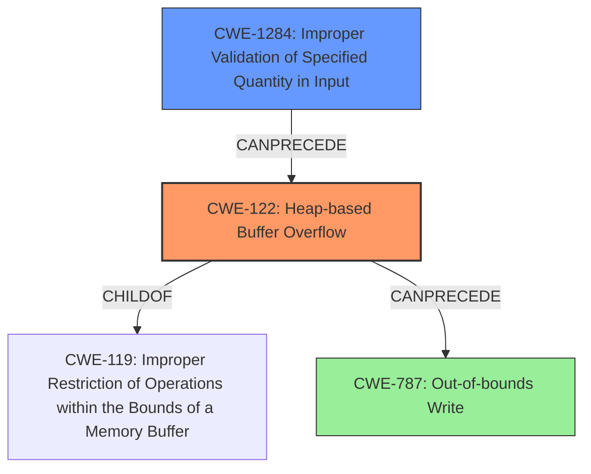

# Final Resolution for CVE-2021-42739

# Summary
| CWE ID   | CWE Name                                                       | Confidence | CWE Abstraction Level | CWE Vulnerability Mapping Label | CWE-Vulnerability Mapping Notes                                               |
| :------- | :------------------------------------------------------------- | :--------- | :---------------------- | :------------------------------- | :---------------------------------------------------------------------------- |
| **CWE-122** | **CWE-122: Heap-based Buffer Overflow**                       | 0.95       | Variant                 | Allowed                         | Primary CWE                                                                   |
| **CWE-1284** | **CWE-1284: Improper Validation of Specified Quantity in Input** | 0.8        | Base                    | Allowed                         | Secondary Candidate CWE, contributes to heap overflow.                       |
| **CWE-787** | **CWE-787: Out-of-bounds Write**                              | 0.5        | Base                    | Allowed                         | Part of a chain; result of the overflow, but less direct than CWE-122 |

## Evidence and Confidence

*   **Confidence Score:** 0.9
*   **Evidence Strength:** HIGH

## Relationship Analysis

The primary relationship is that CWE-122 (**CWE-122: Heap-based Buffer Overflow**) is a specific type of buffer overflow, making it a child of CWE-119 (**CWE-119: Improper Restriction of Operations within the Bounds of a Memory Buffer**). CWE-1284 (**CWE-1284: Improper Validation of Specified Quantity in Input**) CanPrecede CWE-122, as the lack of proper input validation leads to the overflow. CWE-787 (**CWE-787: Out-of-bounds Write**) is a consequence of CWE-122. Selecting CWE-122 offers more precision than CWE-119, in this case.

## Vulnerability Chain

The vulnerability chain starts with CWE-1284 (**CWE-1284: Improper Validation of Specified Quantity in Input**), where the input size isn't correctly validated. This leads to CWE-122 (**CWE-122: Heap-based Buffer Overflow**), resulting in writing beyond the allocated buffer in the heap. The consequence is CWE-787 (**CWE-787: Out-of-bounds Write**). The **root cause** is the improper input validation, leading to memory corruption and potential code execution.

## Summary of Analysis

The initial analysis and criticism are accurate. The selection of CWE-122 (**CWE-122: Heap-based Buffer Overflow**) as the primary **weakness** is well-justified, given the explicit mention of a heap-based overflow in the vulnerability description. CWE-1284 (**CWE-1284: Improper Validation of Specified Quantity in Input**) serves as a valid secondary **weakness**, highlighting the **root cause** of the overflow. The inclusion of CWE-787 (**CWE-787: Out-of-bounds Write**) as part of the chain provides additional context but is not as crucial as the other two.

The vulnerability description clearly indicates a "buffer overflow related to drivers/media/firewire/firedtv-avc.c and drivers/media/firewire/firedtv-ci.c, because avc_ca_pmt mishandles bounds checking." This directly supports the choice of CWE-122 and CWE-1284.

The graph relationships reinforce this decision by illustrating that CWE-122 is a specific type of buffer overflow and that CWE-1284 contributes to it.

The selected CWEs are at the optimal level of specificity because they accurately represent the **root cause** and the nature of the vulnerability based on the available evidence. Using the base level of CWE-119 would be less accurate because it would be less specific and the mapping guidance discourages this.