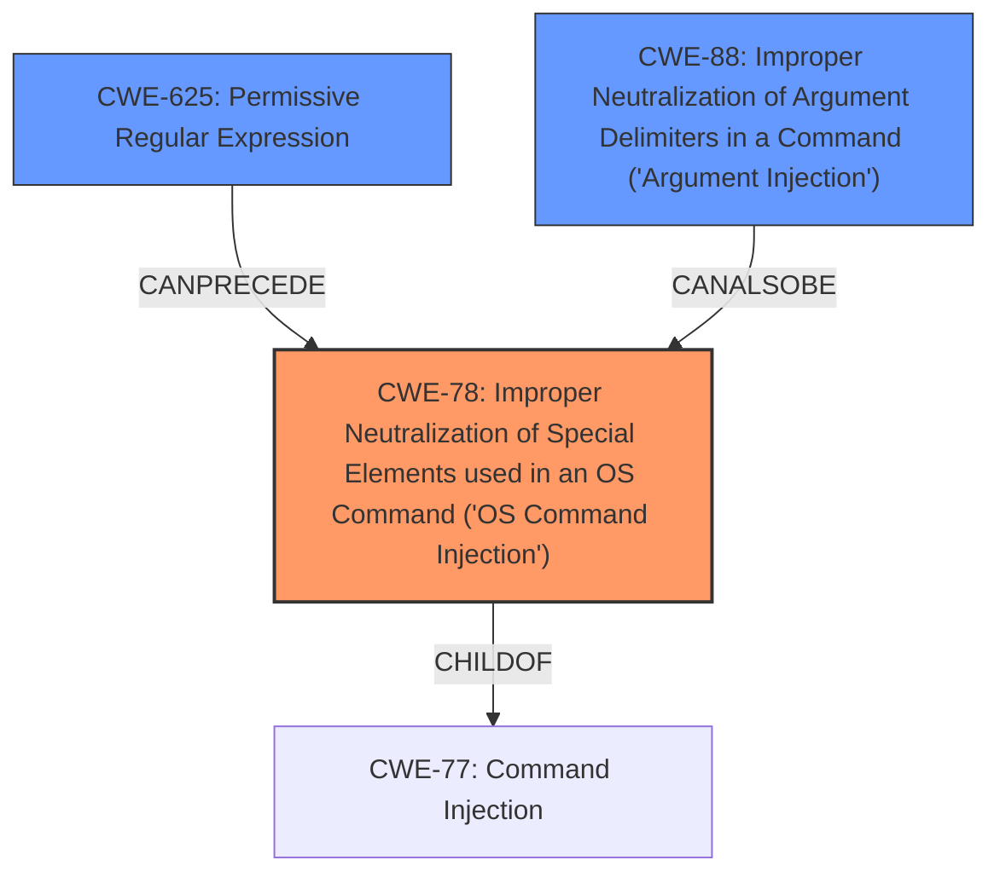

# Final Resolution for CVE-2021-42740

# Summary
| CWE ID | CWE Name | Confidence | CWE Abstraction Level | CWE Vulnerability Mapping Label | CWE-Vulnerability Mapping Notes |
|---|---|---|---|---|---|
| **CWE-78** | Improper Neutralization of Special Elements used in an OS Command ('OS Command Injection') | 0.95 | Base | Allowed | **Primary CWE**. The vulnerability allows execution of arbitrary commands due to **improper handling of shell metacharacters**. Mitigations: Use library calls instead of external processes, consider sandboxing. |
| **CWE-625** | Permissive Regular Expression | 0.7 | Base | Allowed | Secondary **CWE**. The regex used to identify Windows drive letters is too permissive, allowing shell metacharacters. Mitigation: Use precise regex definitions with appropriate anchors. |
| **CWE-88** | Improper Neutralization of Argument Delimiters in a Command ('Argument Injection') | 0.6 | Base | Allowed | Secondary **CWE**. Potentially relevant as injected commands might be interpreted as arguments. Mitigation: Parameterization (but this is also a fix for **CWE-78**). |

## Evidence and Confidence

*   **Confidence Score:** 0.9
*   **Evidence Strength:** HIGH

## Relationship Analysis
The assessment of **CWE-78** as the primary **WEAKNESS** is supported by its hierarchical relationship as a child of **CWE-77** (Command Injection). This indicates a direct link to the broader category of command injection vulnerabilities. **CWE-625** further clarifies the root cause by highlighting the use of a permissive regular expression, showcasing a specific instance of **improper input validation**. While **CWE-88** is considered, its relevance is less direct, acting as a potential consequence rather than a primary cause.

## Vulnerability Chain
The vulnerability chain begins with **CWE-625**, the permissive regular expression. This **WEAKNESS** allows unescaped shell metacharacters to pass validation. This leads directly to **CWE-78**, OS Command Injection, where the **improperly neutralized** metacharacters are used to construct and execute arbitrary commands. **CWE-88** may then come into play if the injected commands are interpreted as arguments, further extending the attack surface.

## Summary of Analysis
The initial analysis correctly identifies **CWE-78** as the primary **WEAKNESS** due to the ability to inject and execute arbitrary commands. The criticism strengthens the analysis by emphasizing the importance of mitigations for **CWE-78** and **CWE-625**, such as using library calls instead of external processes and employing precise regular expression definitions. The relationship analysis helps to understand the connections between the **CWEs**, with **CWE-625** being the root cause enabling **CWE-78**. The final decision is based on the evidence from the vulnerability description, the relationship analysis, and the mapping guidance, resulting in **CWE-78** as the primary **CWE** and **CWE-625** and **CWE-88** as secondary **CWEs**. This classification reflects the optimal level of specificity, as **CWE-78** directly addresses the OS command injection, while **CWE-625** highlights the cause of the vulnerability by using a permissive regular expression. "The shell-quote package before 1.7.3 for Node.js allows command injection. An attacker can inject unescaped shell metacharacters through a regex designed to support Windows drive letters. If the output of this package is passed to a real shell as a quoted argument to a command with exec(), an attacker can inject arbitrary commands. This is because the Windows drive letter regex character class is {A-z] instead of the correct {A-Za-z]."