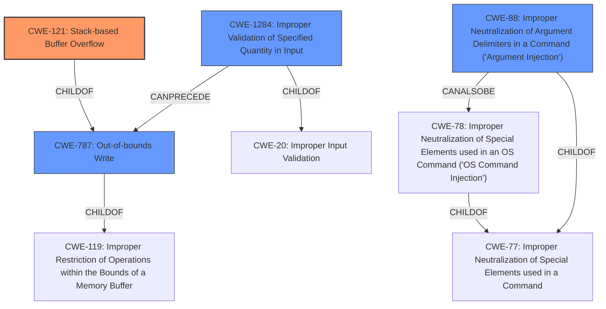

# Final Resolution for CVE-2021-42757

# Summary
| CWE ID | CWE Name | Confidence | CWE Abstraction Level | CWE Vulnerability Mapping Label | CWE-Vulnerability Mapping Notes |
|---|---|---|---|---|---|
| CWE-121 | Stack-based Buffer Overflow | 0.9 | Variant | Primary | Allowed |
| CWE-787 | Out-of-bounds Write | 0.7 | Base | Secondary | Allowed |
| CWE-1284 | Improper Validation of Specified Quantity in Input | 0.3 | Base | Secondary | Allowed |
| CWE-88 | Improper Neutralization of Argument Delimiters in a Command ('Argument Injection') | 0.4 | Base | Secondary | Allowed |

## Evidence and Confidence

*   **Confidence Score:** 0.8
*   **Evidence Strength:** MEDIUM

## Relationship Analysis
The primary relationship is that CWE-121 (Stack-based Buffer Overflow) is a specific type of **buffer overflow**, which inherently involves **out-of-bounds write** (CWE-787). Thus, CWE-787 is a parent of CWE-121. CWE-1284 (Improper Validation of Specified Quantity in Input) can **precede** CWE-787, as insufficient input validation could lead to a buffer overflow. CWE-88 (Improper Neutralization of Argument Delimiters in a Command ('Argument Injection')) is a peer of CWE-78 (Improper Neutralization of Special Elements used in an OS Command ('OS Command Injection')), and both are children of CWE-77 (Improper Neutralization of Special Elements used in a Command). Because the vulnerability is triggered via command line arguments, CWE-88 is a relevant peer consideration.

## Vulnerability Chain
The vulnerability chain starts with potentially **improper input validation** (CWE-1284) of command-line arguments. This leads to the **lack of sanitization of argument delimiters** (CWE-88), which then results in an exploitable **stack-based buffer overflow** (CWE-121) during the processing of the command-line arguments. The **out-of-bounds write** (CWE-787) is a direct consequence of the buffer overflow, where data is written beyond the allocated buffer's boundaries on the stack. The ultimate impact is arbitrary code execution.

## Summary of Analysis
The initial analysis correctly identified CWE-121 as the primary **WEAKNESS**, given the vulnerability description's explicit mention of a "buffer overflow" in the stack. The criticism provided helpful suggestions for improving the analysis, specifically regarding the confidence level for CWE-1284 and the potential inclusion of CWE-88.

Based on the retriever scores and the nature of command-line argument exploitation, CWE-88 (Improper Neutralization of Argument Delimiters in a Command ('Argument Injection')) is added as a secondary CWE with a confidence of 0.4. The reasoning is that command-line arguments often involve parsing and interpretation, and a failure to properly neutralize argument delimiters could contribute to the **buffer overflow** by allowing an attacker to inject malicious data. This wasn't explicitly stated but is a reasonable inference, aligning with the retriever's suggestions.

The confidence in CWE-1284 is reduced to 0.3. While a lack of input validation may contribute, it's not as direct a cause as the **buffer overflow** itself or the **improper neutralization of argument delimiters**. It remains a secondary consideration because it highlights the potential for preventing the vulnerability through better input handling, but the evidence for it is not strong.

The confidence in CWE-787 is adjusted to 0.7, reflecting that while it is always part of **buffer overflows**, it is less specific than CWE-121.

The selected CWEs are at the optimal level of specificity. CWE-121 is a Variant that accurately describes the stack-based nature of the **buffer overflow**. CWE-787 is a Base CWE that complements CWE-121 by highlighting the **out-of-bounds write** aspect. CWE-1284 and CWE-88 address the potential contributing factors related to input validation and command interpretation, respectively. These are all Base CWEs and thus an appropriate level of abstraction.