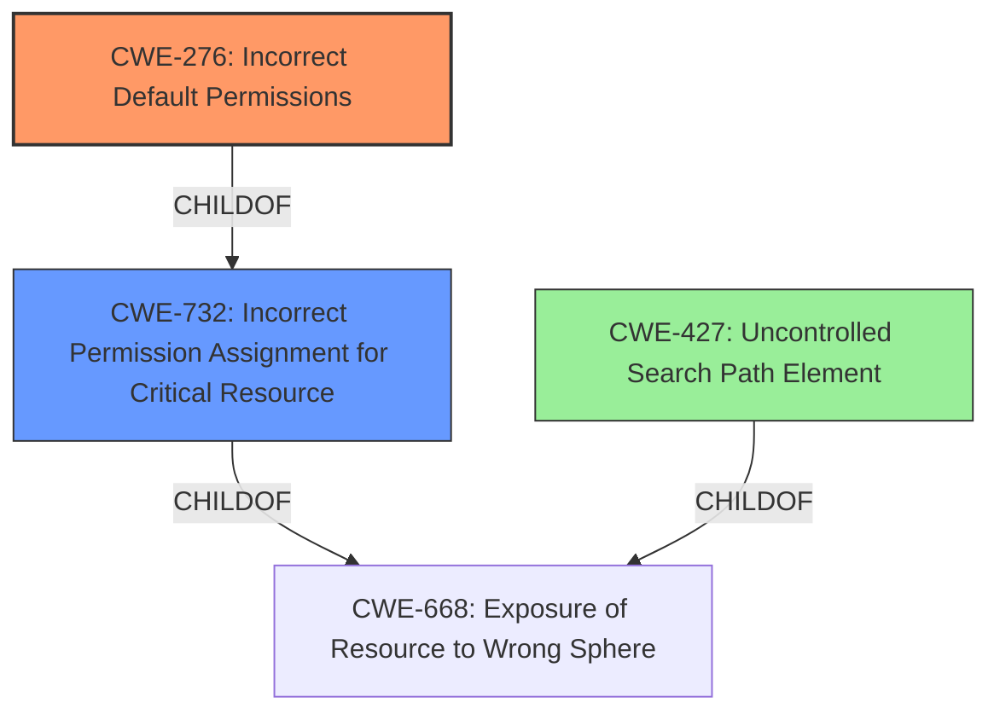

# Final Resolution for CVE-2021-43037

# Summary
| CWE ID | CWE Name | Confidence | CWE Abstraction Level | CWE Vulnerability Mapping Label | CWE-Vulnerability Mapping Notes |
|---|---|---|---|---|---|
| **CWE-276** | **Incorrect Default Permissions** | 0.95 | Base | Allowed | This is the Primary CWE. The vulnerability description explicitly mentions "**insecure default permissions**" as the root cause. |
| CWE-732 | Incorrect Permission Assignment for Critical Resource | 0.6 | Class | Allowed-with-Review | This is a secondary candidate because the **insecure default permissions** lead to incorrect permission assignment for resources. However, CWE-276 is more specific to the root cause. The permissions were *set* incorrectly. The analysis does *not* involve a missing authorization check, explaining why CWE-732 is properly used here. |
| CWE-427 | Uncontrolled Search Path Element | 0.3 | Base | Allowed | This is a potential tertiary candidate if DLL injection is the attack vector, as it could involve planting a malicious DLL in a directory already within the search path. However, CWE-276 is the more direct root cause, and the exploitation relies on write access to the search path due to the incorrect permissions. |

## Evidence and Confidence

*   **Confidence Score:** 0.95
*   **Evidence Strength:** HIGH

## Relationship Analysis
The primary relationship influencing the decision is the parent-child relationship between CWE-732 (Incorrect Permission Assignment for Critical Resource) and CWE-276 (**Incorrect Default Permissions**). CWE-276 is a more specific instance of CWE-732, focusing specifically on default permissions. This specificity makes CWE-276 the preferred choice for the primary **WEAKNESS**. The relationship between CWE-426 (Untrusted Search Path) and CWE-427 (Uncontrolled Search Path Element) was also considered, clarifying that the vulnerability likely involves a fixed search path with attacker-controlled elements (CWE-427) rather than the ability to modify the search path itself (CWE-426).

## Vulnerability Chain
The vulnerability chain starts with **CWE-276 (Incorrect Default Permissions)**, where the Unitrends Windows agent is installed with overly permissive file permissions. This allows an unprivileged user to modify critical files, such as DLLs. If DLL injection is the attack vector, this could then lead to **CWE-427 (Uncontrolled Search Path Element)** if the attacker can place a malicious DLL in a directory already present in the search path. Ultimately, this results in privilege escalation, granting the attacker SYSTEM privileges.

## Summary of Analysis
The analysis is strongly based on the provided evidence, specifically the vulnerability description's mention of "**insecure default permissions**." This directly maps to **CWE-276 (Incorrect Default Permissions)**, which is at the Base level of abstraction and has a clear description aligning with the root cause. The criticism correctly points out the importance of specific mitigation guidance related to setting file permissions during installation. The relationship analysis helped solidify the choice of CWE-276 over the more general CWE-732, emphasizing the need for the most specific CWE possible. The possibility of a **WEAKNESS** chain involving CWE-427 was also considered, though the primary **ROOTCAUSE** remains the **incorrect default permissions**.

The selected CWEs are at the optimal level of specificity. CWE-276 directly addresses the root cause, while CWE-732 and CWE-427 represent potential contributing factors or consequences of the primary **WEAKNESS**.