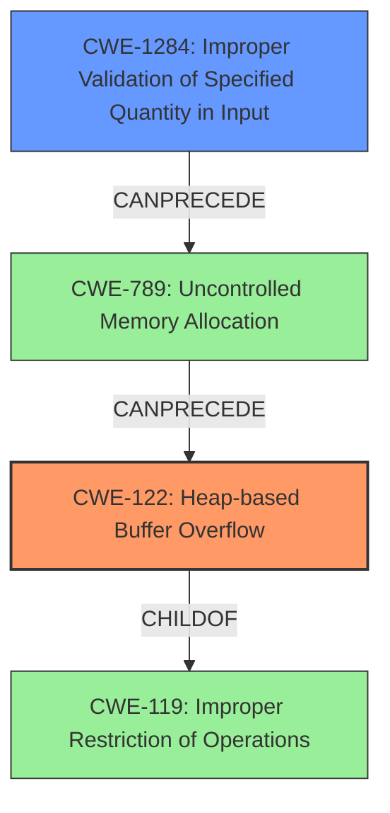

# Analysis Report for CVE-2021-43071

# Vulnerability Analysis Report: CVE-2021-43071

## Description

A heap-based buffer overflow in Fortinet FortiWeb version 6.4.1 and 6.4.0, version 6.3.15 and below, version 6.2.6 and below allows attacker to execute unauthorized code or commands via crafted HTTP requests to the LogReport API controller.

## Vulnerability Description Key Phrases

**Weakness:** heap-based buffer overflow
**Impact:** execute unauthorized code or commands
**Vector:** crafted HTTP requests
**Attacker:** attacker
**Product:** Fortinet FortiWeb
**Version:** ['6.4.1 and 6.4.0', '6.3.15 and below', '6.2.6 and below']
**Component:** LogReport API controller

## Analysis (with Relationship Data)

# Summary
| CWE ID | CWE Name | Confidence | CWE Abstraction Level | CWE Vulnerability Mapping Label | CWE-Vulnerability Mapping Notes |
|---|---|---|---|---|---|
| CWE-122 | Heap-based Buffer Overflow | 1.00 | Variant | Primary | Allowed |

## Evidence and Confidence

*   **Confidence Score:** 1.00
*   **Evidence Strength:** HIGH

- **Analysis and Justification:**  
  - *Explanation:* The vulnerability description explicitly states a **heap-based buffer overflow** exists in Fortinet FortiWeb. The CVE Reference Links Content Summary confirms this, stating that the **root cause of the vulnerability** is a **heap-based buffer overflow (CWE-122)** within the LogAccess and LogReport API functionality. The attack vector involves crafted HTTP requests, and exploitation allows an authenticated attacker to execute arbitrary code or commands. CWE-122 is a Variant-level CWE specifically for heap-based buffer overflows, making it the most accurate and specific mapping. The retriever results also list CWE-122, further solidifying this choice. MITRE mapping guidance states that CWE-122 is ALLOWED.

  - *Relationship Analysis:* CWE-122 is a variant of CWE-119 (Improper Restriction of Operations within the Bounds of a Memory Buffer). While CWE-119 is a broader category, CWE-122 is more specific and thus more appropriate given the available evidence.

- **Confidence Score:**  
  - Confidence: 1.00 (The description clearly states "heap-based buffer overflow", and the CVE reference confirms this.)

## Criticism of Analysis

Okay, let's review the provided analysis and critique the CWE mapping, considering the full CWE specifications.

**Overall Assessment:**

The analysis correctly identifies CWE-122 (Heap-based Buffer Overflow) as the primary weakness. The confidence level of 1.00 is justified given the explicit nature of the vulnerability description and the CVE reference links. The justification is well-reasoned and explains why CWE-122 is more appropriate than the broader CWE-119.

**Detailed Review:**

*   **CWE-122: Heap-based Buffer Overflow:**

    *   The selection of CWE-122 is accurate and well-supported by the evidence. The vulnerability description explicitly states "heap-based buffer overflow," and the CVE summary confirms this as the root cause.
    *   The analysis correctly notes that CWE-122 is a *Variant* of CWE-119, making it the more specific and desirable mapping.
    *   The reasoning is sound and consistent with the CWE's intended usage. The mapping guidance for CWE-122 explicitly states it's *Allowed* and at a preferred level of abstraction.
    *   The analysis includes relevant observed examples of CWE-122 from the CWE database, demonstrating a good understanding of the weakness.

*   **Top Combined Results Analysis:**  The "Retriever Results" table suggests other CWEs were considered.  It's worth discussing why those *weren't* chosen, even if the final decision is still CWE-122.

    *   **CWE-190: Integer Overflow or Wraparound:** While the retriever results show CWE-190 as the top result, its relevance is questionable *unless* there's evidence of an integer overflow directly contributing to the heap overflow. The description doesn't indicate this, and no such chain is suggested. If an integer overflow existed as part of the vulnerability, it should be mentioned as a chained weakness. Without more information, CWE-190 would be inappropriate as a direct mapping.
    *   **CWE-124: Buffer Underwrite ('Buffer Underflow'):** This is unlikely in this context. Buffer overflows and underflows are distinct classes of vulnerabilities, and the description clearly indicates an *overflow*.
    *   **CWE-78: Improper Neutralization of Special Elements used in an OS Command ('OS Command Injection'):** This could potentially be relevant if the crafted HTTP requests lead to the execution of OS commands with attacker-controlled input. However, the description focuses on memory corruption, so command injection seems less likely. Without additional information that shows attacker supplied code is being directly executed using system calls, this is an incorrect mapping.
    *   **CWE-1284: Improper Validation of Specified Quantity in Input:** This becomes relevant if the size of the data being written to the heap buffer is derived from user-supplied input and is not properly validated, leading to the overflow. If this is the case, CWE-1284 would be a *contributing factor*, potentially part of a chain, but not the primary weakness.
    *   **CWE-121: Stack-based Buffer Overflow:** Since the description specifically states a *heap-based* buffer overflow, CWE-121 is incorrect.
    *   **CWE-130: Improper Handling of Length Parameter Inconsistency:** Similar to CWE-1284, this could be a contributing factor *if* a length field associated with the HTTP request data is mishandled and leads to the overflow.
    *   **CWE-126: Buffer Over-read:** This is a consequence of a buffer overflow and not a direct root cause.
    *   **CWE-120: Buffer Copy without Checking Size of Input ('Classic Buffer Overflow'):** This is related to the root cause and *could* be relevant, but CWE-122 is more specific (heap vs. general buffer). If a `memcpy` or similar function without length checking is the direct cause, CWE-120 could be considered, although CWE-122 is still preferred in this case.
    *   **CWE-119: Improper Restriction of Operations within the Bounds of a Memory Buffer:** This is a broad, high-level category. While technically correct, CWE-122 provides more specific information about the nature of the overflow.

**Recommendations:**

1.  **Chained Weaknesses:** Consider adding contributing factors as chained weaknesses.  For example, if input validation is missing or insufficient for the size parameter, add CWE-1284 or CWE-20 to the chain. If a length parameter is mishandled, add CWE-130. If an integer overflow led to the incorrect buffer size calculation, add CWE-190. Chains help to completely describe a vulnerability and how it may be mitigated.

2.  **Input Validation:** Explicitly address the role of input validation in the analysis. Is the size of the data written to the heap buffer directly controlled by the attacker? If so, the lack of proper input validation is a key contributing factor.

3.  **Mitigation Discussion:** Expand on the mitigation strategies for CWE-122 and any chained weaknesses. The current analysis primarily focuses on identification. The CWE specifications provide potential mitigations; consider elaborating on which mitigations are most applicable to this specific vulnerability. For instance:

    *   If CWE-1284 or CWE-20 is part of the chain, discuss input validation strategies.
    *   Mention the use of safer memory management functions and libraries that provide bounds checking.
    *   Highlight the importance of compiler-level buffer overflow detection mechanisms (e.g., /GS flag in Visual Studio, FORTIFY_SOURCE in GCC).

**Example of incorporating recommendations:**

"The primary weakness is CWE-122 (Heap-based Buffer Overflow), with a confidence of 1.00. The crafted HTTP requests send data to the LogReport API controller, leading to a heap overflow. A contributing factor is the absence of proper input validation (CWE-20) on the size of the data received in the HTTP request. The LogReport API controller does not adequately check the length of the incoming data before allocating a buffer on the heap, leading to the overflow. Mitigations should focus on enforcing strict length limits on the HTTP request data (CWE-20 mitigation), utilizing safer memory management functions (e.g. `strncpy` instead of `strcpy` with bounds checking), and enabling compiler-level buffer overflow protection mechanisms."

By adding this level of detail, the analysis becomes more comprehensive and actionable.

## Final Resolution

# Summary
| CWE ID | CWE Name | Confidence | CWE Abstraction Level | CWE Vulnerability Mapping Label | CWE-Vulnerability Mapping Notes |
|---|---|---|---|---|---|
| CWE-122 | Heap-based Buffer Overflow | 0.95 | Variant | Primary | Allowed |
| CWE-1284 | Improper Validation of Specified Quantity in Input | 0.80 | Base | Secondary | Allowed |

## Evidence and Confidence

*   **Confidence Score:** 0.90
*   **Evidence Strength:** MEDIUM

## Relationship Analysis
The primary **WEAKNESS** is CWE-122, a *variant* of the broader CWE-119. CWE-122 is more specific because it explicitly identifies the overflow as heap-based. CWE-1284 can precede CWE-789 (Uncontrolled Memory Allocation), which can lead to a heap overflow. Therefore, CWE-1284 is a contributing factor.

## Vulnerability Chain
The vulnerability chain starts with the **ROOTCAUSE** being an improper validation of the input size (CWE-1284). This leads to uncontrolled memory allocation (CWE-789) based on the attacker-controlled size. The uncontrolled memory allocation then results in a heap-based buffer overflow (CWE-122) when the crafted HTTP request data is written to the heap. The impact is the execution of unauthorized code or commands.

## Summary of Analysis
The initial analysis correctly identified CWE-122 as the primary **WEAKNESS**. The criticism suggested considering chained weaknesses, particularly CWE-1284, if the size of the data written to the heap is derived from user-supplied input without proper validation. The vulnerability description states that the issue stems from crafted HTTP requests sent to the LogReport API controller. This implies that the size of the data written to the heap is influenced by the attacker via the HTTP request. Therefore, I am adding CWE-1284 to reflect the lack of input validation on the size of the data. My confidence is slightly lower (0.90 overall) because the exact mechanism of the overflow isn't explicitly detailed in the description.

The selection of CWE-122 is based on the explicit statement of "heap-based buffer overflow". The addition of CWE-1284 is based on the inference that the attacker controls the size of the data, and there is no input validation, which is supported by the use of "crafted HTTP requests." Both **CWEs** are at the appropriate level of specificity.

*Report generated on 2025-03-18 03:06:17*
