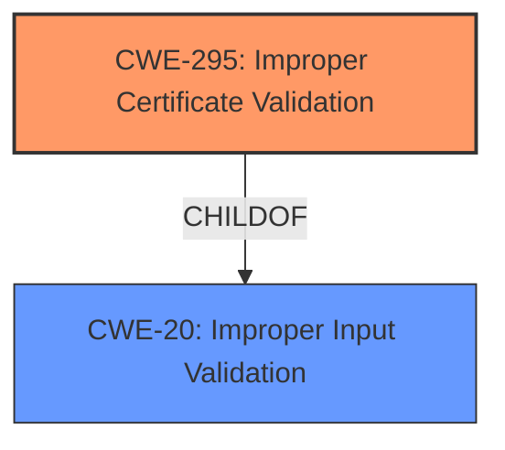

# Final Resolution for CVE-2021-43114

# Summary
| CWE ID    | CWE Name                                     | Confidence | CWE Abstraction Level | CWE Vulnerability Mapping Label | CWE-Vulnerability Mapping Notes |
| :-------- | :------------------------------------------- | :--------- | :-------------------- | :------------------------------ | :------------------------------ |
| **CWE-295**   | **Improper Certificate Validation**              | 0.80       | Base                  | Allowed                         | Primary **CWE**                     |
| CWE-20   | Improper Input Validation              | 0.60       | Class                  | Allowed                         | Secondary Candidate                     |

## Evidence and Confidence

*   **Confidence Score:** 0.75
*   **Evidence Strength:** MEDIUM

## Relationship Analysis
The primary relationship influencing the decision is the parent-child relationship where CWE-20 is a parent of CWE-295. This indicates a general input validation issue manifesting as a certificate validation problem. There are no direct relationships defined in the provided data for CWE-295 itself, emphasizing its role as a specific case of a more general problem. The base abstraction level of CWE-295 is appropriate for directly addressing the certificate validation flaw.

## Vulnerability Chain
The vulnerability chain starts with a general **lack of input validation** (**CWE-20**), which leads to the specific issue of **improper certificate validation** (**CWE-295**). This **weakness** allows malformed certificates to be processed, resulting in a crash and a denial-of-service. The **root cause** is the inadequate input validation practices.

## Summary of Analysis
Based on the vulnerability description ("FORT Validator versions prior to 1.5.2 will crash if an RPKI CA publishes an X.509 EE certificate") and the CVE reference content summary ("improper handling of certificate data and a lack of proper validation"), **CWE-295 (Improper Certificate Validation)** is the most appropriate primary **CWE**. The analysis and criticism both agree on this. The decision is based on the direct match of the **CWE** description to the vulnerability, as well as the "Allowed" mapping guidance.

The secondary **CWE**, **CWE-20 (Improper Input Validation)**, addresses the broader context of input validation. The graph relationships, specifically the child-of relationship of CWE-295 to CWE-20, influenced the decision to include CWE-20 as a secondary candidate. This reflects that the **root cause** is a general validation issue that manifests specifically in certificate handling.

The selected **CWEs** are at the optimal level of specificity. **CWE-295** directly addresses the certificate validation **weakness**, while **CWE-20** provides context about the broader input validation problem.