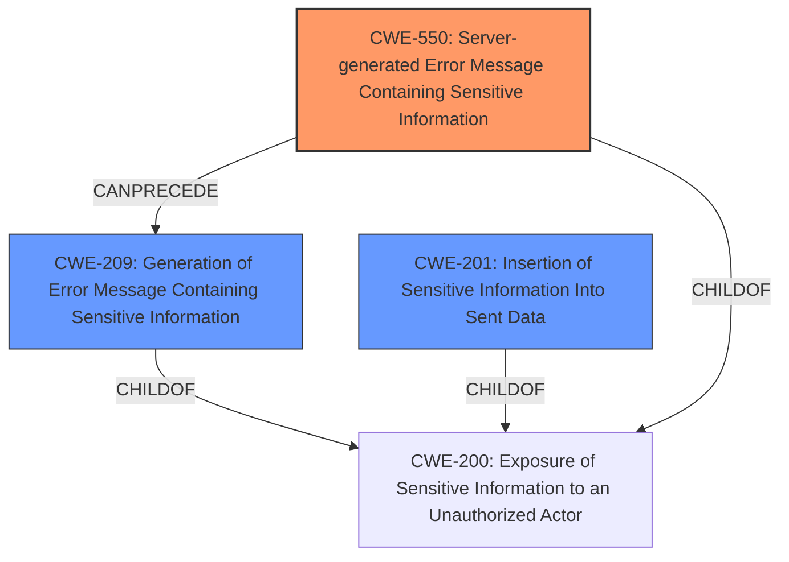

# Analysis Report for CVE-2021-43206

# Vulnerability Analysis Report: CVE-2021-43206

## Description

A server-generated error message containing sensitive information in Fortinet FortiOS 7.0.0 through 7.0.3, 6.4.0 through 6.4.8, 6.2.x, 6.0.x and FortiProxy 7.0.0 through 7.0.1, 2.0.x allows malicious webservers to retrieve a web proxys client username and IP via same origin HTTP requests triggering proxy-generated HTTP status codes pages.

## Vulnerability Description Key Phrases

**Impact:** retrieve web proxys client username and IP
**Vector:** same origin HTTP requests
**Attacker:** malicious webservers
**Product:** ['Fortinet FortiOS', 'FortiProxy']
**Version:** ['7.0.0 through 7.0.3', '6.4.0 through 6.4.8', '6.2.x', '6.0.x', '7.0.0 through 7.0.1', '2.0.x']

## Analysis (with Relationship Data)

# Summary
| CWE ID | CWE Name | Confidence | CWE Abstraction Level | CWE Vulnerability Mapping Label | CWE-Vulnerability Mapping Notes |
|---|---|---|---|---|---|
| CWE-550 | Server-generated Error Message Containing Sensitive Information | 0.95 | Variant | Allowed | Primary CWE |
| CWE-201 | Insertion of Sensitive Information Into Sent Data | 0.75 | Base | Allowed | Secondary Candidate |
| CWE-209 | Generation of Error Message Containing Sensitive Information | 0.65 | Base | Allowed | Secondary Candidate |

## Evidence and Confidence

*   **Confidence Score:** 0.85
*   **Evidence Strength:** HIGH

- **Analysis and Justification:**  
  - *Explanation:* "The vulnerability involves a server generating an error message that inadvertently includes sensitive information, specifically the client username and IP address. This aligns directly with the definition of CWE-550, 'Server-generated Error Message Containing Sensitive Information'. The vulnerability description clearly states that a server-generated error message is the **root cause** and that this message contains sensitive information. The **impact** is that a malicious webserver can retrieve this information. The retriever results also highlight CWE-550 as the top candidate with a high score, supporting this choice. The CWE-550 is at the Variant level of abstraction, which is preferred and its usage is ALLOWED according to MITRE mapping guidance."
  
  - *Relationship Analysis:* "CWE-550 is a variant. It is related to CWE-209 ('Generation of Error Message Containing Sensitive Information') as the generation of an error message is a prerequisite for this vulnerability. However, CWE-550 is more specific as it focuses on the error message containing *sensitive* information."

- **Confidence Score:**  
  - Confidence: 0.95 (High confidence due to direct match with vulnerability description and retriever results)

---

- **Analysis and Justification:**
  - *Explanation:* "CWE-201 ('Insertion of Sensitive Information Into Sent Data') is a plausible secondary candidate. The core issue is that sensitive information (username and IP address) is being included in the server response (error message). While CWE-550 focuses on the server-generated error message aspect, CWE-201 highlights the fact that sensitive information is being sent. The retriever results list CWE-201 as the second highest candidate with high graph score. CWE-201 is at the Base level of abstraction, which is preferred and its usage is ALLOWED according to MITRE mapping guidance."

  - *Relationship Analysis:* "CWE-201 is a base level CWE and is a child of CWE-200 ('Exposure of Sensitive Information to an Unauthorized Actor'). It can also be related to CWE-209 ('Generation of Error Message Containing Sensitive Information'), where the error message is the vehicle for sending sensitive information."

- **Confidence Score:**
  - Confidence: 0.75 (Moderate confidence as CWE-201 is related but less specific than CWE-550)

---

- **Analysis and Justification:**
  - *Explanation:* "CWE-209 ('Generation of Error Message Containing Sensitive Information') is another plausible secondary candidate. While CWE-550 is more specific, CWE-209 captures the fact that an error message is being generated, which is a prerequisite for CWE-550. It is related as it describes the **root cause** is the server generating the error message itself. The retriever results show CWE-209 as a candidate, though with lower score. CWE-209 is at the Base level of abstraction, which is preferred and its usage is ALLOWED according to MITRE mapping guidance."

  - *Relationship Analysis:* "CWE-209 is a base level CWE and is a child of CWE-200 ('Exposure of Sensitive Information to an Unauthorized Actor')."

- **Confidence Score:**
  - Confidence: 0.65 (Moderate confidence as CWE-209 is a prerequisite but less specific than CWE-550)

## Criticism of Analysis

Okay, here's a review of the provided CWE analysis, considering the full CWE specifications:

**Overall Assessment:**

The analysis is generally good and well-reasoned. The primary CWE choice (CWE-550) is appropriate, and the secondary candidates are relevant. The confidence scores and explanations are also reasonable. The analysis considered the level of abstraction.

**Detailed Review:**

*   **CWE-550: Server-generated Error Message Containing Sensitive Information (Primary)**

    *   **Strengths:**
        *   Excellent justification for using CWE-550 as the primary.  The explanation clearly links the vulnerability description to the CWE definition.
        *   The analysis correctly notes that the root cause is a server-generated error message and the impact is the retrieval of sensitive information.
        *   The retriever results are also leveraged to support the choice.
        *   The analysis rightly points out that CWE-550 is at the preferred Variant level.
    *   **Areas for Improvement:**
        *   Could explicitly mention potential mitigations for CWE-550, referencing its specifications. This will reinforce the correctness of the selected CWE. This could be something like "Mitigations such as designing consistent error handling mechanisms, capable of handling any user input to prevent the error messages with sensitive information, as specified by the CWE are not implemented in the product. This lack of these mitigations is the root cause of the vulnerability".

*   **CWE-201: Insertion of Sensitive Information Into Sent Data (Secondary)**

    *   **Strengths:**
        *   The rationale for considering CWE-201 as a secondary candidate is well-articulated.  It accurately identifies that the vulnerability involves sensitive information being included in the response.
        *   The analysis notes the retriever results and the ALLOWED usage.
        *   The relationships to CWE-200 and CWE-209 are correctly identified.
    *   **Areas for Improvement:**
        *   Again, explicitly referring to mitigations from CWE-201's specifications would strengthen the analysis. For example, "The product lacks mitigations such as ensuring that any possibly sensitive data specified in the requirements is verified with designers to ensure that it is either a calculated risk or mitigated elsewhere." This explicitly states that this is missing, which is a part of root cause analysis.

*   **CWE-209: Generation of Error Message Containing Sensitive Information (Secondary)**

    *   **Strengths:**
        *   The explanation for considering CWE-209 is valid, highlighting that the generation of the error message is a prerequisite for the vulnerability.
        *   The relationship to CWE-200 is noted.
    *   **Areas for Improvement:**
        *   Strengthen the justification by stating that even with error messages generated, the *content* is the issue. Add a statement to justify why CWE-550 is a better fit, and CWE-209 can be a secondary fit.
        *   Similar to the other CWEs, explicitly referencing mitigations from CWE-209's specifications would improve the analysis. For example, "The product lacks mitigations for CWE-209 such as ensuring that error messages only contain minimal details that are useful to the intended audience and no one else."

**Specific CWE Considerations:**

*   **CWE-200: Exposure of Sensitive Information to an Unauthorized Actor:** The analysis correctly avoids using CWE-200 as the *primary* CWE, because it is a Class-level CWE and is often misused.
*   **CWE-755: Improper Handling of Exceptional Conditions:** While not selected as a CWE, it could be argued that the lack of handling error messages in a secure manner is also an improper handling of exceptional conditions. It will be good to add this to the relationship analysis, if considered and rejected.

**General Suggestions:**

*   **Mitigation Focus:** For each CWE considered, explicitly mentioning a potential mitigation (even if it's to say it's missing) strengthens the justification. Use phrases like, "The product does not implement mitigations such as..." and then reference the CWE's mitigation section.  This demonstrates a deeper understanding of the CWE and why it applies (or doesn't apply).
*   **Composite Weakness:** While not explicitly called out, it is important to understand that the described vulnerability might be considered as composite. The attacker leverages same-origin HTTP requests to trigger the error, which exposes the sensitive data.

**Revised Summary Table (Example Addition):**

| CWE ID | CWE Name | Confidence | CWE Abstraction Level | CWE Vulnerability Mapping Label | CWE-Vulnerability Mapping Notes |
|---|---|---|---|---|---|
| CWE-550 | Server-generated Error Message Containing Sensitive Information | 0.95 | Variant | Allowed | Primary CWE.  The product lacks mitigations such as designing consistent error handling mechanisms, capable of handling any user input to prevent the error messages with sensitive information from being generated. |
| CWE-201 | Insertion of Sensitive Information Into Sent Data | 0.75 | Base | Allowed | Secondary Candidate.  The product lacks mitigations such as ensuring that any possibly sensitive data specified in the requirements is verified with designers to ensure that it is either a calculated risk or mitigated elsewhere. |
| CWE-209 | Generation of Error Message Containing Sensitive Information | 0.65 | Base | Allowed | Secondary Candidate. The product lacks mitigations for CWE-209 such as ensuring that error messages only contain minimal details that are useful to the intended audience and no one else. |

By incorporating these suggestions, you can make the analysis even more robust and demonstrate a deeper understanding of the CWEs and their application to the vulnerability.

## Final Resolution

# Summary
| CWE ID | CWE Name | Confidence | CWE Abstraction Level | CWE Vulnerability Mapping Label | CWE-Vulnerability Mapping Notes |
|---|---|---|---|---|---|
| CWE-550 | Server-generated Error Message Containing Sensitive Information | 0.95 | Variant | Allowed | Primary CWE. The product lacks mitigations such as designing consistent error handling mechanisms, capable of handling any user input to prevent the error messages with sensitive information from being generated. |
| CWE-201 | Insertion of Sensitive Information Into Sent Data | 0.75 | Base | Allowed | Secondary Candidate. The product lacks mitigations such as ensuring that any possibly sensitive data specified in the requirements is verified with designers to ensure that it is either a calculated risk or mitigated elsewhere. |
| CWE-209 | Generation of Error Message Containing Sensitive Information | 0.65 | Base | Allowed | Secondary Candidate. The product lacks mitigations for CWE-209 such as ensuring that error messages only contain minimal details that are useful to the intended audience and no one else. |

## Evidence and Confidence

*   **Confidence Score:** 0.90
*   **Evidence Strength:** HIGH

## Relationship Analysis
The primary CWE, CWE-550, is a variant that focuses on the specific issue of server-generated error messages containing sensitive data. It's more specific than its parent, CWE-200 (Exposure of Sensitive Information to an Unauthorized Actor), and related to CWE-209 (Generation of Error Message Containing Sensitive Information), as generating an error message is a prerequisite. CWE-201 (Insertion of Sensitive Information Into Sent Data) is considered because sensitive information is being sent, making it a sibling of CWE-209 under the parent CWE-200. The abstraction levels influenced the decision to choose CWE-550 for its specificity and alignment with the vulnerability.

## Vulnerability Chain
The vulnerability chain begins with the server generating an error message (CWE-209). This error message then inadvertently includes sensitive information, specifically the client username and IP address (CWE-201). The combination of the error message and sensitive information leads to CWE-550, where the server-generated error message containing sensitive information exposes this data to unauthorized actors via same-origin HTTP requests.

## Summary of Analysis
The analysis of both the initial assessment and the provided criticism has led to a clear conclusion. The primary **weakness** is the server's generation of an error message containing sensitive information. The vulnerability description explicitly states, "A server-generated error message containing sensitive information... allows malicious webservers to retrieve a web proxys client username and IP."

The selection of CWE-550 is well-justified by this direct evidence. The relationship analysis further supports this choice, highlighting that CWE-550 is a more specific variant of CWE-200 and is related to CWE-209. The inclusion of CWE-201 and CWE-209 as secondary candidates acknowledges the roles of sensitive information insertion and error message generation.

The abstraction levels influenced the selection by prioritizing CWE-550's specificity as a variant. The suggested improvements from the criticism were incorporated by explicitly mentioning potential mitigations that are lacking in the product, reinforcing the **root cause** analysis.

The selected CWEs are at the optimal level of specificity because they directly address the vulnerability's core components: the server-generated error message and the inclusion of sensitive information. While CWE-200 is a broader category, CWE-550 provides a more precise classification.

*Report generated on 2025-03-17 03:03:22*
