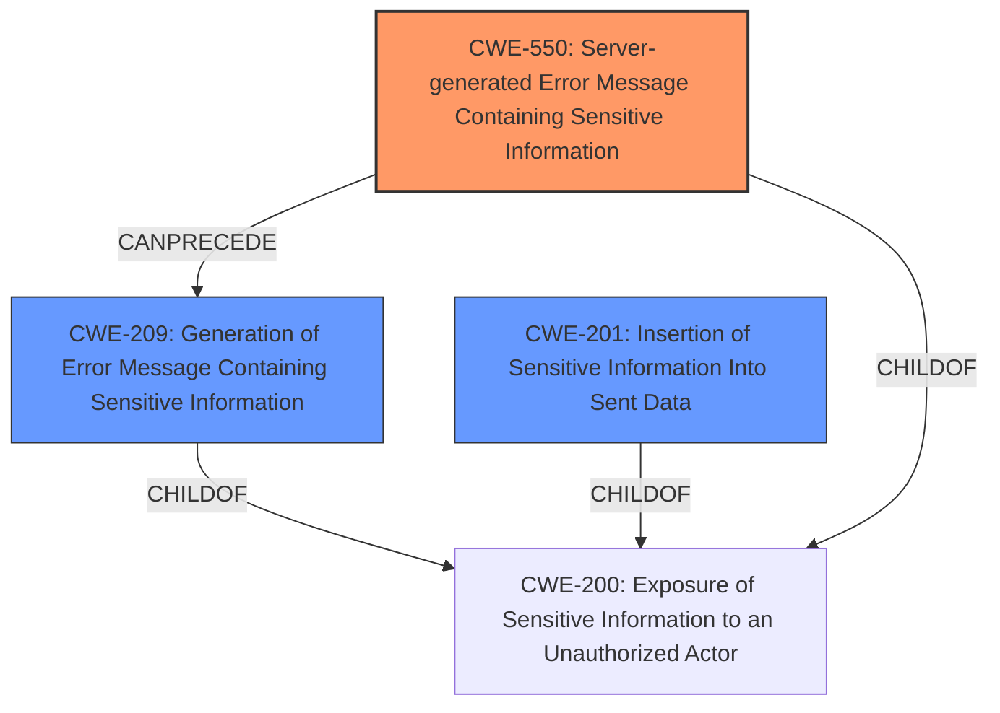

# Final Resolution for CVE-2021-43206

# Summary
| CWE ID | CWE Name | Confidence | CWE Abstraction Level | CWE Vulnerability Mapping Label | CWE-Vulnerability Mapping Notes |
|---|---|---|---|---|---|
| CWE-550 | Server-generated Error Message Containing Sensitive Information | 0.95 | Variant | Allowed | Primary CWE. The product lacks mitigations such as designing consistent error handling mechanisms, capable of handling any user input to prevent the error messages with sensitive information from being generated. |
| CWE-201 | Insertion of Sensitive Information Into Sent Data | 0.75 | Base | Allowed | Secondary Candidate. The product lacks mitigations such as ensuring that any possibly sensitive data specified in the requirements is verified with designers to ensure that it is either a calculated risk or mitigated elsewhere. |
| CWE-209 | Generation of Error Message Containing Sensitive Information | 0.65 | Base | Allowed | Secondary Candidate. The product lacks mitigations for CWE-209 such as ensuring that error messages only contain minimal details that are useful to the intended audience and no one else. |

## Evidence and Confidence

*   **Confidence Score:** 0.90
*   **Evidence Strength:** HIGH

## Relationship Analysis
The primary CWE, CWE-550, is a variant that focuses on the specific issue of server-generated error messages containing sensitive data. It's more specific than its parent, CWE-200 (Exposure of Sensitive Information to an Unauthorized Actor), and related to CWE-209 (Generation of Error Message Containing Sensitive Information), as generating an error message is a prerequisite. CWE-201 (Insertion of Sensitive Information Into Sent Data) is considered because sensitive information is being sent, making it a sibling of CWE-209 under the parent CWE-200. The abstraction levels influenced the decision to choose CWE-550 for its specificity and alignment with the vulnerability.

## Vulnerability Chain
The vulnerability chain begins with the server generating an error message (CWE-209). This error message then inadvertently includes sensitive information, specifically the client username and IP address (CWE-201). The combination of the error message and sensitive information leads to CWE-550, where the server-generated error message containing sensitive information exposes this data to unauthorized actors via same-origin HTTP requests.

## Summary of Analysis
The analysis of both the initial assessment and the provided criticism has led to a clear conclusion. The primary **weakness** is the server's generation of an error message containing sensitive information. The vulnerability description explicitly states, "A server-generated error message containing sensitive information... allows malicious webservers to retrieve a web proxys client username and IP."

The selection of CWE-550 is well-justified by this direct evidence. The relationship analysis further supports this choice, highlighting that CWE-550 is a more specific variant of CWE-200 and is related to CWE-209. The inclusion of CWE-201 and CWE-209 as secondary candidates acknowledges the roles of sensitive information insertion and error message generation.

The abstraction levels influenced the selection by prioritizing CWE-550's specificity as a variant. The suggested improvements from the criticism were incorporated by explicitly mentioning potential mitigations that are lacking in the product, reinforcing the **root cause** analysis.

The selected CWEs are at the optimal level of specificity because they directly address the vulnerability's core components: the server-generated error message and the inclusion of sensitive information. While CWE-200 is a broader category, CWE-550 provides a more precise classification.