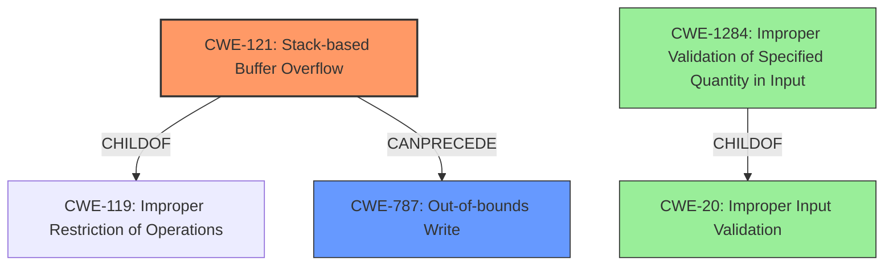

# Final Resolution for CVE-2021-43299

# Summary

| CWE ID | CWE Name | Confidence | CWE Abstraction Level | CWE Vulnerability Mapping Label | CWE-Vulnerability Mapping Notes |
|---|---|---|---|---|---|
| CWE-121 | Stack-based Buffer Overflow | 1.0 | Variant | Primary | Allowed |
| CWE-787 | Out-of-bounds Write | 0.7 | Base | Secondary | Allowed |
| CWE-20 | Improper Input Validation | 0.4 | Class | Tertiary | Allowed |
| CWE-1284 | Improper Validation of Specified Quantity in Input | 0.4 | Base | Tertiary | Allowed |

## Evidence and Confidence

*   **Confidence Score:** 0.9
*   **Evidence Strength:** HIGH

## Relationship Analysis
The primary CWE is CWE-121, which is a variant of CWE-119 (Improper Restriction of Operations within the Bounds of a Memory Buffer), providing a more specific classification because the overflow occurs on the stack. It is also related to CWE-787 (Out-of-bounds Write), as the overflow leads to writing beyond the buffer's boundaries. CWE-20 and CWE-1284 are added as tertiary CWEs because the root cause stems from a lack of input validation on the filename length which is attacker controlled. CWE-1284 is a child of CWE-20, further specifying the lack of validation of a specified quantity (filename length) in the input.

## Vulnerability Chain
The vulnerability chain starts with the lack of input validation (**CWE-20** and **CWE-1284**) on the attacker-controlled filename argument. This leads to a **buffer copy** operation without checking the size of the input. Because a fixed-size buffer is allocated on the stack, a stack-based buffer overflow (**CWE-121**) occurs when the filename exceeds the buffer's capacity. This, in turn, results in an out-of-bounds write (**CWE-787**), potentially allowing the attacker to overwrite adjacent stack variables or control the program's execution flow.

## Summary of Analysis
The initial analysis correctly identified **CWE-121** as the primary weakness. The vulnerability description explicitly states a "**stack overflow**" due to copying an attacker-controlled filename to a fixed-size stack buffer without validation. This aligns perfectly with the definition of **CWE-121**. The secondary weakness, **CWE-787**, is also correctly identified as an out-of-bounds write resulting from the overflow.

The criticism suggested adding **CWE-20** and **CWE-1284** as tertiary CWEs due to the lack of input validation. The vulnerability description states the "**attacker** controlled filename argument" and that the filename is copied "**without any size validation**." This is the root cause, and failing to validate the attacker controlled input length can be described by **CWE-20** and more specifically by **CWE-1284**.

Other retriever results such as **CWE-120, CWE-190, CWE-1325, CWE-789, CWE-193, CWE-131, CWE-770, and CWE-126** are not directly applicable because the vulnerability description does not provide evidence to support these. For example, there is no mention of integer overflow in the description, so including those would not be evidence based.

The final selection of CWEs reflects the optimal level of specificity because **CWE-121** describes the exact type of buffer overflow (stack-based), **CWE-787** describes the resulting out-of-bounds write, and **CWE-20** and **CWE-1284** capture the root cause of the lack of input validation on the attacker-controlled length of the filename.