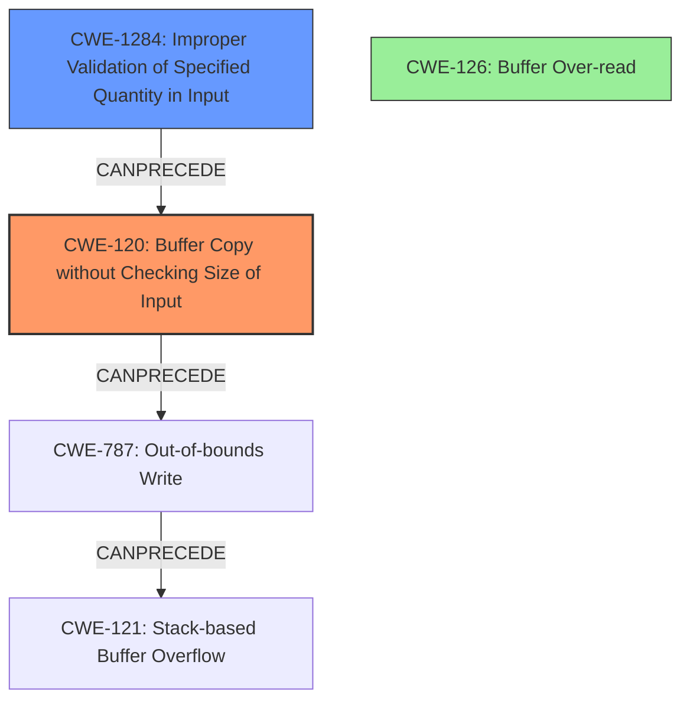

# Final Resolution for CVE-2021-43300

# Summary
| CWE ID | CWE Name | Confidence | CWE Abstraction Level | CWE Vulnerability Mapping Label | CWE-Vulnerability Mapping Notes |
|---|---|---|---|---|---|
| CWE-120 | Buffer Copy without Checking Size of Input ('Classic Buffer Overflow') | 0.95 | Base | Allowed-with-Review | Primary CWE |
| CWE-1284 | Improper Validation of Specified Quantity in Input | 0.80 | Base | Allowed | Secondary Candidate |
| CWE-126 | Buffer Over-read | 0.40 | Variant | Allowed | Tertiary Candidate |

## Evidence and Confidence

*   **Confidence Score:** 0.90
*   **Evidence Strength:** HIGH

## Relationship Analysis
The decision was influenced by the following CWE relationships:
  - CWE-120 is a child of CWE-119 (Improper Restriction of Operations within the Bounds of a Memory Buffer), providing a more specific description than its parent.
  - CWE-1284 (Improper Validation of Specified Quantity in Input) can precede CWE-120. The lack of input validation directly contributes to the buffer copy without size checking.
  - CWE-126 (Buffer Over-read) is related as the CVE mentions an out-of-bounds read when the filename is shorter than 4 characters.
  - The relationships highlight a vulnerability chain: Improper Input Validation (CWE-1284) -> Unchecked Buffer Copy (CWE-120) -> Out-of-Bounds Write (CWE-787 which is implied by CWE-120) -> Stack-based Buffer Overflow (CWE-121, a consequence of CWE-120, but less descriptive of the root cause).
  - Abstraction levels were considered to ensure that CWEs at the Base or Variant level were preferred over Class-level CWEs.

## Vulnerability Chain
The vulnerability chain starts with **Improper Validation of Input (CWE-1284)**, where the filename length is not validated. This leads to a **Buffer Copy without Checking Size (CWE-120)**, where the attacker-controlled filename is copied to a fixed-size buffer without any size validation. This results in an **Out-of-bounds Write (CWE-787)** that manifests as a **Stack-based Buffer Overflow (CWE-121)**. An additional vulnerability exists where the filename length is less than 4 resulting in a **Buffer Over-read (CWE-126)**.

## Summary of Analysis
Based on both the initial analysis and the criticism, my conclusion is as follows:

The initial analysis correctly identified the stack-based buffer overflow but could be improved by selecting a more precise CWE and acknowledging the out-of-bounds read. The vulnerability description states: "Stack overflow in PJSUA API when calling pjsua_recorder_create. An attacker-controlled filename argument may cause a buffer overflow since it is copied to a fixed-size stack buffer without any size validation."

The selection of CWE-120 (Buffer Copy without Checking Size of Input) as the primary CWE is based on the direct evidence that the filename is *copied* to a buffer without any size checks. This is a more accurate representation of the code-level error than CWE-121, which describes the consequence (the stack overflow). The MITRE mapping guidance for CWE-120 indicates this is ALLOWED-with-Review when an unbounded transfer of data to a buffer occurs.

The selection of CWE-1284 (Improper Validation of Specified Quantity in Input) is justified by the "missing size validation" aspect of the vulnerability. This highlights the root cause that allows the overflow to occur.

The inclusion of CWE-126 (Buffer Over-read) is based on the statement that the CVE mentions an out-of-bounds read when the filename is shorter than 4 characters.

The graph relationships influenced the decision by emphasizing the chain of events leading to the overflow. The vulnerability begins with a lack of input validation (CWE-1284), which leads to an unchecked buffer copy (CWE-120), and eventually results in a stack-based buffer overflow. An additional issue occurs when the filename length is less than 4 characters resulting in a buffer over-read (CWE-126).

The selected CWEs are at the optimal level of specificity because they accurately represent the root cause (CWE-1284), the code-level error (CWE-120) and an additional vulnerability(CWE-126). CWE-120 is a Base-level CWE which more accurately describes the error than the Variant, CWE-121. The chain highlights how weaknesses interact in the vulnerability lifecycle.