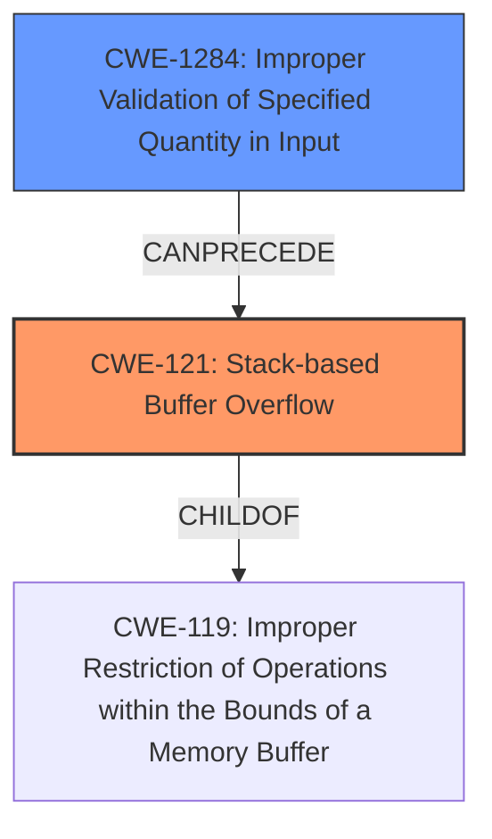

# Final Resolution for CVE-2021-43301

# Summary
| CWE ID | CWE Name | Confidence | CWE Abstraction Level | CWE Vulnerability Mapping Label | CWE-Vulnerability Mapping Notes |
|---|---|---|---|---|---|
| CWE-121 | Stack-based Buffer Overflow | 0.95 | Variant | Primary | Allowed |
| CWE-1284 | Improper Validation of Specified Quantity in Input | 0.6 | Base | Secondary | Allowed |

## Evidence and Confidence

*   **Confidence Score:** 0.95
*   **Evidence Strength:** HIGH

## Relationship Analysis
The primary CWE, CWE-121 (**Stack-based Buffer Overflow**), is a variant of CWE-119 (**Improper Restriction of Operations within the Bounds of a Memory Buffer**). This parent-child relationship confirms that CWE-121 is at an appropriate level of specificity. The secondary CWE, CWE-1284 (**Improper Validation of Specified Quantity in Input**), is a contributing factor to the stack overflow, as the lack of input validation allows an excessively large input to be copied to the stack buffer. Thus CWE-1284 can precede CWE-121.

## Vulnerability Chain
The vulnerability chain starts with CWE-1284 (**Improper Validation of Specified Quantity in Input**), where the size of the input `file_names` argument is not validated. This leads to CWE-121 (**Stack-based Buffer Overflow**) when the oversized input is copied to a fixed-size stack buffer. The lack of input validation is the **ROOTCAUSE**, and the resulting stack overflow is the **WEAKNESS** that can be exploited.

## Summary of Analysis
The initial analysis and the criticism both agree that the primary CWE should be CWE-121 (**Stack-based Buffer Overflow**). The vulnerability description explicitly mentions a stack overflow due to missing size validation, providing strong evidence for this classification. The secondary CWE, CWE-1284 (**Improper Validation of Specified Quantity in Input**), is included because the root cause includes missing validation of the filenames size.

The graph relationships confirm the appropriateness of the CWE selections. CWE-121 is a variant of CWE-119, indicating the right level of specificity. CWE-1284 precedes CWE-121, showing how the lack of input validation leads to the stack overflow.

The selected CWEs are at the optimal level of specificity. CWE-121 accurately describes the stack-based nature of the buffer overflow, and CWE-1284 identifies the lack of input validation as the root cause.