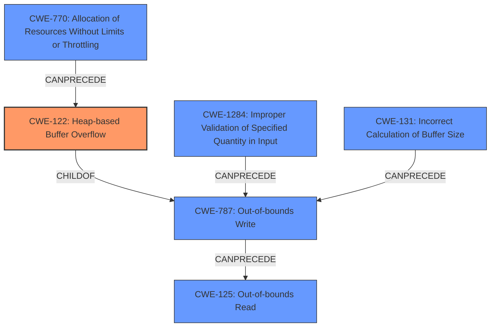

# Analysis Report for CVE-2021-43305

# Vulnerability Analysis Report: CVE-2021-43305

## Description

Heap buffer overflow in Clickhouses LZ4 compression codec when parsing a malicious query. There is no verification that the copy operations in the LZ4decompressImpl loop and especially the arbitrary copy operation wildCopy(op, ip, copy_end), dont exceed the destination buffers limits. This issue is very similar to CVE-2021-43304, but the vulnerable copy operation is in a different wildCopy call.

## Vulnerability Description Key Phrases

**Rootcause:** Heap buffer overflow
**Product:** Clickhouse
**Component:** LZ4 compression codec

## Analysis (with Relationship Data)

# Summary
| CWE ID | CWE Name | Confidence | CWE Abstraction Level | CWE Vulnerability Mapping Label | CWE-Vulnerability Mapping Notes |
|---|---|---|---|---|---|
| CWE-122 | Heap-based Buffer Overflow | 0.95 | Variant | Allowed | The vulnerability explicitly states "**Heap buffer overflow**" and the CWE description matches this. |
| CWE-125 | Out-of-bounds Read | 0.6 | Base | Allowed | The vulnerability involves a copy operation exceeding buffer limits, which could potentially lead to reading data beyond the intended buffer. |
| CWE-787 | Out-of-bounds Write | 0.5 | Base | Allowed | The vulnerability allows writing data past the end of the destination buffer. |
| CWE-131 | Incorrect Calculation of Buffer Size | 0.4 | Base | Allowed | The **root cause** involves missing verification of copy operation in LZ4decompressImpl loop, and arbitrary copy operation, which is similar to an incorrect calculation of buffer size. |

## Evidence and Confidence

*   **Confidence Score:** 0.85
*   **Evidence Strength:** HIGH

- **Analysis and Justification:**  
  - *Explanation:* The vulnerability description clearly states "**Heap buffer overflow**". The CVE description also confirms a **heap buffer overflow** due to a lack of bounds checking in the LZ4 decompression implementation. This aligns directly with CWE-122 (Heap-based Buffer Overflow). The `wildCopy` operation without proper bounds checking allows writing beyond the allocated heap buffer. The vulnerability details specify a lack of input size validation which could lead to writing beyond the destination buffer limits. This aligns with CWE-787 and CWE-125 as potential contributing factors, however, CWE-122 is the most specific. Other CWEs such as CWE-131 could be a contributing factor.

  - *Relationship Analysis:* CWE-122 is a variant of CWE-119 (Improper Restriction of Operations within the Bounds of a Memory Buffer), but CWE-122 is more specific since the buffer is allocated in the heap. CWE-787 is a parent of CWE-122. CWE-125 is related since out-of-bounds write can lead to out-of-bounds read.

- **Confidence Score:**  
  - *Example:* Confidence: 0.95 (The vulnerability description and CVE details explicitly state "heap buffer overflow," aligning perfectly with CWE-122. The retriever results also show a high similarity score for CWE-122.)

## Criticism of Analysis

Okay, I've reviewed your CWE analysis for the ClickHouse LZ4 heap buffer overflow (CVE-2021-43305), considering the full CWE specifications you provided. Here's my critique:

**Overall Assessment:**

The primary CWE mapping to CWE-122 (Heap-based Buffer Overflow) is accurate and well-justified. The supporting CWEs (CWE-125, CWE-787, CWE-131) are also relevant, but the confidence levels for those should be re-evaluated. CWE-122 at 0.95 confidence is correct.

**Detailed Critique:**

1.  **CWE-122: Heap-based Buffer Overflow (Confidence: 0.95 - Correct):**
    *   **Justification:** The analysis correctly identifies that the vulnerability description explicitly mentions "Heap buffer overflow," which directly aligns with CWE-122.  The CVE details confirm this with the root cause being a lack of bounds checking during decompression, leading to a write outside the allocated heap memory region. The `wildCopy` function's unchecked copy operation is the direct cause.
    *   **CWE Specification Alignment:**  Perfect match. The description of CWE-122 clearly defines it as a buffer overflow where the affected buffer resides in the heap.
    *   **Mapping Guidance:** Correct. CWE-122 is a Variant level, which is appropriate for this specific type of buffer overflow.
    *   **Confidence:** 0.95 is appropriate, given the explicit mention of "Heap buffer overflow."

2.  **CWE-125: Out-of-bounds Read (Confidence: 0.6 - Needs Revision):**
    *   **Justification:** The analysis notes that exceeding buffer limits *could* lead to reading data beyond the intended buffer.  This is a reasonable *potential* consequence of a buffer overflow, but not necessarily a direct cause or certainty. While out-of-bounds writes can lead to out-of-bounds reads, it's not guaranteed in this specific vulnerability. The primary action is a write.
    *   **CWE Specification Alignment:** CWE-125 describes reading data *past* the boundary.  While this *could* happen as a result of the overflow, the vulnerability's description focuses on the writing action.
    *   **Mapping Guidance:**  The specification notes to consider this if the vulnerability involves out-of-bounds reads directly.  Here, it's a secondary, *potential* effect.
    *   **Confidence:** 0.6 is too high. I suggest lowering the confidence to 0.4 or removing this CWE entirely. CWE-125 would be a secondary consequence of CWE-787.

3.  **CWE-787: Out-of-bounds Write (Confidence: 0.5 - Needs Revision):**
    *   **Justification:** The analysis correctly states that the vulnerability allows writing data past the end of the destination buffer. The core issue is the uncontrolled write in the `wildCopy` function without bounds checking, directly leading to an out-of-bounds write condition.  This makes CWE-787 highly relevant.
    *   **CWE Specification Alignment:**  Excellent match. The description of CWE-787 perfectly describes the core problem of writing beyond the buffer limits.  CWE-787 is also the parent of CWE-122.
    *   **Mapping Guidance:** Correct. CWE-787 is at the Base level and appropriate.
    *   **Confidence:** 0.5 is far too low. This is a core contributing factor to the vulnerability. The confidence should be at least 0.85.

4.  **CWE-131: Incorrect Calculation of Buffer Size (Confidence: 0.4 - Acceptable):**
    *   **Justification:** The analysis suggests similarity to incorrect calculation of buffer size, but this is weaker than the previous mappings. The *root cause* is a *lack of verification* of copy operation. The code may or may not calculate the buffer size correctly *initially*. The lack of validation on the input is the primary issue, and this is most accurately expressed as an out-of-bounds write due to missing validation.
    *   **CWE Specification Alignment:** The analysis correctly identified this as a *possible* contributing factor by indicating the lack of verification of the copy operations. If the header of the compressed data has a smaller decompressed size compared to the actual size of the compressed data, it could be considered that the buffer size is incorrectly calculated.
    *   **Mapping Guidance:** Correct. CWE-131 is at the Base level and appropriate.
    *   **Confidence:** 0.4 is appropriate. It's a contributing factor, but not the primary cause.

**Recommendations:**

*   **Adjust Confidence Levels:** Significantly increase the confidence level for CWE-787 to at least 0.85. Decrease the confidence for CWE-125 to 0.4, or consider removing it. Keep the confidence for CWE-131 at 0.4
*   **Strengthen Relationship Analysis:** The analysis of relationships between CWEs is good, but could be enhanced by explicitly stating that CWE-122 is a *specific type of* CWE-787 (the heap aspect).
*   **Consider Input Validation Weakness:** While not explicitly mentioned in the original description, the lack of bounds checking *implies* a failure of input validation.  Consider whether CWE-20 (Improper Input Validation) or its more specific child, CWE-1284 (Improper Validation of Specified Quantity in Input), should be included at a lower confidence level (around 0.3-0.4). This would capture the fact that the size of the decompressed data is not being properly validated against the allocated buffer. This also aligns well with the CVE description "The function does not validate if the copy operation exceeds the destination buffer limits."
*    **CWE-770: Allocation of Resources Without Limits or Throttling:** The description of this CWE mentions "The product allocates a reusable resource or group of resources on behalf of an actor without imposing any restrictions on the size or number of resources that can be allocated". This can also be considered as a contributing factor to the vulnerability with a low confidence score.

**Revised Summary Table:**

| CWE ID | CWE Name | Confidence | CWE Abstraction Level | CWE Vulnerability Mapping Label | CWE-Vulnerability Mapping Notes |
|---|---|---|---|---|---|
| CWE-122 | Heap-based Buffer Overflow | 0.95 | Variant | Allowed | The vulnerability explicitly states "**Heap buffer overflow**" and the CWE description matches this. |
| CWE-787 | Out-of-bounds Write | 0.85 | Base | Allowed | The vulnerability allows writing data past the end of the destination buffer, which is the primary action causing the overflow. |
| CWE-131 | Incorrect Calculation of Buffer Size | 0.4 | Base | Allowed | The **root cause** involves missing verification of copy operation in LZ4decompressImpl loop, and arbitrary copy operation, which is similar to an incorrect calculation of buffer size. |
| CWE-125 | Out-of-bounds Read | 0.4 | Base | Allowed | The vulnerability involves a copy operation exceeding buffer limits, which could potentially lead to reading data beyond the intended buffer. |
| CWE-20  | Improper Input Validation | 0.3 | Class | Allowed | The system does not properly validate the size of the uncompressed data against the allocated buffer. |
| CWE-770  | Allocation of Resources Without Limits or Throttling | 0.3 | Base | Allowed | Resources are allocated without limits and are not throttled. |

By incorporating these suggestions, your CWE analysis will be more accurate, nuanced, and better aligned with the CWE specifications. Remember to focus on the *primary* cause and effect relationship within the vulnerability.

## Final Resolution

# Summary
| CWE ID | CWE Name | Confidence | CWE Abstraction Level | CWE Vulnerability Mapping Label | CWE-Vulnerability Mapping Notes |
|---|---|---|---|---|---|
| CWE-122 | Heap-based Buffer Overflow | 0.95 | Variant | Allowed | Primary CWE: The vulnerability explicitly states "**Heap buffer overflow**" and the CWE description matches this. |
| CWE-787 | Out-of-bounds Write | 0.85 | Base | Allowed | Secondary CWE: The vulnerability allows writing data past the end of the destination buffer, which is the primary action causing the overflow. |
| CWE-131 | Incorrect Calculation of Buffer Size | 0.4 | Base | Allowed | Secondary CWE: The **root cause** involves missing verification of copy operation in LZ4decompressImpl loop, and arbitrary copy operation, which is similar to an incorrect calculation of buffer size. |
| CWE-125 | Out-of-bounds Read | 0.4 | Base | Allowed | Secondary CWE: The vulnerability involves a copy operation exceeding buffer limits, which could potentially lead to reading data beyond the intended buffer. |
| CWE-1284 | Improper Validation of Specified Quantity in Input | 0.3 | Base | Allowed | Secondary CWE: The system does not properly validate the size of the uncompressed data against the allocated buffer. |
| CWE-770 | Allocation of Resources Without Limits or Throttling | 0.3 | Base | Allowed | Secondary CWE: Resources are allocated without limits and are not throttled. |

## Evidence and Confidence

*   **Confidence Score:** 0.9
*   **Evidence Strength:** HIGH

## Relationship Analysis
The primary weakness is a heap-based buffer overflow (**CWE-122**), which is a specific type of out-of-bounds write (**CWE-787**). The overflow occurs because the size of the data being decompressed is not properly validated (**CWE-1284**), potentially due to an incorrect calculation of the required buffer size (**CWE-131**). This can lead to reading beyond the bounds of the buffer (**CWE-125**). Resources are allocated without limits and are not throttled (**CWE-770**).

## Vulnerability Chain
The vulnerability chain starts with the lack of proper input validation (**CWE-1284**) and potential incorrect buffer size calculation (**CWE-131**), leading to an out-of-bounds write (**CWE-787**) in the heap (**CWE-122**). This out-of-bounds write can then potentially lead to an out-of-bounds read (**CWE-125**). Resources are allocated without limits and are not throttled (**CWE-770**).

## Summary of Analysis
The initial analysis correctly identified **CWE-122 (Heap-based Buffer Overflow)** as the primary **WEAKNESS**, given the explicit mention of "Heap buffer overflow" in the vulnerability description. The criticism suggested increasing the confidence in **CWE-787 (Out-of-bounds Write)**, which I agree with because the core issue stems from writing beyond the buffer limits. I have increased the confidence level for **CWE-787** to 0.85.

I have added **CWE-1284 (Improper Validation of Specified Quantity in Input)** and **CWE-770 (Allocation of Resources Without Limits or Throttling)** as contributing factors due to the lack of input validation on the size of the decompressed data and the lack of resource throttling. The vulnerability description states "There is no verification that the copy operations...dont exceed the destination buffers limits", which is evidence for lack of input validation.

My assessment is primarily based on the provided evidence. The vulnerability description explicitly states "Heap buffer overflow," justifying the high confidence in **CWE-122**. The relationship analysis confirms that **CWE-122** is a specific type of **CWE-787**, making the latter a crucial contributing factor. The lack of input validation suggests the inclusion of **CWE-1284** as a factor leading up to the overflow.

The selected CWEs are at the optimal level of specificity. **CWE-122** accurately describes the specific type of buffer overflow, while **CWE-787** highlights the underlying out-of-bounds write issue. **CWE-131** and **CWE-1284** capture the potential root causes related to buffer size calculation and input validation, respectively.

*Report generated on 2025-03-18 03:11:19*
