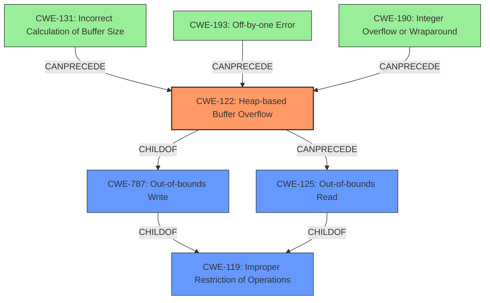

# Analysis Report for CVE-2021-43313

# Vulnerability Analysis Report: CVE-2021-43313

## Description

A heap-based buffer overflow was discovered in upx, during the variable bucket points to an inaccessible address. The issue is being triggered in the function PackLinuxElf32invert_pt_dynamic at p_lx_elf.cpp1688.

## Vulnerability Description Key Phrases

**Rootcause:** heap-based buffer overflow
**Product:** upx

## Analysis (with Relationship Data)

# Summary
| CWE ID | CWE Name | Confidence | CWE Abstraction Level | CWE Vulnerability Mapping Label | CWE-Vulnerability Mapping Notes |
|---|---|---|---|---|---|
| CWE-122 | Heap-based Buffer Overflow | 0.95 | Variant | Primary | Allowed |
| CWE-125 | Buffer Over-read | 0.65 | Base | Secondary | Allowed |

## Evidence and Confidence

*   **Confidence Score:** 0.80
*   **Evidence Strength:** HIGH

- **Analysis and Justification:**  
  - *Explanation:* The vulnerability is described as a "**heap-based buffer overflow**" in UPX. The CVE Reference Links Content Summary states that the root cause is an insufficient boundary check when accessing the `buckets` array, leading to an out-of-bounds read during the decompression process. This aligns directly with CWE-122 (Heap-based Buffer Overflow) since the overflow occurs in the heap portion of memory. The description specifically mentions a "**heap-based buffer overflow**," making CWE-122 the most accurate primary mapping. Additionally, since the vulnerability results in an out-of-bounds read when accessing `buckets[j]`, CWE-125 (Buffer Over-read) is a secondary candidate.
  
  - *Relationship Analysis:* CWE-122 is a variant of CWE-119 (Improper Restriction of Operations within the Bounds of a Memory Buffer), indicating a more specific type of buffer overflow. CWE-125 is related as it describes the out-of-bounds read resulting from the overflow.

- **Confidence Score:**  
  - Confidence: 0.95 (High evidence from the vulnerability description and CVE reference materials for CWE-122)
  - Confidence: 0.65 (Lower Confidence in CWE-125 due to it being a consequence of the primary weakness)

---

## Criticism of Analysis

Okay, here's a review of the provided CWE analysis, focusing on the accuracy of the CWE mappings, the confidence levels, and the justification, considering the full CWE specifications.

**Overall Assessment:**

The analysis is generally sound and the primary CWE mapping to CWE-122 (Heap-based Buffer Overflow) is very strong. The secondary mapping to CWE-125 (Out-of-bounds Read) is reasonable as a consequence of the overflow.

**Detailed Review:**

**1.  CWE-122: Heap-based Buffer Overflow (Primary Mapping)**

*   **CWE Abstraction Level:** Variant.  This is a good choice.  Variant is preferred when it accurately describes the vulnerability.
*   **CWE Vulnerability Mapping Label:** Primary.  Appropriate since the root cause is the heap overflow.
*   **Confidence Score:** 0.95.  This is justified. The description explicitly states "heap-based buffer overflow," and the CVE Reference Links Content Summary reinforces this with details about heap memory corruption in the `PackLinuxElf32::invert_pt_dynamic` function, which is also on the heap. The root cause is an insufficient boundary check when accessing the `buckets` array.
*   **Evidence Strength:** HIGH. This aligns with the high confidence score. Direct quotes and summary points are being used to support the choice of CWE.
*   **Justification:** The justification is very strong.  It directly links the vulnerability description and the CVE summary to the definition of CWE-122. The explanation of how the overflow occurs in the heap reinforces the mapping.
*   **CWE Relationships:**
    *   `ChildOf -> CWE-788`: Access of Memory Location After End of Buffer.  This relationship isn't incorrect, but CWE-122 is a *more specific* description of the problem.  CWE-788 is what you *generally* have when you do a BOF.
    *   `ChildOf -> CWE-787`: Out-of-bounds Write. This is the *best* and most appropriate parent for CWE-122.
*   **CWE Mapping Guidance:** The analysis correctly notes that CWE-122 is at the Variant level, which is preferred. The analysis emphasizes that both the name and description should be carefully read to ensure it fits.
*   **CWE Potential Mitigations:**  The listed mitigations (language choice, abstraction libraries, compiler-based detection) are all relevant and appropriate. Using a language with automatic bounds checking is mentioned as a solution.
*   **CWE Observed Examples:** The provided examples are relevant to CWE-122.

**2.  CWE-125: Buffer Over-read (Secondary Mapping)**

*   **CWE Abstraction Level:** Base.  This is appropriate.
*   **CWE Vulnerability Mapping Label:** Secondary. Correct, as it is a consequence of the overflow.
*   **Confidence Score:** 0.65.  This is a reasonable confidence level. It's lower because the *primary* problem is the overflow (the write).  The read is a consequence.
*   **Evidence Strength:** The evidence strength is medium. While the documentation does not explicitly mention reading other user-controlled sensitive data, it is still the result of an out-of-bounds read of memory.
*   **Justification:** The justification notes that the vulnerability results in an out-of-bounds read, which is consistent with CWE-125.
*   **CWE Relationships:**
    *   `ChildOf -> CWE-119`. Correct.
    *   `ParentOf -> CWE-126`. Buffer Over-read. The analysis recognizes the subtle difference between CWE-125 (the general case) and CWE-126 (a more specific variant).
*   **CWE Mapping Guidance:** The analysis acknowledges that CWE-125 is at the Base level, which is preferred.
*   **CWE Potential Mitigations:**  The listed mitigations (input validation, language choice) are relevant. Input validation to ensure correct length arguments and buffer size calculations is directly applicable.
*   **CWE Observed Examples:** The provided examples are relevant to CWE-125.

**Suggestions for Improvement:**

*   **Consider the Role of CWE-787 (Out-of-bounds Write):** While CWE-122 is a *variant* of CWE-787, including a brief mention of CWE-787 as a parent and why CWE-122 is a more precise fit could strengthen the analysis. This isn't strictly necessary, but it would demonstrate a thorough consideration of the CWE hierarchy.
*   **Discuss potential root causes/chaining:** While not necessary for the primary mappings, briefly considering potential causes *leading* to the heap overflow could be valuable. For example:
    *   **CWE-131 (Incorrect Calculation of Buffer Size):** If the allocated buffer size for `buckets` was calculated incorrectly, that could lead to the overflow.
    *   **CWE-193 (Off-by-one Error):** An off-by-one error in the loop condition or buffer allocation could cause the overflow.
    *   **CWE-190 (Integer Overflow or Wraparound):** A size calculation could have experienced an integer overflow, resulting in a smaller-than-expected buffer.
    These might not be directly supported by the available information, but discussing them *as possibilities* would show a deeper understanding of common causes of buffer overflows.  You could lower the confidence level significantly for these, if included.
*   **Add a discussion of CWE-119:** You mention that CWE-119 is a parent of 122 and 125. You should follow CWE's own guidance: "CWE-119 is commonly misused in low-information vulnerability reports when lower-level CWEs could be used instead, or when more details about the vulnerability are available."

**Revised Summary Table (with potential chaining suggestions, low confidence)**

| CWE ID | CWE Name | Confidence | CWE Abstraction Level | CWE Vulnerability Mapping Label | CWE-Vulnerability Mapping Notes |
|---|---|---|---|---|---|
| CWE-122 | Heap-based Buffer Overflow | 0.95 | Variant | Primary | Allowed |
| CWE-125 | Buffer Over-read | 0.65 | Base | Secondary | Allowed |
| CWE-131 | Incorrect Calculation of Buffer Size | 0.20 | Base | Contributing | Allowed | Possible contributing factor, if the initial buffer size was incorrectly calculated. |
| CWE-193 | Off-by-one Error | 0.20 | Base | Contributing | Allowed | Possible contributing factor, if the loop condition or buffer allocation was off by one. |
| CWE-190 | Integer Overflow or Wraparound | 0.20 | Base | Contributing | Allowed | Possible contributing factor, if an integer overflow occurred during buffer size calculation. |

**In summary, the analysis is well-justified, and the CWE mappings are accurate. Adding a brief discussion of potential contributing factors and alternative higher-level CWEs would make it even stronger.**

## Final Resolution

# Summary
| CWE ID | CWE Name | Confidence | CWE Abstraction Level | CWE Vulnerability Mapping Label | CWE-Vulnerability Mapping Notes |
|---|---|---|---|---|---|
| CWE-122 | Heap-based Buffer Overflow | 0.95 | Variant | Primary | Allowed |
| CWE-125 | Out-of-bounds Read | 0.65 | Base | Secondary | Allowed |
| CWE-131 | Incorrect Calculation of Buffer Size | 0.30 | Base | Contributing | Allowed | Possible contributing factor, if the initial buffer size was incorrectly calculated. |
| CWE-193 | Off-by-one Error | 0.30 | Base | Contributing | Allowed | Possible contributing factor, if the loop condition or buffer allocation was off by one. |
| CWE-190 | Integer Overflow or Wraparound | 0.30 | Base | Contributing | Allowed | Possible contributing factor, if an integer overflow occurred during buffer size calculation. |

## Evidence and Confidence

*   **Confidence Score:** 0.90
*   **Evidence Strength:** HIGH

## Relationship Analysis
The primary weakness is a **CWE-122 (Heap-based Buffer Overflow)**, a variant of **CWE-787 (Out-of-bounds Write)** and **CWE-119 (Improper Restriction of Operations within the Bounds of a Memory Buffer)**. The secondary weakness, **CWE-125 (Out-of-bounds Read)**, is a consequence of the overflow. The contributing factors, **CWE-131 (Incorrect Calculation of Buffer Size)**, **CWE-193 (Off-by-one Error)**, and **CWE-190 (Integer Overflow or Wraparound)**, could potentially precede the buffer overflow by causing memory allocation issues.

## Vulnerability Chain
The vulnerability chain starts with a potential **ROOTCAUSE** such as **CWE-131 (Incorrect Calculation of Buffer Size)**, **CWE-193 (Off-by-one Error)**, or **CWE-190 (Integer Overflow or Wraparound)** leading to an incorrectly sized buffer. This results in **CWE-122 (Heap-based Buffer Overflow)** when data is written beyond the allocated buffer's boundaries. The overflow then leads to **CWE-125 (Out-of-bounds Read)** when the code attempts to read from the corrupted memory region, potentially leaking sensitive information or causing further instability.

## Summary of Analysis
The initial analysis correctly identified **CWE-122 (Heap-based Buffer Overflow)** as the primary **WEAKNESS**, supported by the vulnerability description stating "heap-based buffer overflow" and the CVE reference detailing heap memory corruption. The secondary mapping to **CWE-125 (Out-of-bounds Read)** is also reasonable, as it represents a direct consequence of the overflow.

The criticism suggested considering potential contributing factors like **CWE-131 (Incorrect Calculation of Buffer Size)**, **CWE-193 (Off-by-one Error)**, and **CWE-190 (Integer Overflow or Wraparound)**, which could lead to the **HEAP** overflow. These have been added as contributing factors with a lower confidence score (0.30) because the provided evidence doesn't directly confirm their presence, but they are plausible given the nature of buffer overflows.

The graph relationships influenced the final selection by emphasizing the hierarchical relationship between **CWE-122 (Heap-based Buffer Overflow)** and its parent **CWE-787 (Out-of-bounds Write)** and the chain relationship where allocation issues may precede **CWE-122 (Heap-based Buffer Overflow)**, which in turn precedes **CWE-125 (Out-of-bounds Read)**.

The selected CWEs are at the optimal level of specificity because **CWE-122 (Heap-based Buffer Overflow)** accurately describes the type of buffer overflow (heap-based), while **CWE-125 (Out-of-bounds Read)** captures the consequence of the overflow. The contributing factors are included to highlight potential **ROOTCAUSES**, but with a lower confidence due to limited direct evidence.

*Report generated on 2025-03-18 03:13:42*
