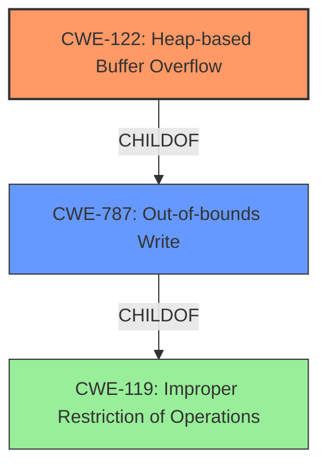

# Final Resolution for CVE-2021-43314

# Summary
| CWE ID | CWE Name | Confidence | CWE Abstraction Level | CWE Vulnerability Mapping Label | CWE-Vulnerability Mapping Notes |
|---|---|---|---|---|---|
| CWE-122 | Heap-based Buffer Overflow | 0.95 | Variant | Allowed | Primary CWE |
| CWE-787 | Out-of-bounds Write | 0.7 | Base | Allowed | Secondary Candidate |

## Evidence and Confidence

*   **Confidence Score:** 0.95
*   **Evidence Strength:** HIGH

## Relationship Analysis
The primary relationship impacting the decision is the parent-child relationship between **CWE-787 (Out-of-bounds Write)** and **CWE-122 (Heap-based Buffer Overflow)**. CWE-122 is a specific type of out-of-bounds write that occurs on the heap. This makes CWE-122 the more specific and thus preferred classification. **CWE-119 (Improper Restriction of Operations within the Bounds of a Memory Buffer)** is the class-level CWE for all buffer overflows and out-of-bounds writes. Although relevant, it is too general and is a discouraged CWE to assign. The abstraction levels influenced the decision, favoring the Variant level CWE-122 over the Base level CWE-787 because it offered a more precise characterization of the vulnerability.

## Vulnerability Chain
The vulnerability chain starts with a **ROOTCAUSE** in the `PackLinuxElf32elf_lookup()` function within UPX, leading to a generic pointer 'p' pointing to an inaccessible address. This results in a **CWE-122 (Heap-based Buffer Overflow)** because the write occurs in the heap. The consequence is a potential crash or arbitrary code execution.

## Summary of Analysis
The initial analysis correctly identified **CWE-122 (Heap-based Buffer Overflow)** as the primary **WEAKNESS**. The vulnerability description states "A heap-based buffer overflows was discovered in upx, during the generic pointer p points to an inaccessible address in func get_le32(). The problem is essentially caused in PackLinuxElf32elf_lookup() at p_lx_elf.cpp5368". The criticism provided valuable suggestions, specifically regarding the inclusion of potential mitigations and acknowledging the Retriever Results (and explaining their exclusion).

The graph relationships reinforced the selection of CWE-122 due to its specificity as a child of CWE-787. The mapping guidance allows for both CWEs, but favors CWE-122 due to its more specific Variant level.

The selected CWEs are at the optimal level of specificity because CWE-122 accurately describes the location of the buffer overflow (heap), while CWE-787 provides a more general description of the out-of-bounds write. The Retriever Results contained false positives, and were correctly excluded from the analysis, but this should be justified with an explanation of why the results are misaligned.