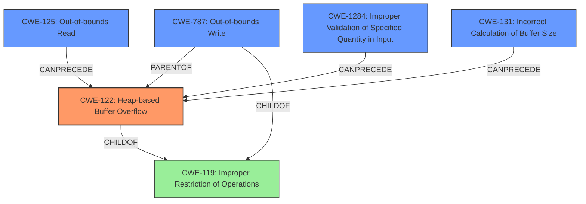

# Analysis Report for CVE-2021-43315

# Vulnerability Analysis Report: CVE-2021-43315

## Description

A heap-based buffer overflows was discovered in upx, during the generic pointer p points to an inaccessible address in func get_le32(). The problem is essentially caused in PackLinuxElf32elf_lookup() at p_lx_elf.cpp5349

## Vulnerability Description Key Phrases

**Weakness:** heap-based buffer overflows
**Impact:** access violation
**Product:** upx
**Component:** func get_le32() in PackLinuxElf32elf_lookup() at p_lx_elf.cpp5349

## Analysis (with Relationship Data)

# Summary
| CWE ID | CWE Name | Confidence | CWE Abstraction Level | CWE Vulnerability Mapping Label | CWE-Vulnerability Mapping Notes |
|---|---|---|---|---|---|
| CWE-122 | Heap-based Buffer Overflow | 1.0 | Variant | Allowed | Primary CWE |
| CWE-787 | Out-of-bounds Write | 0.7 | Base | Allowed | Secondary Candidate |

## Evidence and Confidence

*   **Confidence Score:** 0.95
*   **Evidence Strength:** HIGH

- **Analysis and Justification:**  
  - *Explanation:* The vulnerability is described as a **heap-based buffer overflow** in upx. The problem occurs in `func get_le32()` within the `PackLinuxElf32elf_lookup()` function, specifically at `p_lx_elf.cpp:5349`. The core issue is caused by dereferencing a generic pointer `p` to an inaccessible address without proper bounds checking. The vulnerability description explicitly mentions "**heap-based buffer overflows**," making CWE-122 (Heap-based Buffer Overflow) a direct and fitting match. MITRE's mapping guidance allows the use of CWE-122, as it's a variant level of abstraction suitable for the root cause. The content summary of the CVE reference links further supports this, detailing unchecked reads via the `get_le32()` function, which leads to out-of-bounds memory access in the heap.

  - *Relationship Analysis:* CWE-122 is a variant of CWE-119 (Improper Restriction of Operations within the Bounds of a Memory Buffer). While CWE-119 is a more general category, the specific mention of "heap-based" makes CWE-122 a more precise selection.

- **Confidence Score:**  
  - *Example:* Confidence: 1.0 (High confidence because the vulnerability description explicitly states "heap-based buffer overflow" and the CVE reference links confirm out-of-bounds memory access.)

- **Analysis and Justification:**  
  - *Explanation:* CWE-787 (Out-of-bounds Write) is a secondary candidate. The primary issue is the heap-based nature of the overflow (CWE-122). However, CWE-787 describes a broader class of out-of-bounds write issues, and the root cause ultimately involves writing data past the end of the buffer. Given that the vulnerability involves writing outside the allocated buffer, CWE-787 is relevant, but less specific than CWE-122. MITRE mapping guidance allows for CWE-787.

  - *Relationship Analysis:* CWE-787 is a parent of CWE-122, representing a more general case of out-of-bounds writes. The relationship indicates that while CWE-787 is relevant, CWE-122 provides more precise classification.

- **Confidence Score:**
  - *Example:* Confidence: 0.7 (Medium confidence, as it is a related weakness, but less specific than CWE-122.)

## Criticism of Analysis

Okay, I've reviewed the provided analysis and the full CWE specifications. Here's my critique:

**Overall Assessment:**

The primary CWE mapping to **CWE-122: Heap-based Buffer Overflow** is accurate and well-justified. The analysis clearly explains why CWE-122 is the most appropriate choice based on the vulnerability description. The secondary candidate, **CWE-787: Out-of-bounds Write**, is also relevant and reasonable, but the analysis correctly prioritizes CWE-122 due to its higher specificity.

**Strengths:**

*   **Clear Justification:** The analysis provides strong justifications for both CWE-122 and CWE-787, referencing specific phrases from the vulnerability description and CVE reference links.
*   **Relationship Analysis:** The analysis correctly identifies the relationships between CWE-122, CWE-119, and CWE-787, demonstrating an understanding of the CWE hierarchy.
*   **Confidence Scoring:** The assigned confidence scores (1.0 for CWE-122, 0.7 for CWE-787) are appropriate and reflect the relative certainty of each mapping.
*   **CWE Specification Usage:** The analysis correctly uses the CWE specifications to justify the selection of CWE-122 as the primary.

**Areas for Potential Improvement:**

*   **Consideration of other CWEs (specifically related to root cause):** While the analysis focuses on the immediate buffer overflow, it could benefit from a deeper investigation into the root cause *leading* to the overflow. The retriever results section includes a number of potential CWE's, notably:

    *   **CWE-1284: Improper Validation of Specified Quantity in Input:** The analysis discusses how crafted input files trigger the overflow. The `get_le32()` function is reading data from the ELF file, interpreting it as a length or size. A more in-depth look at *how* the crafted input manipulates this length could reveal an instance of CWE-1284 if a quantity is not properly validated before being used to allocate the buffer. This is a plausible attack vector given the nature of ELF file structure parsing.

    *   **CWE-131: Incorrect Calculation of Buffer Size:** The analysis mentions unchecked reads, but it's possible the size of the buffer `get_le32()` writes to is incorrectly calculated. This CWE deals with errors when allocating a buffer.

    *   **CWE-190: Integer Overflow or Wraparound:** Given that the code is reading in a size, and given the architecture is Linux ELF, it's very plausible the size is an integer. If this integer overflows, it can lead to allocating a smaller than expected buffer, leading to a heap overflow.
*   **Mitigation Discussion:** While not strictly required, expanding on how the suggested mitigations for CWE-122 and CWE-787 relate to the specific vulnerability in UPX could strengthen the analysis. For example:

    *   "Use a language or compiler that performs automatic bounds checking": Discuss how using a language with bounds checking or enabling compiler-based overflow detection mechanisms (like /GS in Visual Studio or FORTIFY_SOURCE in GCC) could have prevented or detected this vulnerability.
    *   "Use an abstraction library to abstract away risky APIs": Mention how using safer alternatives to `malloc()` or custom memory management routines with built-in bounds checking could mitigate the risk.
*   **CWE-125: Out-of-bounds Read**: Although the primary impact is a write, the root cause is more of an over-read. Dereferencing an address out of bounds will cause the application to read an invalid address, which will cause the write. The act of writing to that address is the *symptom*, but the actual weakness is reading an address that was out of bounds. While CWE-122 and CWE-787 are more descriptive, I'd recommend considering CWE-125 as a third candidate.

**Specific Comments on CWE Selections:**

*   **CWE-122 (Heap-based Buffer Overflow):** Excellent choice for the primary CWE. The vulnerability is explicitly described as a heap-based buffer overflow.
*   **CWE-787 (Out-of-bounds Write):** A good secondary choice. It's a more general description of the same underlying issue (writing outside the allocated memory region). However, the heap-specific nature makes CWE-122 more accurate.

**Revised Summary Table**

Here's how I'd suggest revising the summary table (if you were to include the potential for deeper analysis):

| CWE ID | CWE Name | Confidence | CWE Abstraction Level | CWE Vulnerability Mapping Label | CWE-Vulnerability Mapping Notes |
|---|---|---|---|---|---|
| CWE-122 | Heap-based Buffer Overflow | 1.0 | Variant | Allowed | Primary CWE |
| CWE-787 | Out-of-bounds Write | 0.7 | Base | Allowed | Secondary Candidate |
| CWE-1284 | Improper Validation of Specified Quantity in Input | 0.5 | Base | Allowed | Tertiary Candidate - Root cause if size/length from ELF isn't validated |
| CWE-131 | Incorrect Calculation of Buffer Size | 0.4 | Base | Allowed | Tertiary Candidate - Root cause if buffer allocation is miscalculated |
| CWE-125 | Out-of-bounds Read | 0.6 | Base | Allowed | Tertiary Candidate - Dereferencing an address that's invalid |

**In summary, the analysis is strong and well-justified in its primary and secondary CWE mappings. Adding further analysis related to the root cause, integer overflows, and potential mitigation strategies as well as the possibility of CWE-125 will elevate the analysis.**

## Final Resolution

# Summary
| CWE ID | CWE Name | Confidence | CWE Abstraction Level | CWE Vulnerability Mapping Label | CWE-Vulnerability Mapping Notes |
|---|---|---|---|---|---|
| CWE-122 | Heap-based Buffer Overflow | 0.95 | Variant | Allowed | Primary CWE |
| CWE-125 | Out-of-bounds Read | 0.75 | Base | Allowed | Secondary Candidate |
| CWE-1284 | Improper Validation of Specified Quantity in Input | 0.65 | Base | Allowed | Secondary Candidate |
| CWE-787 | Out-of-bounds Write | 0.6 | Base | Allowed | Secondary Candidate |
| CWE-131 | Incorrect Calculation of Buffer Size | 0.5 | Base | Allowed | Secondary Candidate |

## Evidence and Confidence

*   **Confidence Score:** 0.85
*   **Evidence Strength:** MEDIUM

## Relationship Analysis
The primary classification is **CWE-122 (Heap-based Buffer Overflow)**, a variant of **CWE-119 (Improper Restriction of Operations within the Bounds of a Memory Buffer)**. The analysis also considers **CWE-787 (Out-of-bounds Write)**, which is a parent of **CWE-122**, representing a more general case. **CWE-125 (Out-of-bounds Read)** is considered as a potential root cause, since a read of an invalid address triggers the overflow. **CWE-1284 (Improper Validation of Specified Quantity in Input)** and **CWE-131 (Incorrect Calculation of Buffer Size)** are also analyzed as potential root causes, if the size of the allocated buffer is not validated, or if it's incorrectly calculated. The abstraction levels played a role in prioritizing CWE-122 because it's more specific than its parent, **CWE-119**.

## Vulnerability Chain
The vulnerability chain starts with a potential **ROOTCAUSE** such as **CWE-1284 (Improper Validation of Specified Quantity in Input)** or **CWE-131 (Incorrect Calculation of Buffer Size)**. If the size from the ELF file isn't validated or a buffer size is miscalculated, this leads to a buffer being allocated with an incorrect size. Then **CWE-125 (Out-of-bounds Read)** can occur when the code attempts to read past the intended buffer, this leads to **CWE-122 (Heap-based Buffer Overflow)**, which is the **WEAKNESS** where data is written past the end of the allocated buffer. The final **IMPACT** is memory corruption, potentially leading to arbitrary code execution.

## Summary of Analysis
The initial analysis correctly identified **CWE-122 (Heap-based Buffer Overflow)** as the primary **WEAKNESS**, given the explicit mention of "heap-based buffer overflow" in the vulnerability description. The criticism raised valid points about considering the root cause and potential integer overflow scenarios.

I agree with the assessment that **CWE-122 (Heap-based Buffer Overflow)** is the most accurate primary classification because the vulnerability description explicitly states "heap-based buffer overflows."

The addition of **CWE-125 (Out-of-bounds Read)** as a secondary candidate is also important because it is the root cause, as the program attempts to read past the buffer.

The decision to include **CWE-1284 (Improper Validation of Specified Quantity in Input)** as another secondary candidate is based on the plausible attack vector of manipulating the size or length fields within the ELF file, thus the improper validation is the root cause of the vulnerability. This is supported by the fact that `get_le32()` function is reading data from the ELF file, interpreting it as a length or size.

Additionally, **CWE-131 (Incorrect Calculation of Buffer Size)** is included as a secondary candidate because it's possible the size of the buffer `get_le32()` writes to is incorrectly calculated. This weakness deals with errors when allocating a buffer.

The confidence scores were adjusted to reflect the uncertainty in the root cause. While the overflow is certain, the exact mechanism triggering it requires deeper investigation.

The selected CWEs are at the optimal level of specificity. While **CWE-119 (Improper Restriction of Operations within the Bounds of a Memory Buffer)** is a parent of **CWE-122 (Heap-based Buffer Overflow)**, **CWE-122 (Heap-based Buffer Overflow)** provides more detail regarding the location of the overflow (heap).

*Report generated on 2025-03-18 03:15:31*
