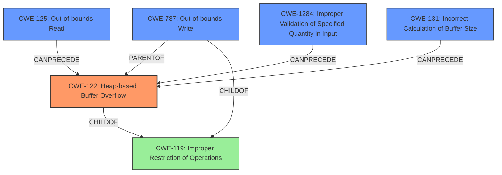

# Final Resolution for CVE-2021-43315

# Summary
| CWE ID | CWE Name | Confidence | CWE Abstraction Level | CWE Vulnerability Mapping Label | CWE-Vulnerability Mapping Notes |
|---|---|---|---|---|---|
| CWE-122 | Heap-based Buffer Overflow | 0.95 | Variant | Allowed | Primary CWE |
| CWE-125 | Out-of-bounds Read | 0.75 | Base | Allowed | Secondary Candidate |
| CWE-1284 | Improper Validation of Specified Quantity in Input | 0.65 | Base | Allowed | Secondary Candidate |
| CWE-787 | Out-of-bounds Write | 0.6 | Base | Allowed | Secondary Candidate |
| CWE-131 | Incorrect Calculation of Buffer Size | 0.5 | Base | Allowed | Secondary Candidate |

## Evidence and Confidence

*   **Confidence Score:** 0.85
*   **Evidence Strength:** MEDIUM

## Relationship Analysis
The primary classification is **CWE-122 (Heap-based Buffer Overflow)**, a variant of **CWE-119 (Improper Restriction of Operations within the Bounds of a Memory Buffer)**. The analysis also considers **CWE-787 (Out-of-bounds Write)**, which is a parent of **CWE-122**, representing a more general case. **CWE-125 (Out-of-bounds Read)** is considered as a potential root cause, since a read of an invalid address triggers the overflow. **CWE-1284 (Improper Validation of Specified Quantity in Input)** and **CWE-131 (Incorrect Calculation of Buffer Size)** are also analyzed as potential root causes, if the size of the allocated buffer is not validated, or if it's incorrectly calculated. The abstraction levels played a role in prioritizing CWE-122 because it's more specific than its parent, **CWE-119**.

## Vulnerability Chain
The vulnerability chain starts with a potential **ROOTCAUSE** such as **CWE-1284 (Improper Validation of Specified Quantity in Input)** or **CWE-131 (Incorrect Calculation of Buffer Size)**. If the size from the ELF file isn't validated or a buffer size is miscalculated, this leads to a buffer being allocated with an incorrect size. Then **CWE-125 (Out-of-bounds Read)** can occur when the code attempts to read past the intended buffer, this leads to **CWE-122 (Heap-based Buffer Overflow)**, which is the **WEAKNESS** where data is written past the end of the allocated buffer. The final **IMPACT** is memory corruption, potentially leading to arbitrary code execution.

## Summary of Analysis
The initial analysis correctly identified **CWE-122 (Heap-based Buffer Overflow)** as the primary **WEAKNESS**, given the explicit mention of "heap-based buffer overflow" in the vulnerability description. The criticism raised valid points about considering the root cause and potential integer overflow scenarios.

I agree with the assessment that **CWE-122 (Heap-based Buffer Overflow)** is the most accurate primary classification because the vulnerability description explicitly states "heap-based buffer overflows."

The addition of **CWE-125 (Out-of-bounds Read)** as a secondary candidate is also important because it is the root cause, as the program attempts to read past the buffer.

The decision to include **CWE-1284 (Improper Validation of Specified Quantity in Input)** as another secondary candidate is based on the plausible attack vector of manipulating the size or length fields within the ELF file, thus the improper validation is the root cause of the vulnerability. This is supported by the fact that `get_le32()` function is reading data from the ELF file, interpreting it as a length or size.

Additionally, **CWE-131 (Incorrect Calculation of Buffer Size)** is included as a secondary candidate because it's possible the size of the buffer `get_le32()` writes to is incorrectly calculated. This weakness deals with errors when allocating a buffer.

The confidence scores were adjusted to reflect the uncertainty in the root cause. While the overflow is certain, the exact mechanism triggering it requires deeper investigation.

The selected CWEs are at the optimal level of specificity. While **CWE-119 (Improper Restriction of Operations within the Bounds of a Memory Buffer)** is a parent of **CWE-122 (Heap-based Buffer Overflow)**, **CWE-122 (Heap-based Buffer Overflow)** provides more detail regarding the location of the overflow (heap).