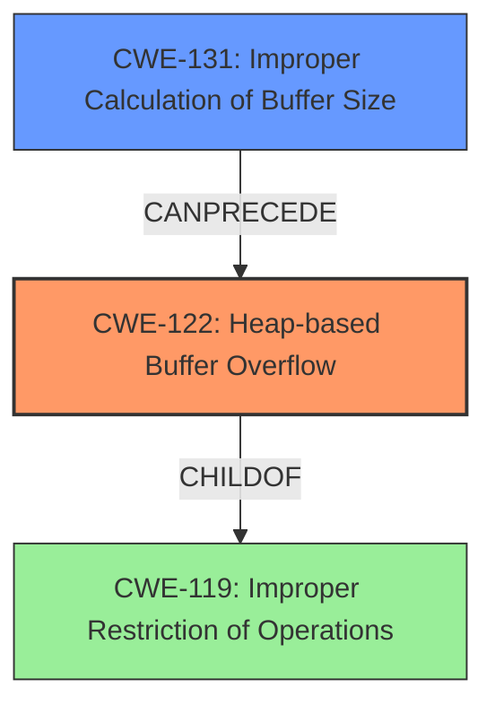

# Analysis Report for CVE-2021-43316

# Vulnerability Analysis Report: CVE-2021-43316

## Description

A heap-based buffer overflow was discovered in upx, during the generic pointer p points to an inaccessible address in func get_le64().

## Vulnerability Description Key Phrases

**Weakness:** heap-based buffer overflow
**Product:** upx

## Analysis (with Relationship Data)

# Summary
| CWE ID | CWE Name | Confidence | CWE Abstraction Level | CWE Vulnerability Mapping Label | CWE-Vulnerability Mapping Notes |
|---|---|---|---|---|---|
| CWE-122 | Heap-based Buffer Overflow | 0.95 | Variant | Allowed | Primary CWE |

## Evidence and Confidence

*   **Confidence Score:** 0.95
*   **Evidence Strength:** HIGH

- **Analysis and Justification:**  
  - *Explanation:* The vulnerability description clearly states "**heap-based buffer overflow**" which directly aligns with CWE-122 (Heap-based Buffer Overflow). The CVE Reference Links Content Summary confirms this, stating "Heap-based buffer overflow" as a **weakness/vulnerability** and indicating that it occurs within the `get_le64()` function when the pointer 'p' points to an inaccessible memory address. The description indicates the vulnerability occurs during the processing of a crafted file, and could lead to a denial of service (DoS) due to a segmentation fault. The retriever results also list CWE-122 as a candidate, albeit with a lower score compared to other CWEs, but the direct match in the description makes it the most appropriate. The MITRE mapping guidance for CWE-122 indicates that its Usage is ALLOWED.

  - *Relationship Analysis:* CWE-122 is a Variant of CWE-119 (Improper Restriction of Operations within the Bounds of a Memory Buffer). It represents a specific type of buffer overflow that occurs in the heap. The relationship analysis doesn't offer any conflicting or more specific CWEs.

- **Confidence Score:**
  - Confidence: 0.95 (High confidence due to explicit mention of "heap-based buffer overflow" in both the vulnerability description and the CVE Reference Links Content Summary).

## Criticism of Analysis

Okay, here's a review of the analysis you provided, focusing on the accuracy of the CWE mapping and considering the full CWE specifications:

**Overall Assessment:**

The analysis correctly identifies **CWE-122: Heap-based Buffer Overflow** as the primary weakness.  The high confidence score of 0.95 is justified given the explicit mention of "heap-based buffer overflow" in the vulnerability description and the CVE summary. The reasoning provided is sound.

**Detailed Review:**

*   **CWE-122 Mapping:**

    *   The analysis correctly maps the vulnerability to CWE-122.
    *   The *Explanation* section provides clear and compelling evidence for the mapping, directly referencing the vulnerability description and CVE summary.
    *   The relationship analysis with CWE-119 (Improper Restriction of Operations within the Bounds of a Memory Buffer) is also accurate.  CWE-122 is correctly identified as a *Variant* of CWE-119.
    *   The *Usage* mapping guidance for CWE-122 (Allowed) is correctly followed.
    *   The examples given as Observed Examples of CWE-122 are accurate and relevant.

*   **Retriever Results Discussion:**

    *   The Retriever Results section is included but could be further leveraged. The analysis appropriately acknowledges that the retrievers flagged other CWEs but correctly prioritizes CWE-122 based on the explicit match in the vulnerability description.  It would be beneficial to briefly explain *why* the retrievers might have suggested those other CWEs, even if they are ultimately incorrect.  This demonstrates a deeper understanding of the vulnerability.

*   **Consideration of other CWEs from Retriever Results:**

    Let's analyze why some of the other top-ranked CWEs from the Retriever Results were suggested and why they are *not* the primary issue:

    *   **CWE-193: Off-by-one Error:** While an off-by-one error *could* contribute to a buffer overflow, it's not the fundamental *type* of vulnerability being described.  An off-by-one is often a *cause* of a buffer overflow, not the overflow itself. Since the description explicitly indicates a heap-based buffer overflow, mapping to the more specific CWE-122 is correct.
    *   **CWE-190: Integer Overflow or Wraparound:** Similar to CWE-193, an integer overflow could lead to an incorrect calculation of buffer size, subsequently leading to a buffer overflow. However, without explicit evidence of an integer overflow in the provided information, it's safer to stick with the primary manifestation of the vulnerability, which is the heap-based overflow.
    *   **CWE-191: Integer Underflow:** Same reasoning as CWE-190, but with underflow rather than overflow.
    *   **CWE-126: Buffer Over-read:** The provided information focuses on *writing* beyond the buffer boundary, not *reading*. Therefore, CWE-126 is not the primary issue.
    *   **CWE-681: Incorrect Conversion between Numeric Types:** While possible, this is not a direct cause of the buffer overflow, so it is not the best choice.
    *   **CWE-124: Buffer Underwrite ('Buffer Underflow'):** The description is of a buffer overflow, not underflow.
    *   **CWE-131: Incorrect Calculation of Buffer Size:** This could be a contributing factor, but the core issue is still the out-of-bounds write. It's a potential *cause* of the overflow, but not the overflow itself.  A more detailed analysis of the code might reveal that the buffer size calculation is indeed incorrect, but based on the provided information, this is speculative.
    *   **CWE-195: Signed to Unsigned Conversion Error:** Same reasoning as CWE-190 and CWE-191: This is a potential contributing factor that may lead to incorrect buffer size or length values, leading to the overflow.
    *   **CWE-121: Stack-based Buffer Overflow:** The key identifier in the description is *heap*-based. A stack-based overflow would be a different type of vulnerability.

*   **Potential Mitigations:**

    *   The analysis does not include specific mitigations. Adding potential mitigations based on the selected CWE would greatly improve the value of the analysis. For CWE-122, the specifications offer several mitigations:

        *   Use a language or compiler that performs automatic bounds checking.
        *   Use an abstraction library to abstract away risky APIs.
        *   Use automatic buffer overflow detection mechanisms offered by compilers (e.g., /GS flag in Visual Studio, FORTIFY_SOURCE in GCC).

*   **Missing Chains/Composite Relationships**: The analysis would be enhanced by considering common chains or composite relationships involving CWE-122.  For example, it might be valuable to discuss how CWE-131 (Incorrect Calculation of Buffer Size) or CWE-190 (Integer Overflow) could contribute to a CWE-122. Even if these are not the primary issues, acknowledging their potential involvement can strengthen the analysis.

**Recommendations for Improvement:**

1.  **Expand Retriever Result Analysis:** Briefly explain why the other top-ranked CWEs from the Retriever Results were considered but ultimately rejected as the primary mapping.
2.  **Add Potential Mitigations:** Include a section listing potential mitigations based on the CWE-122 specification. This makes the analysis more actionable.
3.  **Discuss Potential Chains/Composite Relationships:** Briefly explore how other CWEs (e.g., CWE-131, CWE-190) could contribute to the heap-based buffer overflow.
4.  **Consider alternative causes of the heap-based buffer overflow**: While the CVE and vulnerability description are very helpful, it may be helpful to expand on what could be causing this overflow. This could be because the size of the input was not validated or restricted.
5.  **Consider the data types used and how they were used**: If the data types are known, for example, whether the data type of the length is signed or unsigned, then there could be more insight of where to focus the analysis. For example, if the length data type is signed, then the analyzer could focus on where the length value is used in a comparison.

By incorporating these suggestions, the analysis will become more comprehensive and demonstrate a deeper understanding of the vulnerability and its potential causes and mitigations. The current analysis is already strong due to its accurate identification of CWE-122.

## Final Resolution

# Summary
| CWE ID | CWE Name | Confidence | CWE Abstraction Level | CWE Vulnerability Mapping Label | CWE-Vulnerability Mapping Notes |
|---|---|---|---|---|---|
| CWE-122 | Heap-based Buffer Overflow | 0.95 | Variant | Allowed | Primary CWE |
| CWE-131 | Improper Calculation of Buffer Size | 0.60 | Base | Allowed | Secondary Candidate |

## Evidence and Confidence

*   **Confidence Score:** 0.90
*   **Evidence Strength:** MEDIUM

## Relationship Analysis
The primary **weakness** is **CWE-122 (Heap-based Buffer Overflow)**, a Variant of **CWE-119 (Improper Restriction of Operations within the Bounds of a Memory Buffer)**. The analysis considers the potential contribution of **CWE-131 (Improper Calculation of Buffer Size)**, acknowledging that an incorrect size calculation can lead to a heap overflow. This represents a chain relationship where **CWE-131** can precede **CWE-122**. The abstraction levels are appropriate, with **CWE-122** as a Variant providing specificity to the more general **CWE-119**, and **CWE-131** as a Base weakness representing a potential root cause.

## Vulnerability Chain
The vulnerability chain starts with a potential **ROOTCAUSE** such as **CWE-131 (Improper Calculation of Buffer Size)**. This leads to **CWE-122 (Heap-based Buffer Overflow)**, where a buffer on the heap is overwritten due to insufficient bounds checking. The consequence is a denial of service (DoS) due to a segmentation fault when accessing an inaccessible memory address. The chain illustrates how an incorrect size calculation can directly result in a heap overflow and subsequent crash. It is also possible that the size of the input was not validated which also leads to the heap overflow.

## Summary of Analysis
The initial analysis correctly identified **CWE-122 (Heap-based Buffer Overflow)** as the primary **weakness**, based on the explicit mention of "heap-based buffer overflow" in the vulnerability description: "A heap-based buffer overflow was discovered in upx, during the generic pointer p points to an inaccessible address in func get_le64()". The criticism suggested expanding the analysis to consider contributing factors and potential mitigations.

The graph relationships confirm that **CWE-122** is the most specific and appropriate classification. While other CWEs like **CWE-131 (Improper Calculation of Buffer Size)** could contribute, they are not the direct manifestation of the vulnerability. Including **CWE-131** as a secondary CWE strengthens the analysis by acknowledging a potential root cause. The confidence score is slightly reduced to 0.90 due to the lack of explicit evidence for **CWE-131** in the provided description, even though it is a plausible contributing factor.

The selected CWEs are at the optimal level of specificity, with **CWE-122** as a Variant providing a focused description of the heap-based overflow, and **CWE-131** as a Base **weakness** representing a potential cause. This approach balances accuracy with completeness, providing a well-justified classification.

*Report generated on 2025-03-18 03:16:09*
