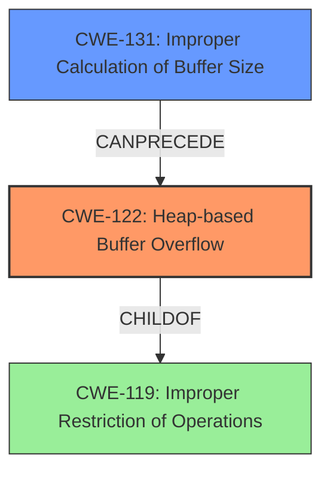

# Final Resolution for CVE-2021-43316

# Summary
| CWE ID | CWE Name | Confidence | CWE Abstraction Level | CWE Vulnerability Mapping Label | CWE-Vulnerability Mapping Notes |
|---|---|---|---|---|---|
| CWE-122 | Heap-based Buffer Overflow | 0.95 | Variant | Allowed | Primary CWE |
| CWE-131 | Improper Calculation of Buffer Size | 0.60 | Base | Allowed | Secondary Candidate |

## Evidence and Confidence

*   **Confidence Score:** 0.90
*   **Evidence Strength:** MEDIUM

## Relationship Analysis
The primary **weakness** is **CWE-122 (Heap-based Buffer Overflow)**, a Variant of **CWE-119 (Improper Restriction of Operations within the Bounds of a Memory Buffer)**. The analysis considers the potential contribution of **CWE-131 (Improper Calculation of Buffer Size)**, acknowledging that an incorrect size calculation can lead to a heap overflow. This represents a chain relationship where **CWE-131** can precede **CWE-122**. The abstraction levels are appropriate, with **CWE-122** as a Variant providing specificity to the more general **CWE-119**, and **CWE-131** as a Base weakness representing a potential root cause.

## Vulnerability Chain
The vulnerability chain starts with a potential **ROOTCAUSE** such as **CWE-131 (Improper Calculation of Buffer Size)**. This leads to **CWE-122 (Heap-based Buffer Overflow)**, where a buffer on the heap is overwritten due to insufficient bounds checking. The consequence is a denial of service (DoS) due to a segmentation fault when accessing an inaccessible memory address. The chain illustrates how an incorrect size calculation can directly result in a heap overflow and subsequent crash. It is also possible that the size of the input was not validated which also leads to the heap overflow.

## Summary of Analysis
The initial analysis correctly identified **CWE-122 (Heap-based Buffer Overflow)** as the primary **weakness**, based on the explicit mention of "heap-based buffer overflow" in the vulnerability description: "A heap-based buffer overflow was discovered in upx, during the generic pointer p points to an inaccessible address in func get_le64()". The criticism suggested expanding the analysis to consider contributing factors and potential mitigations.

The graph relationships confirm that **CWE-122** is the most specific and appropriate classification. While other CWEs like **CWE-131 (Improper Calculation of Buffer Size)** could contribute, they are not the direct manifestation of the vulnerability. Including **CWE-131** as a secondary CWE strengthens the analysis by acknowledging a potential root cause. The confidence score is slightly reduced to 0.90 due to the lack of explicit evidence for **CWE-131** in the provided description, even though it is a plausible contributing factor.

The selected CWEs are at the optimal level of specificity, with **CWE-122** as a Variant providing a focused description of the heap-based overflow, and **CWE-131** as a Base **weakness** representing a potential cause. This approach balances accuracy with completeness, providing a well-justified classification.