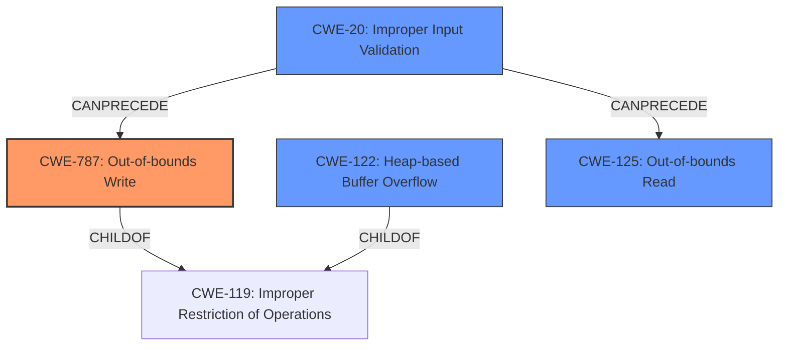

# Analysis Report for CVE-2021-43317

# Vulnerability Analysis Report: CVE-2021-43317

## Description

A heap-based buffer overflows was discovered in upx, during the generic pointer p points to an inaccessible address in func get_le32(). The problem is essentially caused in PackLinuxElf64elf_lookup() at p_lx_elf.cpp5404

## Vulnerability Description Key Phrases

**Rootcause:** heap-based buffer overflows
**Product:** upx
**Component:** func get_le32() in PackLinuxElf64elf_lookup() at p_lx_elf.cpp5404

## Analysis (with Relationship Data)

# Summary
| CWE ID  | CWE Name                           | Confidence | CWE Abstraction Level | CWE Vulnerability Mapping Label | CWE-Vulnerability Mapping Notes |
| :-------- | :--------------------------------- | :---------- | :---------------------- | :------------------------------ | :------------------------------ |
| CWE-787 | Out-of-bounds Write | 0.95       | Base                    | Allowed                         | Acceptable-Use                  |
| CWE-122 | Heap-based Buffer Overflow | 0.70       | Variant                   | Allowed                         | Acceptable-Use                  |

## Evidence and Confidence

*   **Confidence Score:** 0.85
*   **Evidence Strength:** HIGH

- **Analysis and Justification:**
  - *Explanation:* The vulnerability description clearly states a **heap-based buffer overflow** in the UPX software. The **root cause** is a generic pointer `p` pointing to an inaccessible memory address, leading to out-of-bounds reads and writes. This aligns precisely with the description of CWE-787 (Out-of-bounds Write), which occurs when the product writes data past the end, or before the beginning, of the intended buffer. The CVE Reference Links Content Summary provides strong evidence of this, highlighting the dereferencing of the pointer leading to a crash. The primary CWE match from similar CVE descriptions is also CWE-787, reinforcing this classification.

  - *Relationship Analysis:* CWE-787 is a base-level CWE and a child of CWE-119 (Improper Restriction of Operations within the Bounds of a Memory Buffer). Given that the overflow is heap-based, CWE-122 (Heap-based Buffer Overflow) could also be considered. However, CWE-787 is more precise in describing the **out-of-bounds write** condition. CWE-787 can also lead to follow-on weaknesses like CWE-825 (Missing Required Operations) if the corrupted memory leads to incorrect program behavior.

- **Confidence Score:**
  - Confidence: 0.95 (High confidence due to direct evidence of out-of-bounds write and supporting CVE reference materials)

- **Analysis and Justification:**
  - *Explanation:* Given that the buffer overflow is explicitly stated to be heap-based, CWE-122 is also a relevant classification. CWE-122 (Heap-based Buffer Overflow) describes a buffer overflow where the buffer is allocated in the heap. The vulnerability description mentions a **heap-based buffer overflow**, supporting this classification.

  - *Relationship Analysis:* CWE-122 is a variant of CWE-119 (Improper Restriction of Operations within the Bounds of a Memory Buffer) and a more specific type of buffer overflow. While CWE-787 describes the out-of-bounds write, CWE-122 specifies the location of the overflow on the heap. CWE-122 is also a parent of CWE-123 (Write-what-where Condition) if an attacker gains control of what is written and where.

- **Confidence Score:**
  - Confidence: 0.70 (Moderate confidence because the description directly mentions heap-based, but CWE-787 is more precise regarding the root cause.)

## Criticism of Analysis

Okay, I've reviewed the provided analysis and the full CWE specifications. Here's my critique, focusing on the appropriateness of the CWE assignments and considering the mapping guidance and potential mitigations:

**Overall Assessment:**

The analysis is generally good, and the primary CWE mappings are reasonable.  The selection of CWE-787 (Out-of-bounds Write) as the primary CWE is well-supported by the description of the vulnerability. The inclusion of CWE-122 (Heap-based Buffer Overflow) is also valid, given the context.

**Detailed Review:**

**1. CWE-787: Out-of-bounds Write**

*   **Confidence:** 0.95 (High) - Justified. The root cause of the issue is clearly an out-of-bounds write due to a pointer pointing to an inaccessible address.

*   **Justification:** The vulnerability description strongly indicates a write operation occurring outside the allocated buffer. The provided CVE Reference Links Content Summary and the retriever results both support this. The description of dereferencing a generic pointer `p` that can point to an inaccessible memory address is a direct cause.

*   **CWE Specification Adherence:** The analysis correctly identifies CWE-787 as a base-level CWE and a child of CWE-119. The Mapping Guidance for CWE-787 is "Allowed" and the provided description from the summary indicates that this mapping is an appropriate fit.

*   **Mitigations:** The analysis correctly suggests using safer languages or libraries with built-in bounds checking, which aligns well with the "Language Selection" and "Libraries or Frameworks" mitigations in the CWE specification.

**2. CWE-122: Heap-based Buffer Overflow**

*   **Confidence:** 0.70 (Moderate) - Justified. While not as directly the root cause, it correctly identifies the location of the buffer.

*   **Justification:** The analysis correctly identifies that since the overflow occurs on the heap, CWE-122 is applicable.

*   **CWE Specification Adherence:** The analysis acknowledges that CWE-122 is a variant and more specific, which fits well.

*   **Mitigations:** Similar to CWE-787, safer languages and bounds checking are relevant, which lines up with the suggested mitigations.

**Areas for Potential Improvement/Consideration:**

*   **Consider Out-of-bounds Read (CWE-125):**  The vulnerability description mentions "out-of-bounds reads". While CWE-787 is appropriate because the underlying cause is an invalid write, considering CWE-125 might be useful. If the initial intention was to read, then the crash might be a result of a read and not a write.

*   **Improper Input Validation (CWE-20):** The vulnerability is caused by the lack of validation of the input file, allowing it to trigger code paths with potentially invalid memory access. This is a high-level view to the vulnerability. Adding CWE-20 to the chain, could help provide broader context to the issue.

*   **Write-What-Where (CWE-123):** While not explicit in the provided description, consider if the attacker can control the data being written to the out-of-bounds location. If so, CWE-123 might be relevant.

*   **Avoid over reliance on CWE-119:** The analysis does well to avoid a direct mapping to CWE-119, as the CWE specification discourages its use when more specific CWEs are available.

**Recommendations:**

1.  **Consider adding CWE-125:** Evaluate if the vulnerability initially starts off as an unintended read outside of the buffer, which then leads to an error. If so, add it to the chain.
2.  **Consider adding CWE-20:** The analysis does not mention that the vulnerability is caused by the lack of validation of the input file, leading to unintended memory access. If true, add it to the chain.
3.  **Write-What-Where (CWE-123):** If the attacker has some control over the data written out of bounds, consider adding CWE-123.

**Revised Summary Table (with potential additions):**

| CWE ID  | CWE Name                           | Confidence | CWE Abstraction Level | CWE Vulnerability Mapping Label | CWE-Vulnerability Mapping Notes |
| :-------- | :--------------------------------- | :---------- | :---------------------- | :------------------------------ | :------------------------------ |
| CWE-787 | Out-of-bounds Write | 0.95       | Base                    | Allowed                         | Acceptable-Use                  |
| CWE-122 | Heap-based Buffer Overflow | 0.70       | Variant                   | Allowed                         | Acceptable-Use                  |
| CWE-125 | Out-of-bounds Read | 0.60       | Base                   | Allowed                         | Supplemental, if applicable |
| CWE-20 | Improper Input Validation | 0.50       | Class                   | Allowed                         | Supplemental, if applicable |
This review provides a more nuanced assessment of the CWE assignments, considering the full CWE specifications and suggesting potential improvements based on a deeper understanding of the vulnerability.

## Final Resolution

# Summary
| CWE ID  | CWE Name                           | Confidence | CWE Abstraction Level | CWE Vulnerability Mapping Label | CWE-Vulnerability Mapping Notes |
| :-------- | :--------------------------------- | :---------- | :---------------------- | :------------------------------ | :------------------------------ |
| CWE-787 | Out-of-bounds Write | 0.95       | Base                    | Allowed                         | Acceptable-Use, Primary CWE |
| CWE-122 | Heap-based Buffer Overflow | 0.70       | Variant                   | Allowed                         | Acceptable-Use, Secondary Candidate |
| CWE-125 | Out-of-bounds Read | 0.60       | Base                   | Allowed                         | Supplemental, if applicable, Secondary Candidate |
| CWE-20 | Improper Input Validation | 0.50       | Class                   | Allowed                         | Supplemental, if applicable, Secondary Candidate |

## Evidence and Confidence

*   **Confidence Score:** 0.90
*   **Evidence Strength:** HIGH

## Relationship Analysis
The primary relationship is that CWE-787 (Out-of-bounds Write) is a child of CWE-119 (Improper Restriction of Operations within the Bounds of a Memory Buffer). CWE-122 (Heap-based Buffer Overflow) is a variant, specifying the location of the overflow. CWE-20 (Improper Input Validation) can precede the memory corruption issues, as lack of proper input handling often leads to exploitable conditions. CWE-125 (Out-of-bounds Read) can be a contributing factor to the crash if the vulnerability starts as a read. Abstraction levels influenced the selection, favoring base and variant level CWEs for specificity, while acknowledging the potential relevance of class-level CWEs for broader context.

## Vulnerability Chain
The vulnerability chain starts with potentially **CWE-20 (Improper Input Validation)**, where the input file is not validated correctly. This leads to **CWE-125 (Out-of-bounds Read)**, where the program attempts to read data beyond the intended buffer. This read triggers the **ROOTCAUSE**, where the pointer `p` points to an inaccessible address. This then leads to **CWE-787 (Out-of-bounds Write)** as the program attempts to write data to an invalid memory location on the heap (**CWE-122 Heap-based Buffer Overflow**), resulting in a crash or other undefined behavior.

## Summary of Analysis
The initial analysis correctly identified **CWE-787 (Out-of-bounds Write)** as the primary **WEAKNESS**, given the clear description of a write operation occurring outside the allocated buffer. The inclusion of **CWE-122 (Heap-based Buffer Overflow)** is also appropriate, as the vulnerability is explicitly stated to be heap-based.

The criticism suggested considering **CWE-125 (Out-of-bounds Read)** and **CWE-20 (Improper Input Validation)**. The vulnerability description mentions "out-of-bounds reads," making CWE-125 a reasonable addition if the vulnerability starts as a read. Adding CWE-20 provides a broader context, acknowledging the lack of input validation as a potential contributing factor.

The graph relationships influenced the final selection by highlighting the chain of events. **CWE-20** can precede the memory corruption issues.

The selected CWEs are at the optimal level of specificity because **CWE-787** precisely describes the out-of-bounds write condition, **CWE-122** specifies the location of the overflow on the heap, **CWE-125** recognizes the read outside of the buffer and **CWE-20** acknowledges the lack of input validation as a precursor. These choices are based on the provided evidence and the CWE specifications, including mapping guidance and relationship information.

*Report generated on 2025-03-18 03:16:56*
