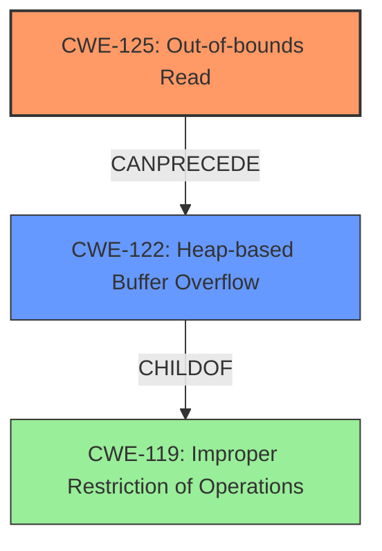

# Analysis Report for CVE-2021-43453

# Vulnerability Analysis Report: CVE-2021-43453

## Description

A Heap-based Buffer Overflow vulnerability exists in JerryScript 2.4.0 and prior versions via an out-of-bounds read in parser_parse_for_statement_start in the js-parser-statm.c file. This issue is similar to CVE-2020-29657.

## Vulnerability Description Key Phrases

**Rootcause:** out-of-bounds read
**Impact:** Heap-based Buffer Overflow
**Product:** JerryScript
**Version:** 2.4.0 and prior versions
**Component:** parser_parse_for_statement_start in js-parser-statm.c

## Analysis (with Relationship Data)

# Summary
| CWE ID | CWE Name | Confidence | CWE Abstraction Level | CWE Vulnerability Mapping Label | CWE-Vulnerability Mapping Notes |
|---|---|---|---|---|---|
| CWE-125 | Out-of-bounds Read | 0.95 | Base |  Primary | Allowed |
| CWE-122 | Heap-based Buffer Overflow | 0.70 | Variant | Secondary Candidate | Allowed |

## Evidence and Confidence

*   **Confidence Score:** 0.85
*   **Evidence Strength:** HIGH

- **Analysis and Justification:**  
  - *Explanation:* "The vulnerability description explicitly states an **out-of-bounds read** in `parser_parse_for_statement_start` within the js-parser-statm.c file. This directly aligns with CWE-125 (Out-of-bounds Read). The CVE reference summary further confirms a heap-buffer-overflow due to a parsing error. CWE-125 is a Base level CWE, which is a preferred level of abstraction. The retriever results also list CWE-125 with a high score."
  
  - *Relationship Analysis:* "CWE-125 is directly related to buffer over-reads, where data is read from outside the intended buffer boundaries. While a heap-based buffer overflow (CWE-122) is mentioned as an impact, the root cause is the **out-of-bounds read**. This can potentially lead to CWE-122 if the read data is then used improperly. CWE-126 (Buffer Over-read) is a variant of CWE-125 but less specific, so CWE-125 is favored. The description indicates the read occurs *before the write*, which is out of bounds. Therefore, CWE-787 (Out-of-bounds Write) is not applicable as a primary weakness."

- **Confidence Score:**  
  - Confidence: 0.95 (High confidence due to direct evidence and clear root cause)

---
- **Analysis and Justification:**  
  - *Explanation:* The vulnerability description and CVE summary mention a heap-based buffer overflow. The primary cause is the parsing error leading to the **out-of-bounds read**, which can then result in a buffer overflow on the heap (CWE-122). The CVE reference links content summary further confirms that the **Heap-buffer-overflow** can be triggered by crafting a malicious JavaScript program. Therefore, CWE-122 is considered a secondary weakness because it describes a *potential impact* of the **out-of-bounds read**.
  
  - *Relationship Analysis:* "CWE-122 is a Variant of buffer overflow, specifically a heap overflow. It's a child of CWE-119 (Improper Restriction of Operations within the Bounds of a Memory Buffer). The relationship analysis reveals that CWE-125 (Out-of-bounds Read) can precede CWE-122. The crafted JavaScript code can cause a segmentation fault. The retriever results list CWE-122."

- **Confidence Score:**  
  - Confidence: 0.70 (Medium confidence, as CWE-122 is a potential consequence of the primary weakness, CWE-125).

## Criticism of Analysis

Okay, I've reviewed the provided analysis against the full CWE specifications. Here's a critique:

**Overall Assessment:**

The analysis is generally good. The primary and secondary CWE assignments are reasonable given the vulnerability description and the CVE reference. The justifications are well-articulated, and the confidence scores are appropriate.  However, some refinements could be made to the explanations and consideration of alternative CWEs.

**Detailed Critique:**

**1. CWE-125: Out-of-bounds Read (Primary)**

*   **Confidence Score:** 0.95 seems appropriate. The vulnerability description explicitly mentions "out-of-bounds read," making this a strong candidate.
*   **Evidence Strength:** HIGH is justified.
*   **Justification:** The explanation is solid, linking the vulnerability directly to the CWE definition. The analysis correctly favors CWE-125 over the more general CWE-119.
*   **Relationship Analysis:** Good discussion of the relationship between CWE-125 and CWE-122. The point that CWE-787 (Out-of-bounds Write) is not applicable is accurate, as the initial issue is a read, not a write.
*   **Potential Mitigations:**  The analysis doesn't explicitly mention mitigations, but it *implicitly* suggests input validation, given the parsing error. Explicitly calling this out, and perhaps pointing to the CWE-125 mitigations of "Assume all input is malicious" and "Use a language that provides appropriate memory abstractions," would strengthen the analysis.  The "accept known good" input validation strategy from the CWE specification is particularly relevant here.

**2. CWE-122: Heap-based Buffer Overflow (Secondary Candidate)**

*   **Confidence Score:** 0.70 is reasonable. It is a consequence of the out-of-bounds read, not the direct cause.
*   **Justification:** The analysis clearly explains why CWE-122 is a secondary weakness, stemming from the out-of-bounds read on the heap.
*   **Relationship Analysis:** The discussion of the relationship to CWE-119 is good, highlighting that CWE-122 is a more specific *Variant*.
*   **Potential Mitigations:** Again, the analysis could be improved by explicitly linking to mitigation strategies from the CWE specification.  Relevant mitigations for CWE-122 include:
    *   **Language Selection:** Choosing a language with automatic bounds checking (Mitigation 1 from the CWE specifications)
    *   **Using abstraction libraries** (Mitigation 2 from the CWE specifications)
    *   **Environment Hardening:** Using compiler-based overflow detection (Mitigation 3 from the CWE specifications)

**3. Retriever Results Analysis:**

*   The analysis would benefit from a *brief* explanation of why certain high-scoring CWEs from the Retriever Results were *not* chosen. For example:
    *   **CWE-193 (Off-by-one Error):** Could be related but it's not explicitly stated in the description. While a parsing error *might* involve an off-by-one in length calculations, the core issue is the out-of-bounds read and subsequent heap overflow.
    *   **CWE-190 (Integer Overflow or Wraparound):**  Not directly mentioned in the vulnerability description or CVE summary.
    *   **CWE-126 (Buffer Over-read):**  This *is* a very closely related variant of CWE-125, and the distinction is subtle. The analysis is correct in preferring the "Out-of-bounds Read", as Over-read is not as direct. In terms of a chain, the read comes before the potential for a write.
    *   **CWE-197 (Numeric Truncation Error):**  Not directly evident from the description.
    *   **CWE-787 (Out-of-bounds Write):** The analysis is correct that the root cause is an out-of-bounds read, which *can* lead to an out-of-bounds write (i.e., the buffer overflow), but the primary issue starts with the read.

**4. CWE-119: Improper Restriction of Operations within the Bounds of a Memory Buffer**

*   It's important to acknowledge that CWE-119 is a parent (or Class) CWE.  The analysis implicitly does this by focusing on the more specific child CWEs (125 and 122).  Explicitly mentioning the discouragement of using CWE-119 from the CWE specification ("CWE-119 is commonly misused in low-information vulnerability reports...") would be a good addition, demonstrating awareness of CWE best practices.

**5. Alternative CWEs to Consider (but ultimately reject):**

*   **CWE-1284: Improper Validation of Specified Quantity in Input:** This *could* be a contributing factor if the parsing error involves mishandling the size or length of the input data during the parsing of the `let` statement and class declaration. However, without more information, it's less direct than the out-of-bounds read.
*   **CWE-770: Allocation of Resources Without Limits or Throttling:** Similar to 1284, this is possible (the parser might allocate excessive memory due to the parsing error), but it's less direct than the out-of-bounds read. The allocation issue is probably due to the *results* of the parsing error.
*   **CWE-476: NULL Pointer Dereference:** Since the crash is sometimes mentioned in certain instances, this *could* be considered. However, it's usually a consequence of the heap overflow.

**Recommendations for Improvement:**

1.  **Explicitly Discuss Mitigations:** For both CWE-125 and CWE-122, draw direct connections to the mitigation strategies outlined in the CWE specifications.  This strengthens the analysis and makes it more actionable.
2.  **Explain Rejected Retriever Results:** Briefly explain why certain high-scoring CWEs from the Retriever Results were *not* chosen, highlighting the specific details that make them less applicable.
3.  **Acknowledge and Address CWE-119:** Explicitly mention CWE-119 and explain why the more specific CWE-125 and CWE-122 are preferred (and why CWE-119 usage is discouraged in this context).
4.  **Considered (and Reject) Further Alternatives:** Briefly consider and reject CWE-1284, CWE-770 and CWE-476, with explanation.

By incorporating these suggestions, the analysis can become even more robust, demonstrating a deeper understanding of the CWE framework and its application to this specific vulnerability.

## Final Resolution

# Summary
| CWE ID | CWE Name | Confidence | CWE Abstraction Level | CWE Vulnerability Mapping Label | CWE-Vulnerability Mapping Notes |
|---|---|---|---|---|---|
| CWE-125 | Out-of-bounds Read | 0.95 | Base | Primary | Allowed |
| CWE-122 | Heap-based Buffer Overflow | 0.70 | Variant | Secondary Candidate | Allowed |

## Evidence and Confidence

*   **Confidence Score:** 0.90
*   **Evidence Strength:** HIGH

## Relationship Analysis
The primary weakness is **CWE-125 (Out-of-bounds Read)**, which can lead to **CWE-122 (Heap-based Buffer Overflow)**. **CWE-122** is a variant of **CWE-119 (Improper Restriction of Operations within the Bounds of a Memory Buffer)**. Although **CWE-119** is a parent of **CWE-122**, selecting it would be too general.

## Vulnerability Chain
The vulnerability chain starts with an **out-of-bounds read (CWE-125)** in the parser. This read occurs in the `parser_parse_for_statement_start` function. This can then lead to a **heap-based buffer overflow (CWE-122)**. The root cause is the parsing error leading to the out-of-bounds read. The impact is a potential buffer overflow and possible crash.

## Summary of Analysis
The initial analysis correctly identified **CWE-125 (Out-of-bounds Read)** as the primary weakness and **CWE-122 (Heap-based Buffer Overflow)** as a secondary weakness. The vulnerability description states an "out-of-bounds read," which directly aligns with **CWE-125**.

The criticism highlights the importance of explicitly discussing mitigations, explaining rejected retriever results, acknowledging **CWE-119 (Improper Restriction of Operations within the Bounds of a Memory Buffer)**, and considering further alternatives.

Regarding mitigations, **CWE-125** suggests "Assume all input is malicious" and "Use a language that provides appropriate memory abstractions." For **CWE-122**, mitigations include language selection with automatic bounds checking, using abstraction libraries, and environment hardening with compiler-based overflow detection.

The following were considered and rejected:

*   **CWE-193 (Off-by-one Error):** While a parsing error might involve an off-by-one error in length calculations, the core issue is the out-of-bounds read.
*   **CWE-190 (Integer Overflow or Wraparound):** Not directly mentioned in the vulnerability description.
*   **CWE-126 (Buffer Over-read):** Close variant of **CWE-125**. However, the description says "out-of-bounds read"
*   **CWE-197 (Numeric Truncation Error):** Not directly evident from the description.
*   **CWE-787 (Out-of-bounds Write):** The root cause is an out-of-bounds read, which can lead to an out-of-bounds write, but the primary issue starts with the read.
*   **CWE-1284: Improper Validation of Specified Quantity in Input:** This *could* be a contributing factor if the parsing error involves mishandling the size or length of the input data during the parsing of the `let` statement and class declaration. However, without more information, it's less direct than the out-of-bounds read.
*   **CWE-770: Allocation of Resources Without Limits or Throttling:** Similar to 1284, this is possible (the parser might allocate excessive memory due to the parsing error), but it's less direct than the out-of-bounds read. The allocation issue is probably due to the *results* of the parsing error.
*   **CWE-476: NULL Pointer Dereference:** Since the crash is sometimes mentioned in certain instances, this *could* be considered. However, it's usually a consequence of the heap overflow.

The decision to classify **CWE-125** as the primary weakness and **CWE-122** as a secondary weakness is based on the evidence provided in the vulnerability description, the relationship analysis, and the mapping guidance. The selected CWEs are at the optimal level of specificity.

*Report generated on 2025-03-18 03:17:46*
