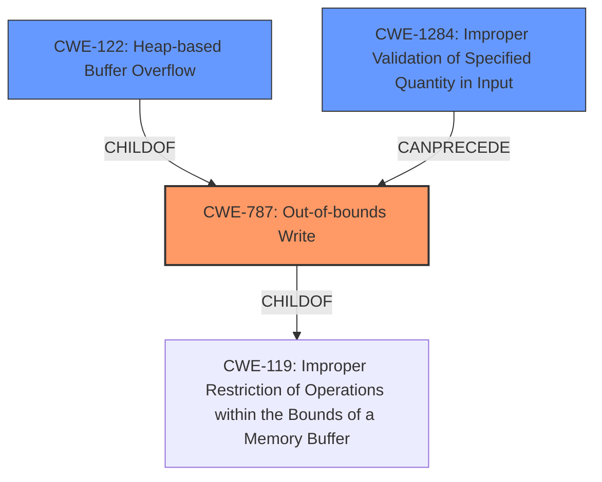

# Final Resolution for CVE-2021-43527

# Summary

| CWE ID    | CWE Name                                         | Confidence | CWE Abstraction Level | CWE Vulnerability Mapping Label | CWE-Vulnerability Mapping Notes |
| :-------- | :----------------------------------------------- | :--------- | :-------------------- | :------------------------------ | :------------------------------ |
| CWE-787   | Out-of-bounds Write                              | 0.95       | Base                  | Allowed                         | Primary CWE                     |
| CWE-122   | Heap-based Buffer Overflow                       | 0.9        | Variant               | Allowed                         | Secondary Candidate             |
| CWE-1284  | Improper Validation of Specified Quantity in Input | 0.8        | Base                  | Allowed                         | Secondary Candidate             |

## Evidence and Confidence

*   **Confidence Score:** 0.9
*   **Evidence Strength:** HIGH

## Relationship Analysis

The primary relationship is that **CWE-1284 (Improper Validation of Specified Quantity in Input)** can precede **CWE-787 (Out-of-bounds Write)**, as improper validation can lead to an out-of-bounds write. **CWE-122 (Heap-based Buffer Overflow)** is a variant of **CWE-787**, specifying that the out-of-bounds write occurs on the heap. Selecting **CWE-787** as the primary CWE is appropriate because it's a base-level weakness, while **CWE-122** provides additional context.

## Vulnerability Chain

The vulnerability chain starts with **CWE-1284 (Improper Validation of Specified Quantity in Input)**, where the length of the signature data isn't validated. This leads to **CWE-787 (Out-of-bounds Write)** and **CWE-122 (Heap-based Buffer Overflow)**, as the code writes past the end of a heap-allocated buffer. The lack of input validation is the **root cause**, and the **heap overflow** is the direct consequence, leading to potential code execution or denial of service.

## Summary of Analysis

The initial analysis and criticism were both accurate. The vulnerability is indeed a **heap overflow** (**CWE-122**) caused by writing data past the end of a buffer in the heap, which is a clear instance of **CWE-787 (Out-of-bounds Write)**. The **root cause** is the missing input validation (**CWE-1284**).

The vulnerability description clearly states, "NSS (Network Security Services) versions prior to 3.73 or 3.68.1 ESR are vulnerable to a **heap overflow** when handling DER-encoded DSA or RSA-PSS signatures." This statement directly supports the selection of **CWE-787** and **CWE-122**. The fact that the overflow happens due to missing input validation of the signature length directly supports the inclusion of **CWE-1284**.

The graph relationships influenced the selection by highlighting the chain of events: missing validation leads to an out-of-bounds write on the heap. The selected CWEs are at the optimal level of specificity, as **CWE-787** is a base-level weakness, **CWE-122** provides additional context about the location of the overflow (heap), and **CWE-1284** identifies the **root cause**.